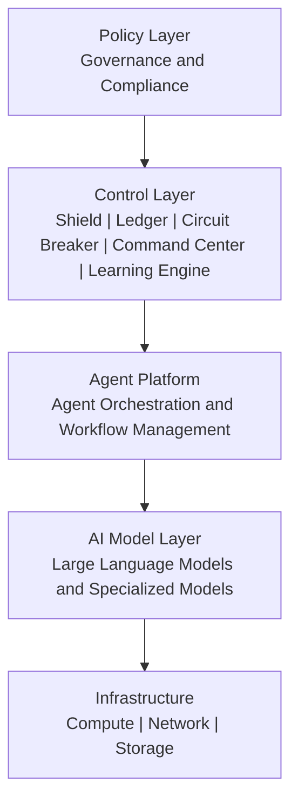

# AISM Control Stack

**Framework:** AI SAFE2 v2.1
**Organization:** Cyber Strategy Institute
**Version:** March 2026

---

## Overview

The AISM Control Stack answers the question that engineers ask most often: where does governance actually live in the software?

Governance policy that does not connect to technical implementation is a document, not a control. The Control Stack makes the connection explicit: every layer of the stack has a defined governance responsibility, and every AISM pillar has a defined position within the stack.

This document is primarily for architects and engineers building the systems that governance depends on. It describes what each layer does, what components live there, and how the layers interact.

---

## The Control Stack

Policy flows downward through enforcement. Telemetry and signals flow upward through observability. The control layer is the interface between organizational intent and operational reality.

---

## Layer 1: Policy Layer

**Governance responsibility:** Define what AI systems must do, must not do, and must do within defined limits.

The Policy Layer is where organizational decisions about AI behavior are formalized. It is not a software layer in the traditional sense. It is the layer of human decision-making and documentation that everything below it depends on.

**What lives in the Policy Layer:**

AI governance policies covering agent behavior, autonomy levels, tool access permissions, data handling requirements, and escalation thresholds. Regulatory compliance requirements derived from NIST AI RMF, ISO 42001, EU AI Act, and other applicable frameworks. Organizational risk policies including risk appetite statements, acceptable use definitions, and exception handling procedures. Sovereignty declarations that define which AI decisions require human approval and which may proceed autonomously.

**Engineering implication:**

Policy Layer decisions must be operationalized in the Control Layer. Every policy that cannot be enforced technically is a policy that depends on human compliance. At AISM Level 3 and above, the expectation is that critical policies are enforced automatically, not voluntarily.

The AISM Compliance Crosswalk maps Policy Layer requirements to specific technical controls in the Control Layer, providing a traceable path from regulatory obligation to implemented enforcement.

---

## Layer 2: Control Layer

**Governance responsibility:** Enforce Policy Layer decisions through technical mechanisms that operate continuously at runtime.

The Control Layer is the operational heart of AISM governance. It is where the five pillars are implemented. This layer sits between organizational policy and the AI systems that policy is meant to govern. It is the enforcement plane.

**Shield controls in this layer:**

Input validation engines that process every input before it reaches the Agent Platform. Prompt injection detection systems using semantic analysis and known attack pattern matching. Data sanitization pipelines for inputs, retrieved documents, and tool responses. Cryptographic verification of model artifacts and dependencies. PII/PHI masking and tokenization for sensitive data. Secret scanning integrated into AI output pipelines.

**Ledger controls in this layer:**

Centralized logging infrastructure with cryptographic signing and tamper protection. Behavioral analytics platforms that establish baselines and detect anomalies. AI asset registry systems maintaining inventory of all models, agents, tools, and endpoints. SBOM generation and tracking systems with dependency vulnerability correlation. Telemetry pipelines that feed Command Center dashboards.

**Circuit Breaker controls in this layer:**

Kill switch infrastructure with multi-stage activation: software-level termination, rate limiting enforcement, and credential revocation for non-human identities. Circuit breaker patterns in agent orchestration frameworks. Rate limiting and resource throttling enforcement. Safe-mode fallback routing that degrades to simpler systems when neural model behavior is unreliable. Agent isolation and quarantine mechanisms for multi-agent systems.

**Command Center controls in this layer:**

Real-time monitoring dashboards aggregating telemetry from all AI systems. Anomaly detection alerting with configured thresholds and escalation routing. Human approval workflow systems for gated agent actions. Audit trail interfaces for human investigation and oversight.

**Learning Engine controls in this layer:**

Threat intelligence integration pipelines that ingest and parse AI-specific threat feeds. Red team tooling and adversarial testing infrastructure. Model retraining pipelines with performance trigger monitoring. Training content management for operator education programs.

---

## Layer 3: Agent Platform

**Governance responsibility:** Provide the orchestration environment within which agents operate, with governance controls enforced at the orchestration level.

The Agent Platform is the runtime environment for autonomous AI workflows. This is where agent frameworks like LangGraph, AutoGen, CrewAI, and similar systems operate. Governance at this layer focuses on what agents can do, with whom they can interact, and how their actions are recorded.

**What lives in the Agent Platform:**

Agent orchestration frameworks managing workflow execution, task scheduling, and multi-agent coordination. Workflow engines that sequence agent actions and enforce step-level constraints. Task scheduling systems that manage when and how often agents run. Agent-to-agent communication infrastructure, including A2A protocol implementations and inter-agent authentication. Tool access control lists that define which agents can invoke which capabilities.

**Engineering implication:**

The Agent Platform is the layer where Control Layer enforcement must be tightest. Input sanitization must occur before agent context is populated. Ledger recording must capture every tool invocation, every sub-agent spawn, and every external API call. Circuit Breaker mechanisms must be able to halt execution at the orchestration level, not just at the model level.

For multi-agent deployments, the Agent Platform must also enforce agent identity: every agent must have a cryptographically verifiable identity so that audit trails and access controls can be applied at the individual agent level rather than the deployment level.

---

## Layer 4: AI Model Layer

**Governance responsibility:** Ensure that the models themselves are trustworthy, verified, and operating within expected behavioral boundaries.

The AI Model Layer contains the machine learning models that agents invoke. Governance at this layer focuses on model provenance, behavioral consistency, and performance monitoring.

**What lives in the AI Model Layer:**

Large language models used for reasoning, generation, and tool use. Fine-tuned models specialized for domain-specific tasks. Embedding models used in RAG retrieval pipelines. Classification models used for content filtering, anomaly detection, or routing. Multimodal models used for vision, audio, or cross-modal tasks.

**Governance controls specific to this layer:**

Model signing verification using OpenSSF Model Signing or equivalent ensures that the model loaded in production is cryptographically identical to the model that was validated. SHA-256 hashing of model artifacts provides integrity verification. Provenance chains document the base model, fine-tuning datasets, training procedures, and validation results for every model in production. Behavioral baselines established at deployment time allow drift detection when model behavior changes over time.

**Engineering implication:**

Every model in production should have an entry in the AI asset registry (Ledger layer). Every model deployment should include cryptographic verification of model identity. Models should not be loaded from unverified sources, and the supply chain from model provider through fine-tuning to deployment should be documented and auditable.

---

## Layer 5: Infrastructure

**Governance responsibility:** Provide the compute, network, and storage environment that enforces isolation, availability, and integrity requirements.

The Infrastructure Layer is where AI workloads physically execute. Governance at this layer focuses on isolation between workloads, network segmentation that limits AI system blast radius, and storage security for model artifacts, agent memory, and audit logs.

**What lives in the Infrastructure Layer:**

Compute resources: GPU clusters, CPU instances, and serverless compute for model inference and agent execution. Network infrastructure: VLANs, firewalls, API gateways, and egress controls that limit AI system network access. Storage systems: object storage for model artifacts, vector databases for agent memory and RAG retrieval, logging infrastructure for immutable audit trails. Secret management systems: HSMs and secret vaults for credentials, API keys, and cryptographic material.

**Engineering implication:**

Infrastructure segmentation should enforce the isolation policies defined at the Policy Layer. AI workloads should run in dedicated network segments. Agent workloads should be containerized with resource limits enforced at the container runtime level. Logging infrastructure must be protected from tampering by the systems it logs.

The Infrastructure Layer is also where non-human identity (NHI) governance is implemented: service accounts, API keys, and machine identities used by AI systems must be inventoried, rotation-scheduled, and monitored for anomalous usage.

---

## Cross-Layer Interactions

The Control Stack is not a one-way enforcement path. Signals flow upward through the stack as well.

**Telemetry flows up:** Model behavioral anomalies surface from Layer 4 to Layer 2 Ledger controls. Agent platform events are captured by Layer 2 audit infrastructure. Infrastructure security events feed Layer 2 SIEM integration. All of this telemetry aggregates to Layer 2 dashboards and feeds Layer 5 Learning Engine controls.

**Enforcement flows down:** Policy Layer decisions propagate through Control Layer configuration to Agent Platform access control lists. Control Layer kill switch activation propagates to Agent Platform workflow termination and Infrastructure credential revocation. Control Layer rate limits propagate to Agent Platform invocation throttling and Infrastructure resource constraints.

**The enforcement gap risk:** The most common governance failure is a gap between Control Layer enforcement intent and Agent Platform implementation reality. Control Layer policies that are not implemented in Agent Platform orchestration, or that can be bypassed by direct model invocation, are not operational controls. Regular red team testing of the cross-layer enforcement path is essential.

---

## Control Stack and AISM Maturity

| Maturity Level | Control Stack Characteristics |
|---|---|
| Level 1: Chaos | Policy Layer informal or absent; Control Layer minimal; Agent Platform ungoverned |
| Level 2: Visibility | Policy Layer emerging; Control Layer has basic logging and access controls; Agent Platform partially instrumented |
| Level 3: Governance | All layers explicitly defined; Control Layer operational across all pillars; Agent Platform enforces access controls |
| Level 4: Control | Control Layer automated enforcement; cryptographic verification at Model Layer; NHI governance at Infrastructure Layer |
| Level 5: Sovereignty | Formal verification of Control Layer logic; self-healing enforcement; continuous behavioral verification across all layers |

---

## Related Documents

- [strategic-architecture.md](./strategic-architecture.md): The three governance layers that the control stack implements
- [operational-loop.md](./operational-loop.md): How the control stack operates as a continuous defense cycle
- [agent-threat-control-matrix.md](./agent-threat-control-matrix.md): How threats target specific layers and what controls address them
- [AISM-Self-Assessment-Tool.md](./AISM-Self-Assessment-Tool.md): Assessment checklist that evaluates control implementation at each stack layer

---

*© 2026 Cyber Strategy Institute. Licensed under CC BY 4.0.*
