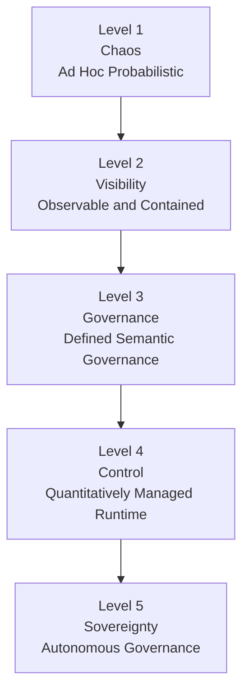

  

# AISM Maturity Model

**Framework:** AI SAFE2 v2.1
**Organization:** Cyber Strategy Institute
**Version:** March 2026

---

## Overview

The AISM Maturity Model describes how organizations evolve their AI governance capabilities from unstructured experimentation to full sovereignty. It provides a common language for assessing current state, setting targets, and tracking progress.

The model has five levels. Each level is defined by specific capabilities across all five AISM pillars. Organizations do not choose a level. They earn it by demonstrating the capabilities that characterize it.

Most organizations currently operate between Level 1 and Level 3. The jump from Level 2 to Level 3 is the most impactful transition for organizations deploying their first agentic systems. The jump from Level 3 to Level 4 is where runtime enforcement replaces documentation-based governance. Level 5 is continuous improvement.

---

## The Maturity Ladder

---

## Level 1: Chaos (Ad Hoc Probabilistic)

**NIST Tier Equivalent:** Partial

### What It Looks Like

AI systems operate without formal governance. Experimentation happens informally, driven by individual teams or developers. There are no standardized deployment procedures, no consistent logging, and no defined response if something goes wrong. When problems occur, they are handled reactively, often by the same person who built the system. Outcomes depend on the judgment and availability of specific individuals.

### Pillar-by-Pillar Characteristics at Level 1

**Shield:** No systematic input validation. Prompt injection is either unknown or unaddressed. Data quality is assumed, not verified.

**Ledger:** Logging may exist for infrastructure purposes but is not AI-specific. Agent actions are not recorded. There is no inventory of AI systems.

**Circuit Breaker:** No defined shutdown procedures. If an AI system behaves unexpectedly, response is improvised. No rate limiting or containment mechanisms.

**Command Center:** No dedicated monitoring. Oversight is passive. Human intervention happens only when problems are already visible.

**Learning Engine:** No structured learning process. Lessons from incidents are not captured. Training, if it exists, is informal.

### Primary Risk at This Level

The primary risk is unknown exposure. Organizations at Level 1 frequently do not know what AI systems they have deployed, what data those systems have access to, or what actions they are capable of taking. Incidents are discovered after the fact, if at all.

### Advancement Priority

The highest-impact first step for a Level 1 organization is an AI system inventory: identify every AI system in production, document its capabilities and data access, and assign ownership. This is the Level 2 Ledger baseline.

---

## Level 2: Visibility (Observable and Contained)

**NIST Tier Equivalent:** Risk Informed

### What It Looks Like

The organization recognizes AI risk and has taken initial steps to address it. Logging exists for primary AI systems. Access controls are in place. Some containment mechanisms exist. There is a growing awareness of what AI systems exist and what they do, but practices are inconsistent across teams. Governance is largely reactive.

### Pillar-by-Pillar Characteristics at Level 2

**Shield:** Basic input filtering is deployed for primary systems. PII masking is in place. Prompt injection is acknowledged as a concern and basic detection exists.

**Ledger:** Activity logging with timestamps is operational for primary AI systems. A basic AI system inventory is maintained, often manually. Model performance is tracked.

**Circuit Breaker:** Emergency shutdown procedures are documented for primary systems. Basic error handling prevents failures from cascading in most cases. Some circuit breaker patterns exist in critical pipelines.

**Command Center:** Basic performance dashboards exist. Escalation procedures are defined but informal. Human oversight is present but not systematic.

**Learning Engine:** AI security awareness is included in general training. Incident lessons are captured informally. Threat intelligence feeds are monitored.

### Primary Risk at This Level

The primary risk is inconsistency. Controls exist for primary systems but not for all AI deployments. The gap between what is known and what is actually deployed creates blind spots. Governance depends on individual initiative rather than organizational process.

### Advancement Priority

The highest-impact step for a Level 2 organization is formalizing governance policies and applying them consistently across all AI systems, not just primary ones. This is the Level 3 foundation.

---

## Level 3: Governance (Defined Semantic Governance)

**NIST Tier Equivalent:** Repeatable

### What It Looks Like

The organization has formalized its AI governance approach. Policies covering agent behavior, memory management, recursion limits, and semantic isolation are documented and enforced. Controls exist across all five pillars for all production AI systems. Regular audits occur. Compliance mapping is complete. The organization can answer questions about its AI risk posture with documented evidence.

### Pillar-by-Pillar Characteristics at Level 3

**Shield:** All AI inputs are validated against predefined schemas. Adversarial prompt detection includes semantic analysis. Data quality anomaly detection is automated. DLP controls protect sensitive data. Dependencies are tracked and cross-referenced against CVEs.

**Ledger:** Centralized, tamper-proof logging is operational across all AI systems. Behavioral baselines are established with statistical anomaly detection. Explainability tracking is implemented. A complete AI system registry exists with ownership, criticality, and risk classification.

**Circuit Breaker:** Circuit breakers with graceful degradation paths are implemented and tested regularly. Kill switches are accessible to operators with escalation procedures. Failover to simpler systems is defined. Incident response playbooks cover identified threat scenarios.

**Command Center:** Human approval workflows govern critical AI actions. Real-time human intervention capability is operational for all production systems. Cross-functional AI governance collaboration is established.

**Learning Engine:** Threat intelligence is integrated into AI risk assessments. Playbooks and controls are updated based on new threats. Comprehensive operator training programs exist. Formal incident lessons learned processes produce tracked action items.

### Primary Risk at This Level

The primary risk is that controls are defined but not continuously enforced. Documentation exists, but runtime behavior may deviate from policy. Metrics exist but may not be used to drive decisions. The gap between documented governance and operational reality can be significant.

### Advancement Priority

The most impactful advancement for a Level 3 organization is moving from documented controls to runtime governors: automated enforcement mechanisms that do not depend on human compliance with policy. This is the Level 4 transition.

---

## Level 4: Control (Quantitatively Managed Runtime)

**NIST Tier Equivalent:** Adaptive

### What It Looks Like

The organization has full visibility over all AI systems and enforces governance automatically at runtime. Controls are not merely documented; they are implemented as technical enforcement mechanisms. Risk is quantified. Failure modes are defined and managed. The organization can measure its AI security posture with metrics and act on those measurements. Agentic AI deployments operate within deterministic constraints.

### Pillar-by-Pillar Characteristics at Level 4

**Shield:** Cryptographic verification of model artifacts at load time. OpenSSF Model Signing integration. Provenance chain verification from base model through fine-tuning to deployment. Secret scanning in all AI outputs. Per-agent session isolation. RAG poisoning detection with baseline monitoring.

**Ledger:** SHA-256 cryptographic hashing of agent state. Consensus voting audit trails for multi-agent systems. Full NHI activity logging with real-time anomaly detection. Automated SBOM accuracy checks. Agent behavioral baseline profiling.

**Circuit Breaker:** Centralized kill switch for multi-agent systems. Automated agent isolation on anomalous behavior detection. Consensus failure escalation to human operators. Automated NHI credential rotation. Memory poisoning incident response playbook.

**Command Center:** Human approval gates for multi-agent consensus decisions. Human override for all agent swarm actions. Just-in-time access with anomalous access alerts for NHI entities. Distributed agent health monitoring with consensus validation.

**Learning Engine:** Structured red teaming with tracked findings. Agent swarm capability evolution tracked and managed. NHI security posture evolution managed. Supply chain provenance control evolution integrated.

### Primary Risk at This Level

The primary risk is operational complexity. Level 4 organizations manage a large number of automated controls, alerts, and monitoring systems. The risk is that critical signals are lost in operational noise, or that the governance system itself becomes a source of complexity that slows down legitimate operations. Tuning and prioritization become important.

### Advancement Priority

The path to Level 5 is continuous improvement integration: building the feedback mechanisms that allow the governance system to learn from its own operation and improve automatically.

---

## Level 5: Sovereignty (Autonomous Governance)

**NIST Tier Equivalent:** Optimizing

### What It Looks Like

The organization has achieved full sovereignty over its AI systems. Governance is not a process the organization runs. It is a capability the organization has. Controls verify themselves. Threat intelligence feeds automatically update defenses. Incident findings automatically improve playbooks. Red team results automatically surface gaps for remediation. Human oversight is concentrated at the decisions that genuinely require it. The governance system continuously improves.

### Pillar-by-Pillar Characteristics at Level 5

**Shield:** Automated self-healing input validation. Formal verification of validation logic. AI-driven anomaly detection that adapts to new attack patterns without manual tuning. Zero-trust input architecture.

**Ledger:** AI-driven continuous audit with formal verification of audit trail integrity. Automated compliance reporting across all frameworks simultaneously. Self-healing audit mechanisms that detect and correct gaps automatically.

**Circuit Breaker:** Automated self-recovery with formal verification of fail-safe logic. AI-driven predictive failure detection. Self-healing systems that detect and remediate without human intervention for defined failure classes.

**Command Center:** AI-assisted oversight that surfaces only highest-priority decisions to humans. Continuous stakeholder transparency with real-time dashboards. Formal verification of human-in-the-loop mechanisms.

**Learning Engine:** AI-driven continuous improvement recommendations. Self-evolving controls that adapt to new threat patterns autonomously. Research integration pipeline that incorporates academic findings within 30 days.

### Sustaining Level 5

Level 5 is not a destination. It is a continuous operational state. Organizations at Level 5 maintain their position through ongoing investment in adversarial learning, regular formal verification of critical control logic, active participation in AI security research and threat intelligence communities, and systematic red team programs that challenge all five pillars.

---

## Maturity Assessment Quick Reference

| Level | Name | AISM Score Range | Key Differentiator |
|---|---|---|---|
| 1 | Chaos | 1.00 to 1.49 | No systematic governance; incident-driven response |
| 2 | Visibility | 1.50 to 2.49 | Basic controls exist; inconsistently applied |
| 3 | Governance | 2.50 to 3.49 | Formalized controls; documented processes; regular audits |
| 4 | Control | 3.50 to 4.49 | Runtime enforcement; quantified risk; automated containment |
| 5 | Sovereignty | 4.50 to 5.00 | Self-improving governance; formal verification; continuous adversarial learning |

---

## Common Advancement Blockers

**Level 1 to Level 2:** Lack of AI system inventory. Organizations cannot govern what they cannot see.

**Level 2 to Level 3:** Governance treated as a documentation exercise rather than an operational commitment. Controls exist on paper but are not consistently applied.

**Level 3 to Level 4:** Gap between policy and enforcement. Organizations have defined what should happen but rely on human compliance rather than technical enforcement.

**Level 4 to Level 5:** Insufficient investment in continuous improvement infrastructure. Governance is operational but does not learn from itself.

---

## Related Documents

- [sovereignty-matrix.md](./sovereignty-matrix.md): How maturity levels map to positions in the sovereignty matrix
- [AISM-Self-Assessment-Tool.md](./AISM-Self-Assessment-Tool.md): The formal assessment tool for determining your current maturity level
- [AISM-Scoring-Matrix-Methodology.md](./AISM-Scoring-Matrix-Methodology.md): How AISM scores are calculated and what determines level classification
- [strategic-architecture.md](./strategic-architecture.md): The governance architecture that maturity levels formalize

---

*© 2026 Cyber Strategy Institute. Licensed under CC BY 4.0.*
