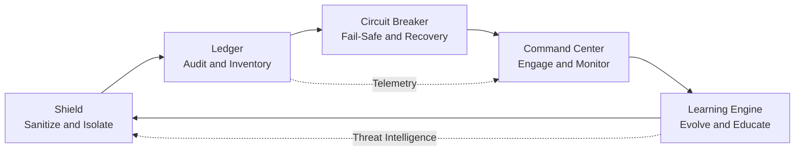

# AISM Operational Defense Loop

**Framework:** AI SAFE2 v2.1
**Organization:** Cyber Strategy Institute
**Version:** March 2026

---

## Overview

Static AI governance does not work. A policy document written in January does not protect an autonomous agent from a novel prompt injection technique discovered in March. An annual audit does not catch a runaway agent in real time. A compliance checklist does not tell you when an agent has started behaving outside its sanctioned parameters.

Safe agentic AI requires governance that operates continuously during runtime. The **AISM Operational Defense Loop** describes how that continuous governance works.

The loop has five stages, corresponding to the five AISM pillars. Each stage feeds into the next. The output of the final stage feeds back into the first. The loop never stops running.

---

## The Defense Loop

The loop operates at two speeds simultaneously. The primary flow (A through B through C through D through E and back to A) is the standard operational cycle. The secondary flows (Ledger telemetry directly to Command Center, Learning Engine threat intelligence directly to Shield) are the accelerated feedback paths that allow critical information to bypass the full cycle when speed matters.

---

## Stage 1: Shield (Sanitize and Isolate)

**Pillar P1**

The Shield stage is the first line of defense for every AI interaction. It operates at the point where inputs enter the system, before any agent processes them.

**What Shield protects against:**

Prompt injection is the primary threat: adversarial instructions embedded in user inputs, tool responses, retrieved documents, or external data feeds that attempt to override agent behavior. Beyond injection, Shield addresses malicious data payloads, unsafe content that violates organizational policy, poisoned training or retrieval data, and adversarially crafted inputs designed to trigger model vulnerabilities.

**Shield capabilities:**

Input validation enforces schema compliance and rejects malformed or unexpected input structures. Prompt injection detection identifies adversarial instruction patterns using semantic analysis, not just keyword matching. Data quality checks catch anomalies in retrieved or ingested data before agents act on it. Toxic content filtering applies organizational policy to inputs and outputs. Sensitive data masking ensures PII, PHI, and other regulated data is handled appropriately before it reaches agent memory or tool calls. Cryptographic verification of model artifacts and datasets ensures supply chain integrity.

**What Shield does not do:**

Shield cannot guarantee zero adversarial inputs will pass through. Novel attack patterns, sufficiently sophisticated injection techniques, and attacks that exploit model-specific vulnerabilities may not be caught at this stage. That is why the Ledger and Circuit Breaker exist.

---

## Stage 2: Ledger (Audit and Inventory)

**Pillar P2**

The Ledger stage records everything the AI system does. Not selectively. Everything.

This is the observability layer. Without it, everything downstream is operating blind. The Command Center has nothing to monitor. The Learning Engine has no data to learn from. Incident response has no audit trail to investigate.

**What the Ledger records:**

Every agent action, tool call, API request, memory read and write, decision and reasoning trace, inter-agent communication, input received, and output produced. All user interactions. All model state changes. All configuration modifications. Chain-of-thought reasoning where available.

**Ledger capabilities:**

Centralized, tamper-proof logging with cryptographic signing ensures audit trails cannot be manipulated after the fact. Behavioral baselines establish what normal agent behavior looks like, enabling anomaly detection. Asset inventory tracks every AI model, agent, tool, API endpoint, and data source in the deployment. SBOM (Software Bill of Materials) generation and tracking covers model dependencies. Immutable telemetry feeds the Command Center and Learning Engine with continuous operational data.

**The Ledger's special role in the loop:**

The Ledger has a direct telemetry path to the Command Center that bypasses the Circuit Breaker stage. This is intentional. Behavioral anomalies detected by the Ledger need to reach human operators quickly, before a Circuit Breaker event has occurred. The Ledger is not just a record. It is an early warning system.

---

## Stage 3: Circuit Breaker (Fail-Safe and Recovery)

**Pillar P3**

The Circuit Breaker stage activates when things go wrong. It is the system's immune response to agentic failure.

Most governance frameworks discuss kill switches as a feature. AISM treats the Circuit Breaker as a full operational stage with multiple activation modes, recovery paths, and restoration procedures. The difference matters when you are managing an autonomous agent that has started executing unintended tool calls at scale.

**What the Circuit Breaker governs:**

Emergency shutdown procedures for individual agents, agent groups, or entire AI systems. Graceful degradation paths that reduce AI autonomy without full shutdown when possible. Rate limiting and resource throttling that prevent runaway consumption of compute, API quota, or external service access. Safe-mode reversion that falls back to simpler, rule-based systems when neural models behave unreliably. Blast radius containment through compartmentalization that prevents a failure in one agent from propagating to others.

**Circuit Breaker capabilities:**

Kill switches with multi-stage escalation: software kills, hardware kills, and credential revocation for non-human identities. Automated agent isolation on anomalous behavior detection. Consensus failure escalation for multi-agent systems. Recovery procedures including backup restoration, configuration reset, and post-incident forensics. Incident response playbooks covering identified AI threat scenarios.

**The Circuit Breaker and human authority:**

Every Circuit Breaker activation is a signal to the Command Center. Circuit Breaker events require human review. The system can activate automatically, but humans decide what happens next.

---

## Stage 4: Command Center (Engage and Monitor)

**Pillar P4**

The Command Center stage is where human authority over AI systems is exercised in real time.

AISM's core principle is that probabilistic intelligence requires deterministic control. The Command Center is where that control is operationalized. Humans cannot make good decisions about AI systems they cannot see. The Command Center makes AI systems visible.

**What the Command Center provides:**

Real-time performance dashboards across all production AI systems. Anomaly alerts when agent behavior deviates from established baselines. Human approval workflows for high-risk or high-consequence agent actions. Intervention capabilities that allow operators to pause, redirect, or terminate agents. Escalation procedures with tiered alert routing. Stakeholder transparency reporting.

**Command Center capabilities:**

Continuous monitoring integrated with Ledger telemetry. Automated alerting for model drift, performance degradation, anomalous API usage, unexpected tool calls, and behavioral pattern changes. Human-in-the-loop (HITL) workflows that gate specific agent actions on operator approval. Full audit trail of all human interventions, approvals, and override decisions.

**The Command Center and multi-agent systems:**

As deployments move to multi-agent architectures, the Command Center must evolve from monitoring individual agents to monitoring agent ecosystems. This includes consensus monitoring for agent voting systems, topology visibility for agent swarms, and oversight of agent-to-agent communication patterns. The agent-specific monitoring controls in AISM address these requirements directly.

---

## Stage 5: Learning Engine (Evolve and Educate)

**Pillar P5**

The Learning Engine stage is what makes AISM a live system rather than a static one. It continuously improves the organization's AI security posture by feeding new intelligence back into the earlier stages.

Most governance frameworks end with incident response. AISM extends the cycle: incidents generate intelligence, intelligence updates controls, and controls prevent the same incident from happening again.

**What the Learning Engine integrates:**

Red team and adversarial testing results that reveal gaps in the Shield and Circuit Breaker stages. Threat intelligence feeds that surface new attack patterns before they reach production systems. Incident lessons learned that update playbooks, baselines, and containment procedures. Model retraining and refinement based on observed behavioral drift. Operator training programs that build workforce capability across all pillars.

**Learning Engine capabilities:**

Structured red teaming with documented methodology and tracked findings. Threat intelligence integration with AI-specific sources covering MITRE ATLAS techniques, OWASP LLM vulnerabilities, and emerging agentic attack research. Dependency and patch management with CVE correlation. Policy and procedure updates driven by new threat findings. Role-based training programs covering agent operators, swarm managers, developers, and executives.

**The Learning Engine feedback paths:**

The Learning Engine feeds back into Stage 1 (Shield) with updated threat intelligence, new injection detection patterns, and revised input validation logic. It feeds into all other stages with updated policies, procedures, and baselines. This is the path from reactive to adaptive governance.

---

## Why the Loop Matters More Than Any Single Stage

Organizations often ask which pillar is most important. The answer is that the question assumes the wrong mental model.

No single stage in the loop provides adequate protection in isolation. A perfect Shield stops every known threat but cannot detect what it missed. A perfect Ledger records everything but cannot stop anything. A perfect Circuit Breaker responds to failures but cannot prevent them. A perfect Command Center supervises everything but cannot improve automatically. A perfect Learning Engine generates intelligence but has nowhere to apply it without the other stages.

The loop is the governance system. The stages are its components. Investing in one while neglecting others creates the illusion of security without its substance.

The AISM Self-Assessment Tool measures all five stages simultaneously and surfaces the specific gaps that most limit overall posture, because the weakest link in the loop determines the resilience of the whole.

---

## Related Documents

- [strategic-architecture.md](./strategic-architecture.md): The three governance layers that the operational loop runs within
- [agent-threat-control-matrix.md](./agent-threat-control-matrix.md): How agentic threats map to specific stages of the loop
- [control-stack.md](./control-stack.md): Technical implementation of each loop stage
- [AISM-Self-Assessment-Tool.md](./AISM-Self-Assessment-Tool.md): Assessment checklist organized by pillar and loop stage

---

*© 2026 Cyber Strategy Institute. Licensed under CC BY 4.0.*
