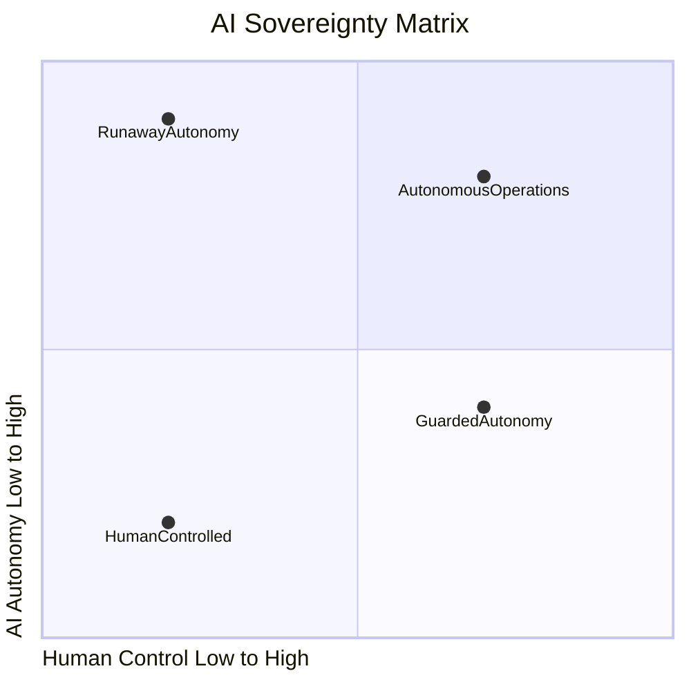

# AISM Sovereignty Matrix

**Framework:** AI SAFE2 v2.1
**Organization:** Cyber Strategy Institute
**Version:** March 2026

---

## Overview

The AI Sovereignty Matrix answers the most fundamental question in agentic AI governance: who is actually in control?

Every AI deployment sits somewhere on a spectrum defined by two forces: the degree of human control maintained over AI decision-making, and the degree of autonomy granted to AI systems to act independently. These forces are not opposites. They can be balanced, and the goal of AISM governance is to achieve that balance at the right point for each deployment context.

The Sovereignty Matrix makes that balance visible, measurable, and actionable.

---

## The Sovereignty Matrix

---

## Axis Definitions

### Horizontal Axis: Human Control

Human Control measures the degree to which humans retain authority over AI system behavior, decisions, and outcomes.

**Low human control** means AI systems operate with minimal human involvement. Decisions are made and actions taken autonomously, with humans reviewing outputs after the fact if at all. There are few or no mechanisms for real-time intervention. Policy constraints, if they exist, are not enforced at runtime.

**High human control** means humans retain meaningful authority over consequential AI decisions. Approval workflows exist for high-risk actions. Real-time intervention is possible. AI behavior is observable and auditable. Policy constraints are enforced, not merely documented.

Human control is not the same as human execution. High human control does not mean humans do all the work. It means humans retain the ability to understand, direct, override, and stop AI behavior at any point.

### Vertical Axis: AI Autonomy

AI Autonomy measures the degree to which AI systems independently execute complex, multi-step tasks without requiring human input at each decision point.

**Low AI autonomy** means AI systems act only when explicitly directed. Each action requires a specific human instruction. AI systems function as tools rather than agents. Workflow automation is sequential and deterministic.

**High AI autonomy** means AI systems independently plan, decide, and act across multi-step workflows. Agents chain tool calls, spawn sub-agents, retrieve and act on external data, and complete complex tasks without human involvement at each step. This is the defining characteristic of agentic AI systems.

---

## The Four Sovereignty Zones

### Zone 1: Human Controlled (Low Autonomy, High Control)

AI acts as a capable assistant. Every significant action is directed by a human. Outputs are reviewed before acting on them. AI systems do not initiate workflows independently.

**Typical systems in this zone:**
Document summarization tools. Search assistants. Coding copilots. Translation services. Classification and categorization systems with human review of outputs.

**Governance requirement at this zone:**
Standard software governance with AI-specific additions for output review, bias monitoring, and input validation. AISM Level 2 (Visibility) provides adequate baseline coverage.

**Who should operate here:**
Organizations beginning their AI deployment journey. High-consequence domains where any autonomous error is unacceptable. Systems where the cost of human review is lower than the risk of autonomous action.

### Zone 2: Guarded Autonomy (Moderate Autonomy, High Control)

AI executes tasks with meaningful independence, but within clearly defined boundaries enforced by governance controls. This is the target operating zone for most enterprise AI deployments.

**Typical systems in this zone:**
Autonomous research agents with human approval gates for high-consequence actions. Customer service agents that escalate edge cases. Code generation systems that require human review before deployment. Data analysis pipelines with human oversight of conclusions.

**Governance requirement at this zone:**
All five AISM pillars must be operational. Shield prevents adversarial inputs. Ledger tracks all agent actions. Circuit Breaker enforces autonomy limits. Command Center enables real-time oversight. Learning Engine continuously improves defenses. AISM Level 3 (Governance) is the minimum; Level 4 (Control) is the target.

**Who should operate here:**
Most enterprise deployments of agentic AI. The combination of high control and moderate autonomy allows AI to deliver meaningful productivity gains while maintaining the oversight required for accountable operation.

### Zone 3: Autonomous Operations (High Autonomy, High Control)

AI independently performs complex, multi-step tasks across extended workflows. Human involvement is concentrated at the points where it matters most: task definition, exception handling, and outcome review.

**Typical systems in this zone:**
Fully autonomous software development pipelines. Multi-agent research and analysis systems. Autonomous trading or resource allocation systems. Agentic systems managing critical infrastructure in well-defined scenarios.

**Governance requirement at this zone:**
This zone is achievable, but only with mature governance. AISM Level 4 (Control) is the minimum for responsible operation here. Level 5 (Sovereignty) is the target. All five pillars must be at full operational capability. Cryptographic agent identity verification, immutable audit trails, automated containment, and continuous adversarial learning are not optional at this level.

**Who should operate here:**
Organizations with mature AISM programs and demonstrated capability across all five pillars. Agentic systems that have been extensively red-teamed and validated. Deployments where the autonomy is genuinely necessary and the governance investment has been made to support it.

### Zone 4: Runaway Autonomy (High Autonomy, Low Control)

AI systems exceed the boundaries of human authority. Actions occur faster than humans can observe them. Decisions are made without governance constraints. Errors propagate without containment. This is not a design goal. It is a failure state.

**How organizations end up here:**
Deploying agentic AI systems without completing AISM pillar implementations. Granting broad tool access without corresponding audit and containment controls. Scaling AI autonomy faster than governance capabilities can match. Accepting vendor assurances about safety without independent verification.

**What Runaway Autonomy looks like:**
Agents executing unexpected tool calls at scale. AI systems consuming resources, sending communications, or modifying data without authorization. Multi-agent systems developing emergent behaviors that no human designed or sanctioned. Inability to reconstruct what happened or why after an incident.

**Governance response:**
Any organization that recognizes itself in the Runaway Autonomy zone should treat it as a critical risk requiring immediate intervention. The AISM Self-Assessment Tool will surface the specific gaps. The Circuit Breaker pillar controls are the most urgent priority.

---

## Using the Sovereignty Matrix for Governance Decisions

### Locating Your Current Position

Plot your organization's current position on the matrix by answering two questions:

For the autonomy axis: what is the highest level of autonomous action your AI systems currently take without human approval? Low autonomy means AI produces outputs for human review. High autonomy means AI agents independently execute multi-step workflows with real-world consequences.

For the control axis: what is your current AISM maturity score, converted to a control percentage? AISM Level 1 maps to low control. Level 3 maps to moderate control. Level 5 maps to high control.

### Locating Your Target Position

Your target position on the matrix is determined by your business requirements, risk appetite, and governance investment capacity. Most organizations should set Guarded Autonomy as a near-term target and Autonomous Operations as a long-term target for mature deployments.

The critical rule: control must lead autonomy. Governance capabilities must be in place before autonomy is expanded. Expanding autonomy without corresponding governance investment moves organizations toward the Runaway Autonomy zone.

### The Sovereignty Gap

The gap between your current position and your target position is your sovereignty gap. It has two dimensions: an autonomy gap (if you are ready to grant more autonomy but have not yet) and a control gap (if your autonomy currently exceeds your governance capabilities).

A control gap is a risk. An autonomy gap is an opportunity. AISM helps organizations close control gaps quickly and autonomy gaps strategically.

---

## Sovereignty Matrix and AISM Scoring

The Sovereignty Matrix is not a separate assessment from the AISM maturity model. It is a visualization of the same underlying data.

Your overall AISM Sovereignty Score maps to a position on the control axis. The autonomy level of your AI systems is an input to the assessment context. Together, they place your organization in one of the four zones.

Organizations in Guarded Autonomy with a score of 3.5 or above are operating in the target state for most enterprise deployments. Organizations whose autonomy level exceeds their AISM score equivalents are in or approaching the Runaway Autonomy zone.

---

## Related Documents

- [maturity-model.md](./maturity-model.md): The five maturity levels that map to positions on the sovereignty matrix
- [operational-loop.md](./operational-loop.md): How the defense loop maintains position in the target sovereignty zone
- [AISM-Self-Assessment-Tool.md](./AISM-Self-Assessment-Tool.md): Assessment tool that produces the data needed to plot your matrix position
- [AISM-Scoring-Matrix-Methodology.md](./AISM-Scoring-Matrix-Methodology.md): How AISM scores are calculated and interpreted

---

*© 2026 Cyber Strategy Institute. Licensed under CC BY 4.0.*
