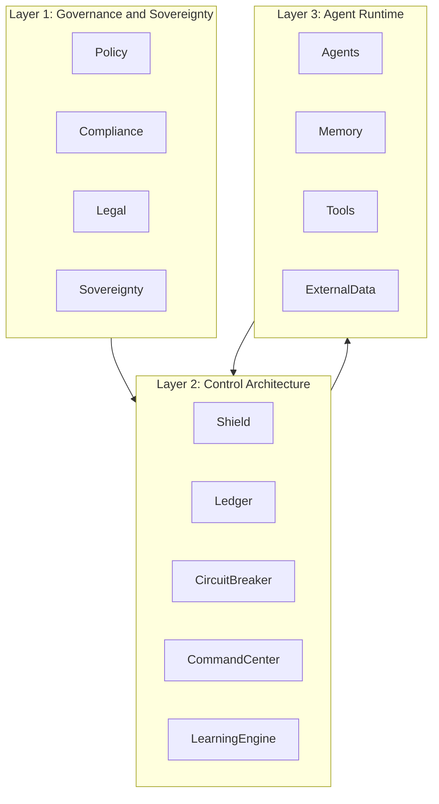

  

# AISM Strategic Architecture

**Framework:** AI SAFE2 v2.1
**Organization:** Cyber Strategy Institute
**Version:** March 2026

---

## Overview

The AISM Strategic Architecture defines how governance authority flows through an AI system deployment. It answers a single critical question: where do governance controls exist, and how do they relate to each other?

The architecture is organized into three layers, stacked from highest authority to lowest. Governance sets the rules. Controls enforce them. Runtime is where AI behavior actually occurs. Each layer feeds into the layer below it, and critical signals flow back upward.

This is not a theoretical model. It is a deployment blueprint. Every organization deploying agentic AI systems operates within these three layers whether they have formalized them or not. AISM makes that structure explicit, measurable, and enforceable.

---

## The Three Governance Layers

---

## Layer 1: Governance and Sovereignty

The Governance layer is where organizational authority over AI systems is defined and maintained. It contains four primary components.

**Policy** establishes the rules that AI systems must follow. This includes agent behavior policies, acceptable use definitions, autonomy boundaries, escalation thresholds, and risk acceptance criteria. Policy is not a document that sits in a folder. In a mature AISM deployment, policy is operationalized: it is encoded into the control layer and enforced automatically.

**Compliance** maps organizational policy to external regulatory and standards obligations. This layer is where NIST AI RMF, ISO 42001, EU AI Act, and CSA AICM requirements are tracked and maintained. The AISM Compliance Crosswalk is the primary artifact produced and maintained at this component.

**Legal** governs liability, contractual obligations, data residency requirements, intellectual property considerations, and the legal framework surrounding AI decision authority. This component becomes especially important when autonomous agents take actions with legal consequence.

**Sovereignty** is the component unique to AISM among governance frameworks. It defines the boundaries of organizational control: which AI decisions require human approval, what autonomy levels are permissible for which agent types, how organizational control is maintained when AI systems are deployed on third-party infrastructure, and how data sovereignty is preserved when AI systems process sensitive information.

---

## Layer 2: Control Architecture

The Control Architecture layer is where governance policy is translated into operational enforcement. This layer maps directly to the five AISM pillars.

**Shield (P1)** is the input sanitization and isolation control set. It sits at the boundary between external inputs and AI system processing, preventing prompt injection, adversarial manipulation, and unsafe data from entering the agent runtime.

**Ledger (P2)** is the observability and audit control set. It maintains immutable records of all agent actions, decisions, tool calls, and state changes. The Ledger makes behavior visible and accountable.

**Circuit Breaker (P3)** is the fail-safe control set. It enforces operational limits, activates kill switches, manages graceful degradation, and executes recovery procedures when agents behave dangerously or unexpectedly.

**Command Center (P4)** is the human oversight control set. It provides real-time dashboards, anomaly alerts, human approval workflows, and intervention capabilities that ensure humans retain operational authority over autonomous systems.

**Learning Engine (P5)** is the continuous improvement control set. It integrates red team findings, threat intelligence, incident lessons, and operator training back into the governance system so that defenses evolve with the threat landscape.

Together, these five controls form the operational heartbeat of AISM governance. They do not operate sequentially. They operate simultaneously and continuously.

---

## Layer 3: Agent Runtime

The Agent Runtime layer is where AI behavior actually occurs. This is the layer that governance frameworks most often fail to reach.

**Agents** are the autonomous AI entities executing tasks, making decisions, and taking actions. In multi-agent deployments, this layer includes orchestrator agents, worker agents, specialized sub-agents, and the communication protocols between them.

**Memory** encompasses all forms of agent state: in-context memory, external vector stores, RAG retrieval pipelines, and long-term storage. Memory is a critical attack surface for agentic systems because it can be poisoned, manipulated, or contaminated without direct access to the agent itself.

**Tools** are the external capabilities agents can invoke: web search, code execution, API calls, database queries, file system access, and inter-agent communication. Tool access represents the primary mechanism through which an agent's actions have real-world consequence.

**External Data** includes all data sources that agents retrieve at runtime: websites, APIs, documents, databases, and feeds. This is the primary injection surface for adversarial inputs and the primary source of data quality risk.

---

## How the Layers Interact

Authority flows downward. Governance defines what is permissible. Controls enforce those definitions at the boundary of the runtime. The runtime operates within the envelope that controls establish.

Signals flow upward. Agent behavior generates telemetry that the Ledger captures. Anomalies detected by the Ledger trigger Circuit Breaker responses. Circuit Breaker activations surface to the Command Center for human review. Command Center observations inform Learning Engine updates. Learning Engine findings update governance policy.

This bidirectional flow is what makes AISM a live governance system rather than a static compliance exercise.

---

## Strategic Architecture and the Maturity Model

The three-layer architecture appears at every level of AISM maturity, but with different degrees of formalization and automation.

At Level 1 (Chaos), the layers exist informally. Governance is whatever the deployment team decided. Controls are minimal or absent. Runtime operates without meaningful constraint.

At Level 3 (Governance), all three layers are explicitly defined. Policies are documented. Controls are implemented. The runtime operates within defined boundaries, though enforcement may still be manual in places.

At Level 5 (Sovereignty), the layers are fully integrated and continuously verified. Governance decisions are operationalized automatically into controls. Control telemetry feeds governance updates. The runtime is fully observable, constrained, and recoverable.

---

## Related Documents

- [operational-loop.md](./operational-loop.md): How the five control-layer pillars operate as a continuous defense cycle
- [control-stack.md](./control-stack.md): Technical implementation of the control architecture layer
- [maturity-model.md](./maturity-model.md): How the strategic architecture matures from Level 1 to Level 5
- [AISM-Self-Assessment-Tool.md](./AISM-Self-Assessment-Tool.md): Assessment checklist for all three layers across all five pillars

---

*© 2026 Cyber Strategy Institute. Licensed under CC BY 4.0.*
