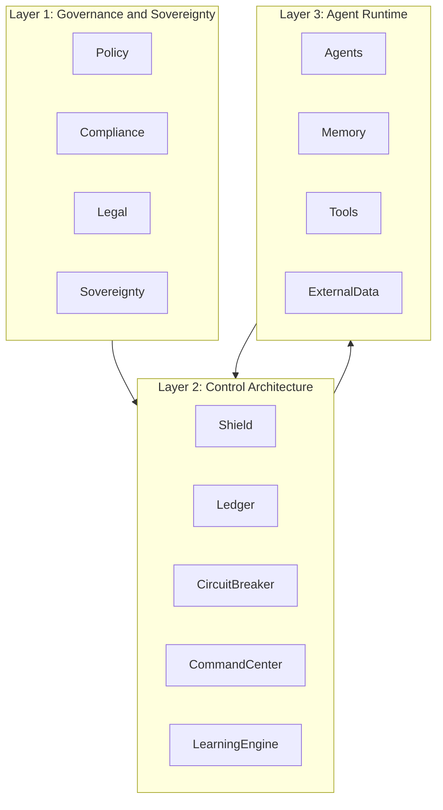
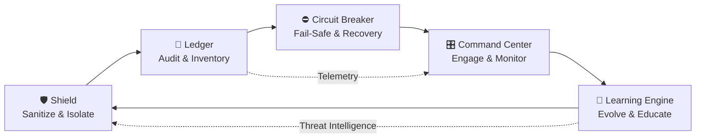
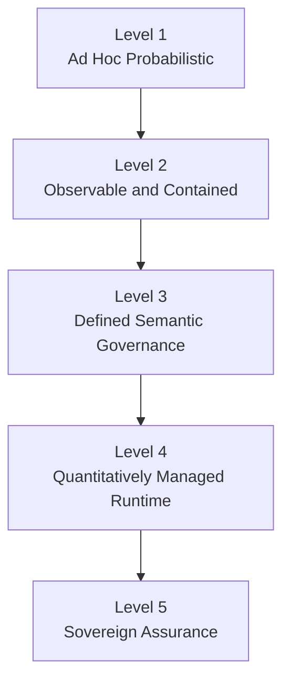
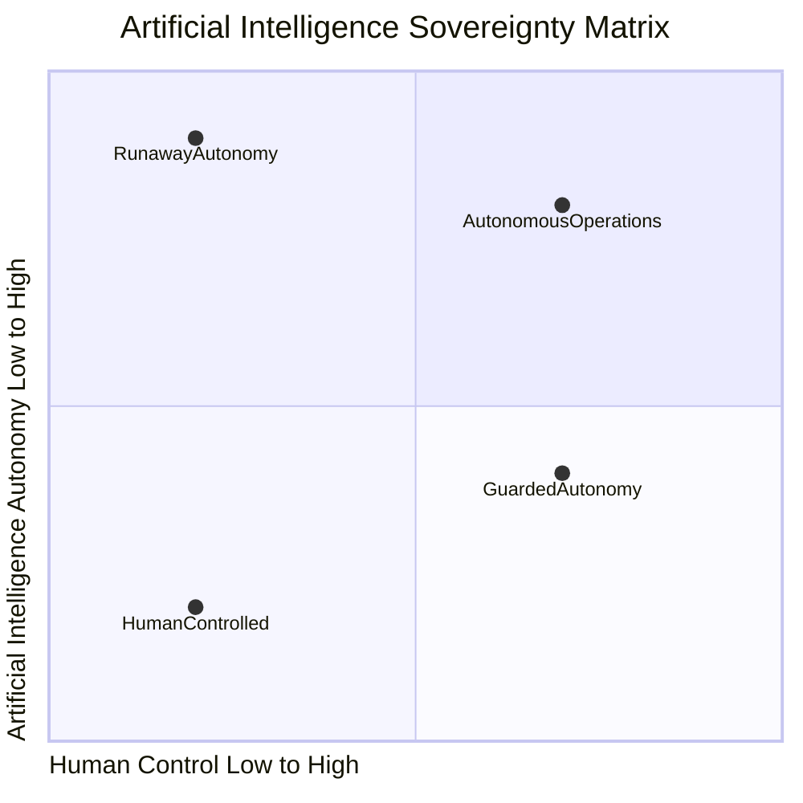
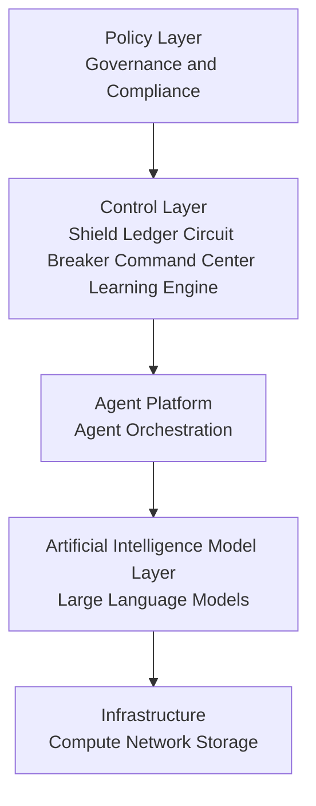

# AISM — AI Sovereignty Maturity Model

**Tagline:** *“The Operating System for Safe Autonomous AI”*  
**Core Principle:** *Probabilistic intelligence requires deterministic control.*

---

## **1. Overview**

AI systems inherently produce non-deterministic outputs.  Safe deployment therefore requires deterministic governance layers that constrain behavior, enforce policy, and enable human oversight.

The **AI Sovereignty Maturity Model (AISM)** is a governance and runtime safety framework for agentic AI systems. It enables organizations to measure, manage, and evolve autonomous AI while maintaining operational control and human oversight.  

Most AI governance frameworks today focus on static policy. They fail to enforce safety while autonomous systems operate, creating blind spots and unquantifiable risk. AISM solves this by combining **AI risk governance, agent operational safety, runtime control architecture / enforcement, continuous adversarial learning, and measurable safety** across five core pillars.

**Purpose of AISM:**

- Assess AI governance maturity
- Identify operational risk gaps
- Implement deterministic safety controls
- Safely deploy autonomous agents at scale

## AI-SAFE² Strategic Architecture

---

## **2. The Five Pillars (Command Architecture)**

The framework is organized into **five operational pillars**, inspired by military doctrine and autonomous system command structures.

| Pillar | AI-Native Name | Description |
|--------|----------------|-------------|
| P1 | **Shield** | Sanitize and isolate inputs to prevent prompt injection, adversarial manipulation, or environment compromise. |
| P2 | **Ledger** | Maintain immutable telemetry and asset registry of all AI agents and workflows. |
| P3 | **Circuit Breaker** | Hard-stop mechanisms, safe-mode reversion, and fail-safe recovery protocols for agentic failures. |
| P4 | **Command Center** | Human-in-the-loop oversight, real-time anomaly detection, and operational control. |
| P5 | **Learning Engine** | Continuous evolution through red teaming, threat intelligence, and operator training. |

> **Note:** The pillars are visible from the root level to ensure clarity and usability. 

### The AI SAFE² Operational Defense Loop 
**Operational Governance for Agentic AI Systems**

### Purpose

The Operational Defense Loop describes how artificial intelligence safety operates continuously during runtime.

Instead of static protection, artificial intelligence defense must function as an ongoing cycle of protection, monitoring, response, and improvement.

This loop forms the operational heartbeat of the ASIM framework.

### Stage 1 Shield

The Shield protects the system from malicious or unsafe inputs.

**Common threats include:**

- prompt injection attacks
- malicious instructions
- unsafe external data

**Shield capabilities include:**

- input validation
- prompt injection detection
- sandboxing
- cryptographic isolation

### Stage 2 Ledger

The Ledger records everything the artificial intelligence system does.

This provides full visibility into system behavior.

**Ledger capabilities include:**

- logging
- asset inventories
- telemetry collection
- chain of thought recording

This layer allows investigators to understand how and why artificial intelligence made decisions.

### Stage 3 Circuit Breaker

The Circuit Breaker protects systems when failures occur.

If artificial intelligence begins behaving dangerously, emergency controls activate.

**Examples include:**

- kill switches
- rate limiting
- recursion limits
- safe mode activation

This layer prevents runaway autonomous behavior.

### Stage 4 Command Center

The Command Center enables Human in the Loop supervision.

Operators monitor system activity and intervene when needed.

**Capabilities include:**

- dashboards
- anomaly detection
- approval workflows
- alerting systems

This ensures humans retain operational authority over artificial intelligence systems.

### Stage 5 Learning Engine

The Learning Engine continuously improves artificial intelligence defenses.

**Capabilities include:**

- red team testing
- adversarial simulations
- threat intelligence integration
- operator training

Lessons learned feed back into the Shield layer, completing the cycle.

---

## **3. AI Sovereignty Maturity Model**

AISM measures organizational maturity in **five progressive levels**. Each level reflects an increasing degree of control, observability, and adversarial resilience.

| Level | Name | Description |
|-------|------|-------------|
| 1 | **Chaos** | Ad hoc AI experiments with no containment, logging, or oversight. Outcomes rely on luck or heroic intervention. |
| 2 | **Visibility** | Logging, inventories, and basic containment mechanisms exist. Operational awareness improves, but behavior is not standardized. |
| 3 | **Governance** | Policies for agent behavior, memory governance, recursion limits, and semantic isolation are defined, documented, and enforced. |
| 4 | **Control** | Runtime governors enforce deterministic constraints such as transaction limits, failure-mode SLOs, and automated containment. Metrics are tracked and risk is quantified. |
| 5 | **Sovereignty** | Full cryptographic control, human oversight, and continuous adversarial evolution loops ensure system-level, adaptive governance. Lessons from incidents and red teaming are integrated into ongoing operations. |

> Placeholder: Diagram showing ladder from Chaos → Sovereignty across pillars.

## Artificial Intelligence Governance Maturity Ladder
### Purpose

The maturity ladder explains how organizations evolve their artificial intelligence governance capabilities.

Most organizations begin with unstructured experimentation.

Over time they develop structured governance, monitoring, and safety capabilities.

The ladder provides a roadmap toward full artificial intelligence sovereignty.

### Level 1 Ad Hoc Probabilistic

Artificial intelligence systems operate without formal governance.

Characteristics include:
- prompt based experimentation
- minimal monitoring
- unpredictable results

### Level 2 Observable and Contained

Basic monitoring and containment controls are implemented.

Capabilities include:

- logging
- access control
- sandboxing
- agent inventory

### Level 3 Defined Semantic Governance

Organizations define standardized governance practices.

Examples include:

- memory governance
- recursion limits
- agent safety policies
- adversarial monitoring

### Level 4 Quantitatively Managed Runtime

Artificial intelligence safety is measured and enforced through metrics.

Examples include:

- safety Service Level Objectives
- failure thresholds
- runtime monitoring metrics

### Level 5 Sovereign Assurance

Artificial intelligence systems operate under full governance authority.

Capabilities include:

- cryptographic identity verification
- continuous adversarial testing
- automated safety enforcement
- sovereign human oversight

---

## **4. AI Sovereignty Matrix**

The **matrix evaluates maturity across all five pillars**, providing a measurable assessment of risk posture and agentic safety.

| Level | Shield | Ledger | Circuit Breaker | Command Center | Learning Engine |
|-------|-------|--------|----------------|---------------|----------------|
| Chaos | No input protection | No logging | No kill switch | No oversight | No learning |
| Visibility | Basic filtering | Logging | Manual shutdown | Monitoring dashboards | Incident review |
| Governance | Isolation policies | Asset registry | Recovery procedures | HITL workflows | Security training |
| Control | Deterministic sandboxing | Quantified telemetry | Automated containment | Real-time governance | Structured red teaming |
| Sovereignty | Cryptographic isolation | Immutable ledger | Autonomous safety governors | Strategic oversight | Continuous adversarial learning |

> Placeholder: Consider adding visual matrix diagram for easy scanning.

### Sovereignty Matrix Diagram

### Purpose

The Artificial Intelligence Sovereignty Matrix explains who ultimately controls artificial intelligence systems.

Two factors determine sovereignty:

1. level of human control
2. level of artificial intelligence autonomy

Organizations must carefully balance these two forces.

### Axis Definitions
**Horizontal Axis**

Human control level

Low control means artificial intelligence operates independently.
High control means humans retain authority.

**Vertical Axis**

Artificial intelligence autonomy

Low autonomy means artificial intelligence acts only when directed.
High autonomy means artificial intelligence independently executes complex workflows.

### Sovereignty Zones
**Human Controlled Systems**

Artificial intelligence acts only as an assistant.

Typical examples:

- document summarization
- search assistants
- coding assistants

**Guarded Autonomy**

Artificial intelligence can execute tasks but within controlled boundaries.

Most enterprise deployments should operate in this zone.

**Autonomous Operations**

Artificial intelligence independently performs complex tasks.

This requires strong governance, monitoring, and safety controls.

**Runaway Autonomy**

Artificial intelligence actions exceed human control.

This is the failure state that governance frameworks must prevent.

---

## **5. AI Control Stack**

The **Control Stack** shows how AISM enforces runtime governance across AI systems.

1. **Probabilistic AI Systems** – Autonomous, agentic behavior.  
2. **Observability Layer** – Telemetry, logging, and inventory.  
3. **Semantic Governance** – Policies, recursion limits, memory isolation.  
4. **Runtime Governors** – Automated constraints, circuit breakers, failure-mode SLOs.  
5. **Sovereign Assurance** – Continuous adversarial learning, red teaming, and adaptive controls.

> Placeholder: Layered diagram illustrating stack from AI systems → Sovereign Assurance.

> This diagram is especially important for engineers because it connects governance policy with actual software components.

### Policy Layer

Defines the rules artificial intelligence must follow.

Examples:

- governance policies
- regulatory compliance requirements
- organizational risk policies

### Control Layer

Implements enforcement mechanisms using the ASIM pillars.

Controls include:

- Shield
- Ledger
- Circuit Breaker
- Command Center
- Learning Engine

### Agent Platform Layer

Manages artificial intelligence workflows.

Typical components include:

- agent orchestration frameworks
- workflow engines
- task scheduling systems

### Artificial Intelligence Model Layer

Contains the machine learning models used by agents.

Examples include:

- large language models
- fine tuned models
- multimodal models

### Infrastructure Layer

Provides the computing environment.

Components include:

- compute resources
- networking
- storage systems
  
---

## **6. Key Insights / Strategic Advantages**

- **Dynamic Runtime Enforcement:** Unlike policy-only frameworks, AISM controls behavior during execution.  
- **Measurable Risk:** Metrics, failure modes, and blast-radius tracking make governance auditable.  
- **AI-Native:** Designed for agentic intelligence, not retrofitted from IT security frameworks.  
- **Continuous Learning:** Red teaming, threat intelligence, and incident feedback integrate into evolution loops.  
- **Adoption-ready:** Can be applied in governments, Fortune 500 enterprises, and critical infrastructure.

### How the ASIM Framework Fits Together

Each diagram explains a different dimension of artificial intelligence governance.

| Framework Component | Question It Answers |
| :--- | :--- |
| **Strategic Architecture** | Where governance controls exist |
| **Operational Defense Loop** | How safety operates continuously |
| **Sovereignty Matrix** | Who ultimately controls artificial intelligence |
| **Maturity Ladder** | How organizations improve governance capabilities |
| **Control Stack** | How engineers implement governance controls |

Together these models form a complete architecture for governing agentic artificial intelligence systems.

---

## **7. Next Steps / Adoption**

- **Explore the full matrix:** [link to future page or PDF]  
- **View pillar details:** [link to future pillar pages]  
- **Download cheat sheet / guide:** [link to PDF]  
- **Examples / Implementations:** [link to `examples` folder]  

> The AISM README serves as the **single source of truth**. As content grows, detailed pillar or model pages can be split into individual markdowns without breaking links.

---

## **8. Call to Action**

> Ready to measure and control your AI systems?  
> **Use AISM to assess your maturity, enforce runtime safety, and evolve agentic intelligence with confidence.**

[Explore GitHub Repo](../) | [Download PDF Cheat Sheet](#)

---

*End of ASIM README.md*
