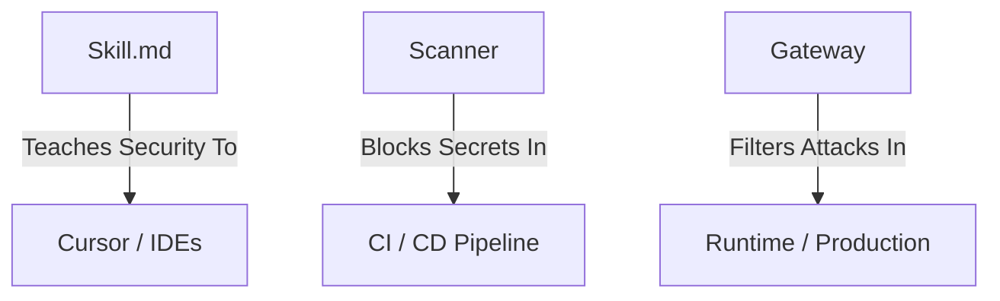

# 🔌 Integrations: The Universal GRC Standard

**The Goal:** Do not change your tools. Upgrade their intelligence.
**The Method:** Inject the AI SAFE² Framework (`skill.md`, Scanner, Gateway) into your existing workflow.

---

## 🗺️ The Ecosystem Architecture
We protect the entire lifecycle of the Agent, from the first line of code written to the final API call in production.


---
## 🧠 Phase 1: Prevention (The Brain)
*Use `skill.md` to turn your AI Tools into Security Architects.*

### ⚡ AI Code Editors (Vibe Coding)
Don't just write code; write *compliant* code automatically.

| Tool | Integration Method | Impact |
| :--- | :--- | :--- |
| **Cursor** | Copy content of `skill.md` → Paste into `.cursorrules` file in project root. | Cursor will auto-suggest validators and logging patterns while you type. |
| **Windsurf** | Type `@skill.md` in the Cascade chat bar (assuming file is in project). | The IDE audits your code logic against the 5 Pillars in real-time. |
| **VS Code (Copilot)** | Open `skill.md` in a pinned tab. | Copilot uses the open tab as context to generate secure boilerplate. |

### 🤖 LLM Chat & Architects
Planning a system? Need specific auditing?

| Tool | Integration Method | Impact |
| :--- | :--- | :--- |
| **Claude Projects** | Upload `skill.md` to **Project Knowledge**. | Claude becomes a dedicated "AI SAFE² Consultant." |
| **ChatGPT** | Upload `skill.md` to **Knowledge** in "Create a GPT". | Creates a custom GPT that reviews your architecture. |
| **Perplexity** | Attach `skill.md` to your search/query. | "Analyze this GitHub repo for violations based on the attached framework." |

---

## 🕵️ Phase 2: Detection (The Gatekeeper)
*Catch secrets and bad configs before they hit Git.*

*   **The Tool:** `scanner.py` (or `detect-secrets`)
*   **The Guide:** [View the 5-Min Quick Start Guide](/QUICKSTART_5_MIN.md)
```bash
# Scan specific folder
python scanner.py --target ./my-agent-code
```
### ⚙️ CI/CD Pipelines (GitHub Actions)
Block the build if vulnerabilities are found.

```yaml
# .github/workflows/security.yml
steps:
  - uses: actions/checkout@v3
  - name: Run AI SAFE² Scanner
    run: |
      pip install detect-secrets
      detect-secrets scan > report.json
      # Fail if secrets found
      if grep -q "hashed_secret" report.json; then exit 1; fi
```
---
## 🛡️ Phase 3: Protection (The Shield)
*Sanitize inputs and enforce firewalls in real-time.*

*   **The Tool:** AI SAFE² Gateway (Docker)
*   **The Guide:** [View Developer Implementation](guides/DEVELOPER_IMPLEMENTATION.md)

### 🐳 Docker & Cloud
Deploy the Gateway as a sidecar or proxy.

```bash
# 1. Start the Gateway
docker run -d -p 8000:8000 ghcr.io/cyberstrategyinstitute/ai-safe2-gateway

# 2. Point your Agent to the Gateway
export OPENAI_BASE_URL="http://localhost:8000/v1"
```
### 🔗 Agent Platforms (No-Code)
Secure your Make.com, n8n, or AgenticFlow agents.

*   **Platform: n8n / Make**
    *   **Integration:** Route all LLM requests through the Gateway URL instead of directly to OpenAI.
    *   **Alternative:** Use the "Code Node" patterns found in our [No-Code Guide](guides/NO_CODE_AUTOMATION.md).
*   **Platform: AgenticFlow / Ishi**
    *   **Integration:** Upload `skill.md` to the Agent's "Knowledge Base" or "System Instruction."
    *   **Impact:** The Agent self-regulates its own prompts to avoid injection risks.

---

## 🚀 Upgrade to Enterprise Governance
**You have the Code. Now get the Command Center.**

Managing security via command line is fine for a side project. But tracking compliance across 50 agents for a Board Meeting requires a **System of Record.**

The **[AI SAFE² Implementation Toolkit](https://cyberstrategyinstitute.com/AI-Safe2/)** bridges the gap between "technical logs" and "executive strategy."

### 📦 What's Inside The Toolkit?
*   📊 **The Audit Engine (Excel):** A 128-point master scorecard that auto-calculates your Global Risk Score and compliance gaps.
*   ⚖️ **The "Golden" Policy (Word):** Pre-written legal protection. Mapped to ISO 42001 & NIST AI RMF. Just add your logo.
*   🛡️ **Supply Chain Defense (Excel):** The High-Impact Vendor Questionnaire. Stop buying insecure AI tools.
*   🗺️ **Zero-to-Hero Roadmap (PDF):** A step-by-step 30-day implementation guide to secure your stack.
*   📘 **Framework Deep Dive (PDF):** The official definitions and architectural reference manual.

### 🖥️ Unlock The "Command Center" View
*Compatible with the **Risk Command Center** (Available via Toolkit).*

Stop showing spreadsheets to the Board. Transform your audit data into a **Strategic HUD**:
*   ✅ **Real-Time Scoring:** Instantly visualize ISO 42001 alignment.
*   ✅ **Strategic HUD:** See Global Risk & Pillar Balance at a glance.
*   ✅ **Executive Ready:** Generate one-click PDF reports that secure budget.

> *Move from "Reactive & Risky" to "Proactive & Profitable."*

👉 **[GET THE IMPLEMENTATION TOOLKIT](https://cyberstrategyinstitute.com/AI-Safe2/)**

