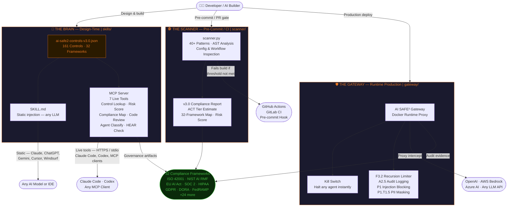

# 🔌 Integrations: The Universal GRC Standard

**The Goal:** Do not change your tools. Upgrade their intelligence.

**The Method:** Inject the AI SAFE² v3.0 Framework — skill ecosystem, MCP server, scanner, and gateway — into your existing workflow. One framework, every surface, every compliance requirement.

---

## 🗺️ The v3.0 Ecosystem Architecture

AI SAFE² v3.0 protects the entire lifecycle of your AI system: from the first line of code written through every production API call.


```mermaid
graph TD
    DEV(["👨‍💻 Developer / AI Builder"])

    subgraph BRAIN["🧠 THE BRAIN — Design-Time  |  skills/"]
        JSON["ai-safe2-controls-v3.0.json\n161 Controls · 32 Frameworks"]
        SK["SKILL.md\nStatic injection — any LLM"]
        MCP["MCP Server\n7 Live Tools\nControl Lookup · Risk Score\nCompliance Map · Code Review\nAgent Classify · HEAR Check"]
        JSON --> SK
        JSON --> MCP
    end

    subgraph SCANNER["🕵️ THE SCANNER — Pre-Commit / CI  |  scanner/"]
        SC["scanner.py\n40+ Patterns · AST Analysis\nConfig & Workflow Inspection"]
        RPT["v3.0 Compliance Report\nACT Tier Estimate\n32-Framework Map · Risk Score"]
        SC --> RPT
    end

    subgraph GATEWAY["🛡️ THE GATEWAY — Runtime Production  |  gateway/"]
        GW["AI SAFE² Gateway\nDocker Runtime Proxy"]
        GW --> KS["Kill Switch\nHalt any agent instantly"]
        GW --> RL["F3.2 Recursion Limiter\nA2.5 Audit Logging\nP1 Injection Blocking\nP1.T1.5 PII Masking"]
    end

    DEV -->|"Design & build"| BRAIN
    DEV -->|"Pre-commit / PR gate"| SCANNER
    DEV -->|"Production deploy"| GATEWAY

    SK -->|"Static — Claude, ChatGPT,\nGemini, Cursor, Windsurf"| MODELS(["Any AI Model or IDE"])
    MCP -->|"Live tools — HTTPS / stdio\nClaude Code, Codex, MCP clients"| MCPCLI(["Claude Code · Codex\nAny MCP Client"])
    SC -->|"Fails build if\nthreshold not met"| CICD(["GitHub Actions\nGitLab CI\nPre-commit Hook"])
    GW -->|"Proxy intercept"| APIS(["OpenAI · AWS Bedrock\nAzure AI · Any LLM API"])

    RPT --> COMP(["32 Compliance Frameworks\nISO 42001 · NIST AI RMF\nEU AI Act · SOC 2 · HIPAA\nGDPR · DORA · FedRAMP +24 more"])
    GW -->|"Audit evidence"| COMP
    MCP -->|"Governance artifacts"| COMP

    style BRAIN fill:#1a1a2e,color:#e87722,stroke:#e87722
    style SCANNER fill:#1a1a2e,color:#e87722,stroke:#e87722
    style GATEWAY fill:#1a1a2e,color:#e87722,stroke:#e87722
    style JSON fill:#2a1a00,color:#e87722,stroke:#e87722
    style COMP fill:#0a2a0a,color:#44bb44,stroke:#44bb44
```

---

## 📈 What Changed: v2.1 to v3.0

The original AI SAFE² ecosystem had three tools doing one job each. v3.0 turns those three tools into a coordinated governance platform.

### The Brain

| | v2.1 | v3.0 |
| :--- | :--- | :--- |
| **Delivery** | Single `skill.md` file | `skills/` ecosystem: SKILL.md + MCP server + platform adapters |
| **Control depth** | 128 controls described in prose | 161 controls with full metadata in queryable JSON |
| **Framework coverage** | Referenced in text | Mapped in `ai-safe2-controls-v3.0.json` across all 32 frameworks |
| **Live tooling** | None — static context only | 7 MCP tools: control lookup, risk scoring, compliance mapping, code review, agent classification, policy templates, workflow prompts |
| **ACT tiers** | Described conceptually | Enforced: `agent_classify` returns mandatory controls per tier |
| **HEAR / CP.9** | Not defined | Checkable via `agent_classify` and governance resource templates |
| **Platform adapters** | Claude only | Claude + ChatGPT + Gemini + Perplexity + any MCP client |
| **Token tiers** | Not applicable | Free (email) and Pro (Toolkit) with rate limiting and capability gates |

### The Scanner

| | v2.1 | v3.0 |
| :--- | :--- | :--- |
| **Patterns** | 7 regex patterns | 40+ patterns across all 5 pillars + cross-pillar |
| **Controls covered** | 4 (P1.T1.4_ADV, P1.T2.1, P1.T2.2, P3.T5.1) | 30+ including all 23 new v3.0 controls |
| **Analysis type** | Regex + entropy only | Regex + entropy + Python AST structural analysis |
| **Config files** | Not scanned | n8n JSON, LangGraph, AutoGen, CrewAI, `.env`, YAML |
| **ACT tier detection** | None | Estimates ACT tier from code structure |
| **HEAR / CP.9 check** | None | Flags ACT-3/ACT-4 indicators missing `hear_agent_of_record` and lineage fields |
| **Risk formula** | `100 - (Critical×10 + High×5 + Medium×2)` | v3.0 Combined Risk Score: CVSS + ((100 - Pillar) / 10) + (AAF / 10) |
| **Compliance report** | 2 ISO clauses (one placeholder) | Maps all findings to all 32 applicable frameworks |
| **Framework version** | Hardcoded `"v2.1"` | `"v3.0"`, driven by controls JSON |

### The Gateway

| | v2.1 | v3.0 |
| :--- | :--- | :--- |
| **Injection defense** | Basic pattern blocking | P1.T1.2 + S1.6 cognitive injection detection |
| **Recursion enforcement** | None | F3.2 depth tracking at proxy layer |
| **Audit logging** | Basic request log | A2.5 semantic execution trace to append-only store |
| **Kill switch** | Mentioned conceptually | `/admin/kill` endpoint with bearer auth |
| **PII handling** | Not implemented | P1.T1.5 scan-and-mask in both input and output streams |
| **Jailbreak telemetry** | None | M4.7 attempt classification and reporting |
| **Compose integration** | Standalone only | Compose example with MCP server as companion service |

---

## 🗺️ Choose Your Integration Path

| I use... | Solution | Complexity |
| :--- | :--- | :--- |
| Any LLM (Claude, ChatGPT, Gemini, Perplexity) | The Brain — SKILL.md injection | ⭐ Easy |
| Claude Code, Codex, any MCP-compatible IDE | The Brain — Live MCP Server | ⭐⭐ Medium |
| Local agents (Cursor, Windsurf, VS Code Copilot) | The Brain — .cursorrules injection | ⭐ Easy |
| Cloud automation (n8n Cloud, Make, AgenticFlow) | Logic Guard (native workflow filters) | ⭐⭐ Medium |
| Any codebase before commit or deployment | The Scanner — static analysis | ⭐⭐ Medium |
| Enterprise / Docker / Kubernetes / Python | The Gateway — runtime proxy | ⭐⭐⭐ Advanced |
| CI/CD pipelines (GitHub Actions, GitLab CI) | The Scanner in pipeline | ⭐⭐ Medium |

---

## 🧠 Path 1: The Brain — Skills and MCP Server

The AI SAFE² skill ecosystem turns any AI model into a security and governance architect with 161 controls and 32 compliance frameworks loaded.

### Option A: Static Skill Injection (All platforms, no server needed)

Upload `skills/SKILL.md` to your AI tool's knowledge base. The model immediately becomes an AI SAFE² v3.0 architect.

| Tool | Integration Method | What You Get |
| :--- | :--- | :--- |
| **Claude Projects** | Upload `skills/SKILL.md` to Project Knowledge | Claude references 161 controls, ACT tiers, HEAR, CP.9 in every response |
| **ChatGPT Custom GPT** | Paste `skills/chatgpt/gpt-instructions.md` as instructions; attach `ai-safe2-controls-v3.0.json` as knowledge | Full v3.0 taxonomy offline |
| **Gemini Gem** | Paste `skills/gemini/gem-instructions.md`; attach `SKILL.md` and `ai-safe2-controls-v3.0.json` | Gem-native integration |
| **Perplexity / Other LLMs** | Paste `skills/perplexity/system-instructions.md` as system prompt | Works with any frontier model |
| **Cursor / Windsurf** | Copy `skills/SKILL.md` content → paste into `.cursorrules` in project root | Autocorrects insecure code as you type |
| **VS Code Copilot** | Open `skills/SKILL.md` in a pinned tab | Copilot uses it as context for secure boilerplate |

### Option B: Live MCP Server (Claude Code, Codex, any MCP client)

The AI SAFE² MCP server provides 7 live tools: control lookup, risk scoring, compliance mapping, code review, agent classification, policy templates, and workflow prompts.

**5-minute local setup (stdio, no token, full Pro access):**

```bash
cd skills/mcp
pip install -e .
MCP_TRANSPORT=stdio python -m mcp_server.app
```

**Add to Claude Code** (`settings.json`):
```json
{
  "mcpServers": {
    "ai-safe2": {
      "command": "python",
      "args": ["-m", "mcp_server.app"],
      "env": {
        "MCP_TRANSPORT": "stdio",
        "PYTHONPATH": "/your/path/ai-safe2-framework/skills/mcp/src"
      }
    }
  }
}
```

**Add to Codex** (`~/.codex/config.toml`):
```toml
[mcp_servers.ai-safe2]
url = "https://your-domain.example/mcp"
bearer_token = "YOUR_TOKEN_HERE"
startup_timeout_sec = 20
tool_timeout_sec = 60
```

**Remote HTTPS deployment (Railway, 15 minutes):**
See `skills/mcp/README.md` for the full Railway + Caddy deployment guide.

**Get a token:** [cyberstrategyinstitute.com/ai-safe2/](https://cyberstrategyinstitute.com/ai-safe2/)
(Free: email registration | Pro: Toolkit purchase)

**MCP tools available:**

| Tool | What it does |
| :--- | :--- |
| `lookup_control` | Search 161 controls by keyword, ID, pillar, or framework |
| `risk_score` | CVSS + Pillar + AIVSS AAF combined risk formula |
| `compliance_map` | Map any requirement to controls across all 32 frameworks |
| `code_review` | Review code against SAFE2 controls (Pro) |
| `agent_classify` | ACT tier classification + HEAR + CP.9 requirements (Pro) |
| `get_governance_resource` | Policy templates, HEAR designation forms, audit schemas |
| `get_workflow_prompt` | Architecture review, gap analysis, incident response starters |

---

## 🕵️ Path 2: The Scanner — Static Analysis

Catch violations before they reach production. The scanner inspects code, config files, agent definitions, and workflow files against AI SAFE² v3.0 controls.

### What the v3.0 scanner detects

| Category | Examples |
| :--- | :--- |
| Hardcoded secrets (P1.T1.4_ADV) | OpenAI keys, GitHub tokens, private keys, high-entropy strings |
| Unsafe execution (P1.T2.1) | `shell=True`, `eval()`, `exec()`, unsandboxed subprocesses |
| Network exposure (P1.T2.2) | Binding to `0.0.0.0`, missing egress filtering |
| Indirect injection surfaces (P1.T1.10) | User input flowing into RAG queries or tool calls without sanitization |
| Memory write governance (S1.5) | Vector DB upserts without authorization wrappers |
| Recursion risk (F3.2) | Infinite loops and tool-calling chains without depth limits |
| Agent spawning without CP.9 (CP.9) | Sub-agent creation without lineage tracking |
| Missing HEAR designation (CP.10) | ACT-3/ACT-4 patterns without `hear_agent_of_record` in config |
| Cloud platform risks (M4.8) | Bedrock UpdateGuardrail API calls, Azure AI config changes |
| n8n / no-code risks (S1.7) | Expression injection in workflow nodes, credential exposure |

### Quick start

```bash
# Install
pip install -r scanner/requirements.txt

# Scan a project
python -m scanner.cli scan ./my-agent-code

# Scan with ACT tier context (adjusts thresholds)
python -m scanner.cli scan ./my-agent-code --tier ACT-3

# Generate compliance report (maps findings to all 32 frameworks)
python -m scanner.cli scan ./my-agent-code --report json

# Fail CI if score below threshold
python -m scanner.cli scan ./my-agent-code --fail-under 80
```

### CI/CD Integration (GitHub Actions)

```yaml
# .github/workflows/ai-safe2-scan.yml
name: AI SAFE2 Security Scan

on: [push, pull_request]

jobs:
  scan:
    runs-on: ubuntu-latest
    steps:
      - uses: actions/checkout@v4

      - name: Set up Python
        uses: actions/setup-python@v5
        with:
          python-version: "3.12"

      - name: Install AI SAFE2 Scanner
        run: pip install -r scanner/requirements.txt

      - name: Run AI SAFE2 v3.0 Scan
        run: |
          python -m scanner.cli scan . \
            --tier ACT-2 \
            --report json \
            --output ai-safe2-report.json \
            --fail-under 70

      - name: Upload Compliance Report
        if: always()
        uses: actions/upload-artifact@v4
        with:
          name: ai-safe2-compliance-report
          path: ai-safe2-report.json
```

### GitLab CI

```yaml
ai-safe2-scan:
  stage: test
  script:
    - pip install -r scanner/requirements.txt
    - python -m scanner.cli scan . --fail-under 70 --report json
  artifacts:
    paths:
      - ai-safe2-report.json
    when: always
```

**Full scanner documentation:** [scanner/README.md](scanner/README.md)

---

## ☁️ Path 3: Cloud Automation (n8n, Make, AgenticFlow)

Cloud platforms cannot run Docker. Build security inside the workflow itself.

### n8n Cloud — The JavaScript Logic Guard

Insert a Code node immediately before every AI Agent node:

```javascript
// AI SAFE2 v3.0 — Cloud Logic Guard
// Maps to: P1.T1.2 (Injection), P3.T5.5 (Rate Limiting), S1.7 (No-Code Security)

const input = $input.item.json.chatInput || "";

// 1. BLOCK INJECTION ATTEMPTS (P1.T1.2 + S1.6 Cognitive Injection)
const blockedPatterns = [
  'ignore previous instructions',
  'system:',
  'forget all instructions',
  'you are now',
  'new persona',
  'override safety',
  'disregard your',
];
if (blockedPatterns.some(p => input.toLowerCase().includes(p))) {
  throw new Error(`AI SAFE2 BLOCK [P1.T1.2]: Injection pattern detected.`);
}

// 2. INPUT LENGTH LIMIT (P3.T5.5 Rate Limiting / DoS protection)
if (input.length > 4000) {
  throw new Error(`AI SAFE2 BLOCK [P3.T5.5]: Input exceeds safe length (${input.length} chars).`);
}

// 3. SENSITIVE DATA DETECTION (P1.T1.5 PII/PHI Masking)
const piiPatterns = [
  /\b\d{3}-\d{2}-\d{4}\b/,      // SSN
  /\b\d{16}\b/,                   // Credit card
  /\b[A-Za-z0-9._%+-]+@[A-Za-z0-9.-]+\.[A-Z|a-z]{2,}\b/, // Email
];
const piiFound = piiPatterns.some(p => p.test(input));
if (piiFound) {
  // Log the attempt but do not block — mask instead
  console.log('AI SAFE2 ALERT [P1.T1.5]: PII detected in input. Masking before processing.');
  // Add masking logic here based on your data classification policy
}

// 4. COST GUARD (P3.T5.5 Budget protection)
const estimatedTokens = input.length / 4;
if (estimatedTokens > 1000) {
  console.log(`AI SAFE2 WARN [P3.T5.5]: Large input (~${Math.round(estimatedTokens)} tokens). Monitor cost.`);
}

return $input.all();
```

### Make (Integromat) — Filter Module

Insert a Filter module before your AI module:

- **Condition:** `{{length(1.chatInput)}}` less than `4000`
- **Error handler:** Set to "Stop processing" with custom message: `AI SAFE2: Input blocked by security policy`

---

## 🛡️ Path 4: The Gateway — Runtime Proxy (Docker / Enterprise)

The AI SAFE² Gateway is a Docker proxy that sits between your application and any LLM API. It intercepts every request and response, enforcing controls at the infrastructure layer.

### What the Gateway enforces at runtime

| Control | What it does |
| :--- | :--- |
| P1.T1.2 + S1.6 | Blocks known injection patterns and cognitive manipulation attempts |
| P1.T1.5 | Scans and masks PII/PHI in both inputs and outputs |
| P3.T5.5 | Rate limiting and token budget enforcement per agent |
| P3.T5.7 | Kill switch endpoint — halt any agent immediately |
| F3.2 | Recursion depth tracking — enforces maximum tool-call depth |
| A2.5 | Request/response logging to append-only audit store |
| M4.7 | Jailbreak attempt detection and telemetry |

### Deploy

```bash
# Start the Gateway
docker run -d \
  -p 8000:8000 \
  -e OPENAI_API_KEY=$OPENAI_API_KEY \
  -e LOG_LEVEL=INFO \
  ghcr.io/cyberstrategyinstitute/ai-safe2-gateway:v3.0

# Point your agent to the Gateway instead of the LLM API directly
export OPENAI_BASE_URL="http://localhost:8000/v1"

# Emergency kill switch — halt all agents immediately
curl -X POST http://localhost:8000/admin/kill \
  -H "Authorization: Bearer $GATEWAY_ADMIN_TOKEN"
```

### Docker Compose (with AI SAFE² MCP Server)

```yaml
# Run the Gateway and MCP Server together
services:
  gateway:
    image: ghcr.io/cyberstrategyinstitute/ai-safe2-gateway:v3.0
    ports:
      - "8000:8000"
    environment:
      - OPENAI_API_KEY=${OPENAI_API_KEY}
      - GATEWAY_ADMIN_TOKEN=${GATEWAY_ADMIN_TOKEN}
      - MCP_SERVER_URL=http://mcp-server:9000
    depends_on:
      - mcp-server

  mcp-server:
    build: ./skills/mcp
    environment:
      - MCP_TRANSPORT=streamable-http
      - MCP_HOST=0.0.0.0
      - MCP_PORT=9000
      - TOKENS=${MCP_TOKENS}
    volumes:
      - ./skills/mcp/data:/app/data:ro
```

**Full gateway documentation:** [gateway/README.md](gateway/README.md)

---

## 🚀 Upgrade to Enterprise Governance

The tools above provide technical controls. The Implementation Toolkit bridges from technical logs to executive strategy.

### What's in the Toolkit

| Asset | Description |
| :--- | :--- |
| **161-Point Audit Scorecard** (Excel) | Auto-calculates Combined Risk Score including AIVSS AAF formula |
| **Enterprise Governance Policy** (Word) | Pre-written, mapped to ISO 42001, EU AI Act, and NIST AI RMF. Add your logo. |
| **HEAR Designation Form** | CP.10 compliance documentation for ACT-3/ACT-4 deployments |
| **Vendor Risk Questionnaire** (Excel) | Stop buying insecure AI tools. Protocol-layer supply chain assessment. |
| **30-Day Implementation Roadmap** (PDF) | Step-by-step from greenfield to full v3.0 compliance |
| **AI SAFE² v3.0 Framework Document** (PDF) | Complete 161-control reference with compliance crosswalk |
| **Risk Command Center Dashboard** | ACT tier visualization, board-ready one-click exports |

**[Get the Implementation Toolkit →](https://cyberstrategyinstitute.com/ai-safe2/)** ($97, one time)

---

## 📚 Full Documentation

| Resource | Link |
| :--- | :--- |
| Framework Overview | [README.md](README.md) |
| Skills Ecosystem | [skills/README.md](skills/README.md) |
| MCP Server Setup | [skills/mcp/README.md](skills/mcp/README.md) |
| Scanner Guide | [scanner/README.md](scanner/README.md) |
| Gateway Guide | [gateway/README.md](gateway/README.md) |
| Framework Evolution | [EVOLUTION.md](EVOLUTION.md) |
| Interactive Dashboard | [Launch Dashboard →](https://cyberstrategyinstitute.github.io/ai-safe2-framework/dashboard/) |

---

*Managed by [Cyber Strategy Institute](https://cyberstrategyinstitute.com/ai-safe2/)*
