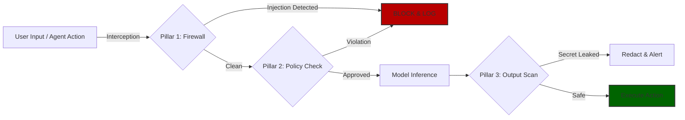

<div align="center">


# AI SAFE² Framework v2.1
### The Universal GRC Standard for Agentic AI & ISO 42001 Compliance

[](https://github.com/CyberStrategy1/ai-safe2-framework/releases)
[](https://creativecommons.org/licenses/by-sa/4.0/)
[](LICENSE)
[](https://cyberstrategyinstitute.com/AI-Safe2/)
[](https://cyberstrategyinstitute.com/AI-Safe2/)
[](https://github.com/CyberStrategy1/ai-safe2-framework/graphs/commit-activity)

[**5-Min Plan**](#5-min-plan) | [**The Architecture**](#architecture) | [**Universal GRC**](#grc) | [**Comparison**](#comparison) | [**Get Toolkit**](#-fast-track-implementation-the-toolkit) | [**Contributing**](#contributing)

</div>

---

# 🛡️ What is AI SAFE²?

**AI SAFE² (Secure AI Framework for Enterprise Ecosystems)** is the open-source governance standard for **Security Architects, GRC Officers, and Platform Engineers** who need to secure Agentic AI without slowing down innovation.

### 🏆 The Race is Over. We Built the Bridge.
While legacy GRC platforms (e.g., Vanta, Drata) are still struggling to define what an "AI Agent" is, **AI SAFE² v2.1** provides the finished bridge between the **Technical Reality** of your stack and the **Regulatory Reality** of the world.

> **What this Means:** AI SAFE² is the only framework that maps **Agentic Swarms, Non-Human Identities (NHI), and Vector DB risks** directly to **ISO 42001, NIST AI RMF, SOC 2 and 10+ other frameworks** controls into a single operational schema.


---
## 🏗️ The Core Architecture (The 5 Pillars)

The framework is architected around **5 Strategic Pillars** that provide defense-in-depth for Agentic Workflows.

*    **The Shield:** Input validation, prompt injection defense, and cryptographic agent sandboxing.

*    **The Ledger:** Full visibility, immutable logging (Chain of Thought), and asset registry.

*    **The Brakes:** Kill switches, circuit breakers, and "Safe Mode" reversion protocols.

*    **The Control Room:** Human-in-the-loop (HITL) workflows and real-time anomaly detection.

*    **The Feedback Loop:** Continuous Red Teaming, threat intelligence integration, and operator training.

---

### 🆚 Positioning: Why AI SAFE²? (The "Game Over" Matrix)
Most tools solve *one* layer of the problem. AI SAFE² is the **Unified Operating System** that connects them all.

| Competitor Type | Examples | The Gap | **The AI SAFE² Solution** |
| :--- | :--- | :--- | :--- |
| **Runtime Scanners** | Rebuff, PromptMap, Lakera | **Too Narrow:** They block injections but ignore governance, policy, and compliance evidence. | **Governance Layer:** We mandate *where* to put scanners and *how* to audit them for ISO 42001. |
| **Legacy GRC** | Vanta, Drata, Archer | **Too Broad:** They focus on human SSO and laptops. They are blind to Agentic Swarms and RAG Poisoning. | **Agentic Native:** We treat AI Agents as "First-Class Citizens" with their own identity and access lifecycles. |
| **General Frameworks** | NIST AI RMF, MITRE ATLAS | **Too Abstract:** They tell you *what* the risks are, but not *how* to engineer the fix in Python/Docker. | **Engineering SOPs:** We provide the JSON schemas, CLI commands, and configs to enforce the standard. |

---

### 🎯 Target Scope & Environment
AI SAFE² v2.1 is engineered for the **Modern AI Stack**, not just chatbots. It explicitly governs:
*   **Orchestration:** n8n, LangGraph, Make.com, CrewAI and others.
*   **Coding Assistants:** Cursor, Windsurf ("Vibe Coding"), GitHub Copilot and others.
*   **Infrastructure:** Vector Databases (Pinecone/Weaviate), MCP Servers, and Dockerized Agents.

> **The 95% Advantage:** We have done the heavy lifting. By adopting AI SAFE², you inherit a pre-built governance structure that satisfies **ISO 42001, NIST AI RMF, SOC 2, HIPAA, and GDPR** simultaneously.

---
<a id="5-min-plan"></a>
## 🚀 Start Securing in 5 Minutes

**Don't wait for a breach. Choose your path and lock it down.**

* Download ```skill.md``` and upload it to 'Claude Projects' > 'Project Knowledge'. Your Claude instance is now a certified AI SAFE² Architect.

| I am a... | 🛠️ Your Action Plan | ⏱️ Time To Fix |
| :--- | :--- | :--- |
| **Developer / Engineer** | [**⚡ Run the 5-Minute Audit**](QUICKSTART.md) | 5 min |
| **Python Builder** | [**🐍 Secure Python Implementation**](guides/DEVELOPER_IMPLEMENTATION.md) | 15 min |
| **No-Code / Automation** | [**🤖 Secure Make.com & n8n Workflows**](guides/NO_CODE_AUTOMATION.md) | 10 min |
| **CISO / Compliance** | [**🛡️ Get the Full GRC Toolkit**](https://cyberstrategyinstitute.com/AI-Safe2/) | Instant |

> *Stuck? Hitting errors? Check the [Troubleshooting Guide](TROUBLESHOOTING.md).*

## 🛡️ Moltbot/Clawdbot Security

AI SAFE² provides the only complete security toolkit for Moltbot/Clawdbot users:

- **Memory Protocol** - Drop-in persistent safety controls
- **Security Scanner** - Automated vulnerability detection
- **Control Gateway** - External enforcement layer

**Quick Start:** [10-Minute Hardening Guide](./guides/moltbot-hardening.md)

**Full Resources:** [examples/moltbot/](./examples/moltbot/)

**Industry Resources:** [Resource Map](./resources/moltbot_clawdbot_security_resource_map.md)

---
<a id="architecture"></a>
## 🏗️ 5-Layer Architectural Coverage

Most frameworks stop at the model. AI SAFE² v2.1 explicitly models and mandates controls across the **entire real-world stack**, securing the tools your developers actually use (*Cursor, Make, LangGraph, AutoGen*).

| Layer | Scope | Key Controls |
| :--- | :--- | :--- |
| **L1: Core Models** | LLMs, Fine-Tuned Weights | **[P1.T1.2_ADV]** OpenSSF Model Signing |
| **L2: Data Infra** | Vector DBs, Data Lakes | **[P1.T1.5_ADV]** Memory Poisoning Defense |
| **L3: Patterns** | RAG, MCP, API Integrations | **[P2.T1.4_ADV]** Context Integrity Verification |
| **L4: Agentic AI** | Swarms, Orchestration (n8n) | **[P3.T1.1_ADV]** Distributed Kill Switches |
| **L5: NHI Users** | Service Accounts, Agents | **[P1.T2.2_ADV]** Non-Human Identity Governance |

---

## 🏗️ The v2.1 Coverage Matrix

AI SAFE² isn't just a list; it's a multi-dimensional defense grid.

| Risk Domain → <br> Pillar ↓ | 🤖 Agentic Swarms | 🆔 Non-Human Identity | 🧠 Memory & RAG | 📦 Supply Chain | ⚖️ Universal GRC |
| :--- | :---: | :---: | :---: | :---: | :---: |
| **P1: Sanitize & Isolate** |  |  |  |  |  |
| **P2: Audit & Inventory** |  |  |  |  |  |
| **P3: Fail-Safe & Recovery** |  |  |  | 🔗 |  |
| **P4: ngag & Monitor** |  |  |  | 🔗 |  |
| **P5: Evolve & Educate** |  |  |  |  |  |

> *Legend: Green = Dedicated Control | 🔗 = Inherited Coverage*
---

### 🧠 The Logic Flow (Infrastructure as Code)



---
<br>
<a id="grc"></a>

## 🏛️ The "Universal Rosetta Stone"

The framework is engineered for **simultaneous compliance reporting**. A single implementation of AI SAFE² controls satisfies the requirements of multiple global standards, eliminating the need for fragmented governance initiatives.

| Standard | Coverage | Why It Matters |
| :--- | :--- | :--- |
| **NIST AI RMF** | **100%** | Maps to all 4 dimensions: *Govern, Map, Measure, Manage*. |
| **ISO/IEC 42001** | **100%** | Covers all key clauses (§ 8.1–8.6) and Annex A/B for AI Management Systems. |
| **MIT AI Risk Repo** | **100%** | Integrates all 7 domains and **1,600+ risks** (April 2025), including new multi-agent vectors. |
| **OWASP LLM** | **100%** | Complete alignment with LLM01–LLM10 (Prompt Injection, Excessive Agency). |
| **MITRE ATLAS** | **98%** | Covers 10 tactics + **14 new agent-focused techniques** (Oct 2025). |
| **Google SAIF** | **95%** | AI SAFE² is **superior** in Swarm Security, NHI Governance, and Memory Poisoning. |
| **CSETv1 Harm** | **92%** | Maps to all 8 harm types (Physical Safety, Financial Loss, Democratic Norms). |
| **SOC 2 Type II** | **Aligned** | Direct mapping for *CC.7.1 (Monitoring)*, *CC.6.1 (Access)*, and *A.1.2 (Availability)*. |
| **ISO 27001:2022** | **Aligned** | Maps to Annex A controls for Access (A.9.2), Logging (A.12.4), and Resilience (A.17.2). |
| **NIST CSF** | **Aligned** | Pillars map directly to the Core: *Identify (P2), Protect (P1), Detect (P4), Recover (P3)*. |
| **HIPAA** | **Aligned** | Enforces **PHI Redaction [P1.T1.5]** and **Disaster Recovery [P3.T6]** (§ 164.308). |
| **GDPR** | **Aligned** | Enforces Data Minimization, Storage Limitation, and Lawful Processing. |
| **CVE / CVSS** | **Integrated** | **Combined Risk Score Formula:** `CVSS + (100 - Pillar Score) / 10`. |
| **Zero Trust** | **Native** | Built on "Never Trust, Always Verify" for **Non-Human Identities**. |

### 🧠 Architectural Insights
*   **MIT AI Risk Repository:** v2.1 is the first framework to achieve **100% mapping** to the repository's 1,600+ cataloged risks.
*   **CVE/CVSS Integration:** Unlike static frameworks, AI SAFE² uses technical vulnerability scores to adjust organizational risk. (e.g., A High CVSS (8.5) combined with Medium Control Effectiveness results in a **Critical Risk**).
*   **Google SAIF Superiority:** While SAIF provides a baseline, AI SAFE² provides explicit **"Gap Filler"** sub-domains for Agentic AI and RAG Security that SAIF only implies.
*   **Foundational Security:** We treat **ISO 27001 & NIST CSF** as the general security foundation, mapping the AI-specific S-A-F-E-E pillars directly into standard enterprise operations.

---
<a id="comparison"></a>
## 🆚 Why The Race Is Over (Comparison Matrix)

Why use AI SAFE² vs. trying to patch together legacy tools?

| Feature / Capability | **AI SAFE² v2.1 (The OS)** | **Legacy GRC** <br>*(Vanta, Archer)* | **AI Point Tools** <br>*(Guardrails)* |
| :--- | :--- | :--- | :--- |
| **Universal Mapping** | **✅ 1-to-Many**<br>One control satisfies ISO, NIST, SOC2, HIPAA, PCI-DSS & GDPR instantly. | **⚠️ Fragmented**<br>Strong on SOC2, but zero-coverage for AI-specific frameworks (e.g. MITRE ATLAS or MIT AI Risk). You have to manually bridge the gap. | **❌ None**<br>Technical blocks only. No compliance evidence. Useless for an auditor. |
| **Agentic Awareness** | **✅ Native**<br>Governs Swarms, n8n loops, and "Vibe Coding" IDEs (Cursor). | **❌ Blind**<br>Treats AI as generic software. No concept of autonomous decision loops or multi-agent risks. | **⚠️ Partial**<br>Can monitor LLM I/O, but lacks context on the orchestration or workflow logic (e.g., n8n loops). |
| **Non-Human Identity** | **✅ First-Class Citizen**<br>Dedicated governance for the 100x explosion of Agent API keys. | **❌ Human-Centric**<br>Focuses on SSO/MFA for people, Completely misses the 100x explosion of Service Accounts and Agent API keys. | **⚠️ Weak**<br>Scans for secrets, but doesn't govern lifecycle or privilege of the Agent identity. |
| **Supply Chain** | **✅ Cryptographic**<br>Mandates OpenSSF Model Signing & SBOMs. Blocks "Model Pickling" attacks. | **⚠️ Questionnaire**<br>Relies on vendor trust vs. technical verification. | **✅ Strong**<br>Good scanning, but lacks policy enforcement. |
| **Cognitive Security (Memory)** | **✅ Anti-Poisoning Architecture**<br>Specific controls for RAG Poisoning (AgentPoison/MINJA). Mandates cryptographic state verification & semantic drift detection. | **❌ Zero Coverage**<br>Legacy tools do not understand Vector Databases or Embedding integrity. Let alone why memory systems like RAG, CAG or fine tuning are important. | **⚠️ Reactive**<br>Can filter bad inputs, but rarely monitors the long-term memory state of the Vector DB for corruption. |
| **Implementation** | **✅ 60 Minutes**<br>Download the Toolkit. Audit-ready immediately. | **❌ 6-12 Months**<br>Requires expensive sales cycles and manual config of custom controls. | **❌ High Friction**<br>Requires code integration before value is realized. |

> **The Verdict:** You can keep looking for a tool that catches up to AI SAFE², or you can adopt the standard that defined the race.

---

<div align="center">

## 🚀 Fast-Track Implementation (The Toolkit)

<p>This repository contains the definitions (The "What"). To operationalize this in an Enterprise (The "How"), use the Implementation Toolkit.</p>

<table>
  <thead>
    <tr>
      <th align="left">Asset</th>
      <th align="left">Description</th>
      <th align="left">Access</th>
    </tr>
  </thead>
  <tbody>
    <tr>
      <td align="left"><strong>Taxonomy Definitions</strong></td>
      <td align="left">Full Markdown descriptions of controls.</td>
      <td align="left">✅ <strong>Free (This Repo)</strong></td>
    </tr>
    <tr>
      <td align="left"><strong>Audit Scorecard</strong></td>
      <td align="left">Excel-based calculator with 128 controls & risk formulas.</td>
      <td align="left">🔒 <a href="https://cyberstrategyinstitute.com/AI-Safe2/"><strong>Get Toolkit</strong></a></td>
    </tr>
    <tr>
      <td align="left"><strong>Governance Policy</strong></td>
      <td align="left">MS Word Legal Template mapped to ISO 42001.</td>
      <td align="left">🔒 <a href="https://cyberstrategyinstitute.com/AI-Safe2/"><strong>Get Toolkit</strong></a></td>
    </tr>
    <tr>
      <td align="left"><strong>Engineering SOPs</strong></td>
      <td align="left">CLI commands and configs for Sanitize & Isolate (P1).</td>
      <td align="left">🔒 <a href="https://cyberstrategyinstitute.com/AI-Safe2/"><strong>Get Toolkit</strong></a></td>
    </tr>
    <tr>
      <td align="left"><strong>Dev-Ready Pack</strong></td>
      <td align="left">JSON Schemas & Local MCP Server Scripts.</td>
      <td align="left">🔒 <a href="https://cyberstrategyinstitute.com/AI-Safe2/"><strong>Get Toolkit</strong></a></td>
    </tr>
  </tbody>
</table>

<br>

<a href="https://cyberstrategyinstitute.com/AI-Safe2/">
  
</a>
<p><i>Includes Excel Scorecards, Legal Policies, and the Risk Command Center Dashboard.</i></p>

</div>


---

## 📈 Framework Evolution
AI SAFE² is a living standard that adapts to the threat landscape.

| Version | Focus | Key Metaphor | Control Depth |
| :--- | :--- | :--- | :--- |
| **v2.1** | **Agentic & Distributed** | Mission Control | **128 Controls** (Swarm, NHI, Memory) |
| **v2.0** | Enterprise Operations | Building Security | **99 Controls** (NIST/ISO Mapping) |
| **v1.0** | Foundational Concepts | The Blueprint | **10 Topics** (Conceptual) |

👉 **[Read the Full Evolution History & Changelog](EVOLUTION.md)**

## 📂 Repository Structure

```text
## 📂 Repository Structure

/
├── .github/                   # CI/CD Workflows & Dependabot Config
├── 01-sanitize-isolate/       # Pillar 1: Input Filters & Boundaries
├── 02-audit-inventory/        # Pillar 2: Logging & Asset Tracking
├── 03-fail-safe-recovery/     # Pillar 3: Circuit Breakers & Kill Switches
├── 04-engage-monitor/         # Pillar 4: Human-in-the-Loop
├── 05-evolve-educate/         # Pillar 5: Red Teaming & Updates
├── assets/                    # Visual Maps, Badges & Diagrams
├── config/                    # Security Configurations (default.yaml)
├── gateway/                   # 🛡️ The AI SAFE² Gateway (Proxy Code)
├── guides/                    # 📚 Implementation Guides (Python & No-Code)
├── research/                  # 🧠 Deep Dive Evidence (001-013)
├── resources/                 # Community Tools & Checklists
├── scanner/                   # 🕵️ The Audit Scanner CLI
├── ADVANCED_AGENT_THREATS.md  # Guide: Swarm & RAG Vulnerabilities
├── Dockerfile                 # Gateway Build Instruction
├── INTEGRATIONS.md          # 🔌 Ecosystem Map (Cursor, n8n, CI/CD)
├── QUICKSTART_5_MIN.md        # ⚡ START HERE: 5-Minute Audit
├── docker-compose.yml         # Container Orchestration
├── pyproject.toml             # Python Dependencies
├── README.md                  # The Universal GRC Standard (You are here)
└── skill.md                   # 🧠 The Brain (Context for AI Agents/IDEs)

``` 
<a id="contributing"></a>
## 🤝 Join the Vanguard (Community)

This isn't just a repo; it's a mission. We recognize and reward the top 1% of security engineers who contribute to the standard.

*   **⭐ Star the Repo:** Unlock the "Supporter" role.
*   **💡 Contribute:** Submit a PR to earn "Contributor" status.
*   **🏆 The Vanguard:** Earn Priority Beta Access to **Agentic Shield (SaaS)** by helping us harden the framework.

[**Read the Vanguard Program Details**](VANGUARD_PROGRAM.md)

---

## ✏️ Citation
If you use AI SAFE² in research or commercial tooling, please cite the Cyber Strategy Institute:
```text
@misc{aisafe2_framework,
  title = {AI SAFE² Framework v2.1: The Universal GRC Standard for Agentic AI},
  author = {Sullivan, Vincent and {Cyber Strategy Institute}},
  year = {2025-2026},
  publisher = {Cyber Strategy Institute},
  url = {https://github.com/CyberStrategy1/ai-safe2-framework},
  note = {Version 2.1. Agentic & Distributed Edition}
}
```

## ⚖️ Licensing & Usage Rights
This project uses a Dual-License Model to support both open innovation and standardized governance.

## 💻 A. The Code: MIT License
Applies to: MCP Server scripts, JSON schemas, HTML dashboards, and code snippets.
You Can: Use this code commercially, modify it, close-source your modifications, and sell software built with it.
The Intent: Build products on top of this. We want this to be the infrastructure of the AI industry.

## 📘 B. The Framework/Docs: CC-BY-SA 4.0
Applies to: The "AI SAFE²" methodology text, pillar definitions, and PDF manuals.
You Can: Share, copy, and redistribute the material. You can adapt it for your internal needs.
You Must:
Attribution: Give credit to Cyber Strategy Institute.
ShareAlike: If you create a public derivative (e.g., "AI SAFE v3.0"), you must share those improvements back to the community under this same license.

<div align="center">
<sub>Managed by <a href="https://cyberstrategyinstitute.com">Cyber Strategy Institute</a>.</sub><br>
<sub>Copyright © 2025-2026. All Rights Reserved.</sub>
</div>
