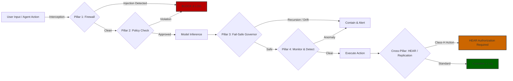

[](https://github.com/CyberStrategyInstitute/ai-safe2-framework/blob/main/assets/AI%20SAFE2%20Architecture.png)

<div align="center">

# AI SAFE² Framework v3.0

### The Universal GRC Standard for Agentic AI, Swarm Governance, and ISO 42001 Compliance

[](https://github.com/CyberStrategyInstitute/ai-safe2-framework/releases)
[](https://creativecommons.org/licenses/by-sa/4.0/)
[](https://github.com/CyberStrategyInstitute/ai-safe2-framework/blob/main/LICENSE)
[](https://cyberstrategyinstitute.com/ai-safe2/)
[](https://cyberstrategyinstitute.com/ai-safe2/)
[](https://github.com/CyberStrategyInstitute/ai-safe2-framework/graphs/commit-activity)

**[Why AI SAFE²](#-what-ai-safe-is-for)** · **[5-Min Start](#-start-securing-in-5-minutes)** · **[Architecture](#️-the-core-architecture)** · **[Examples](#-examples-sovereign-runtimes-in-the-wild)** · **[Challenge Lab](#-challenge-lab-falsification-before-claims)** · **[32 Frameworks](#️-the-universal-rosetta-stone--32-frameworks)** · **[Comparison](#-why-the-race-is-over-comparison-matrix)** · **[Get Toolkit](#-fast-track-implementation-the-toolkit)** · **[Dashboard](https://cyberstrategyinstitute.github.io/ai-safe2-framework/dashboard/)**

</div>

---

## The 10-Second Version

Your agents will misbehave in production. Not might. Will. A retrieval layer drifts, a memory write picks up a bad belief, a tool call escalates in a direction nobody modeled, and there's no code change to point to in the post-mortem because nothing "changed." It just executed exactly as built, and what was built had no governance contract.

**AI SAFE² is that contract.** 161 controls. 5 operational pillars plus a Cross-Pillar Governance Layer (CP.1-CP.10). Reverse-engineered from actual production failures and red-team findings, not written from a risk-landscape whitepaper. One implementation, mapped to 32 compliance frameworks simultaneously — NIST AI RMF, ISO 42001, OWASP AIVSS, MITRE ATLAS, EU AI Act, SOC 2, HIPAA, and more.

It is free, MIT + CC-BY-SA licensed, and it ships with working code: sovereign runtime defense packages for the agent stacks you're already running, an MCP security toolkit, and a scanner CLI. Not a PDF. A specification you can `pip install`.

<table>
<tr>
<th align="left">🧑‍💻 If you build agents, this gets you</th>
<th align="left">🛡️ If you govern risk, this gets you</th>
</tr>
<tr valign="top">
<td>

- Drop-in **sovereign runtime packages** for Claude Code, LangChain, LangGraph, CrewAI, AutoGen, Codex, Grok, Make.com, and more
- A **kill-switch and rollback pattern** you didn't have to design yourself
- MCP server hardening: `mcp-score`, `mcp-scan`, `mcp-safe-wrap` in one `pip install`
- A `skill.md` file that turns any Claude/Codex/Cursor session into a certified AI SAFE² architect
- Copy-paste controls, not a 40-page policy PDF

</td>
<td>

- A **single control set mapped to 32 frameworks** instead of running parallel governance programs
- **Named kill-switch authority** (HEAR Doctrine) and agent replication governance — coverage no other framework defines
- An **audit scorecard** with auto-calculated risk scores, board-ready
- A **60-minute implementation path**, not a 6-12 month GRC rollout
- Evidence generation baked into the control, not bolted on after

</td>
</tr>
</table>

> **What both sides get:** consistency, privacy, security, reliability, and predictability, so agentic AI delivers its intended outcome without silent failures, governance gaps, or a compliance surprise six months in.

### Get Governed in 60 Seconds

```bash
# MCP servers — score, scan, and wrap in one install
pip install aisafe2-mcp-tools

# Or drop the framework brain into any AI coding assistant
curl -O https://raw.githubusercontent.com/CyberStrategyInstitute/ai-safe2-framework/main/skill.md
```

Full onboarding paths by role are in **[Start Securing in 5 Minutes](#-start-securing-in-5-minutes)** below.

---

## 🎯 What AI SAFE² Is For

Every team building AI agents in production hits the same moment. An agent that worked correctly for weeks starts producing subtly wrong outputs. No code changed. No model was updated. The team spends days reconstructing what happened, only to discover that something in the retrieval layer shifted, a memory write accumulated the wrong belief across sessions, or a tool call escalated in a direction nobody had modeled. The execution was a black box. The post-mortem raises more questions than it answers.

### Why It Matters

The tools on the market each solve one layer. Runtime scanners block injections but generate no compliance evidence. Legacy GRC platforms govern employees and laptops; they have no concept of an autonomous agent, a swarm, or a non-human identity with its own permission lifecycle. General frameworks describe the risk landscape without specifying how to engineer the fix. What is missing in all of them is a governance contract: a formal specification of the complete operating envelope for agentic AI that defines what gets sanitized, what gets logged, how failures are contained, who holds the authority to stop a deployment when it needs to stop, and what evidence satisfies the audit.

### How AI SAFE² Addresses It

That is exactly what this framework is. AI SAFE² v3.0 is the engineering specification for agentic AI that happens to satisfy every major compliance requirement simultaneously, because it was built by reverse-engineering actual failure modes from production deployments, then defining the controls required to prevent them. Version 3.0 adds 23 new pillar controls grounded in validated red-team findings, bringing the total to **161 controls**, 151 across five operational pillars. It also introduces 10 cross-pillar governance controls that address what no other framework has yet touched: agent replication governance (the moment one agent can clone itself, four IAM assumptions collapse at once), named kill-switch authority for autonomous deployments, and the first integration of OWASP AIVSS v0.8 amplification scoring into a GRC risk formula.

---

## 🏗️ The Core Architecture

The framework is organized around **5 Operational Pillars** plus a **Cross-Pillar Governance Layer** introduced in v3.0. Together they form a complete operational contract covering every phase of agentic AI.

| Pillar | Role | Focus |
|---|---|---|
| **P1** | The Shield | Input validation, injection defense, memory governance, no-code platform security |
| **P2** | The Ledger | Full visibility, semantic execution tracing, model provenance, RAG diff tracking |
| **P3** | The Brakes | Recursion limits, swarm abort, behavioral drift rollback, cascade containment |
| **P4** | The Control Room | Adversarial detection, tool-misuse monitoring, cloud AI platform telemetry, HITL |
| **P5** | The Feedback Loop | Continuous adversarial evaluation, capability emergence review, red-team repositories |
| **CP** | The Governance OS | ACT tiers, control planes, agent replication governance, HEAR doctrine, catastrophic risk thresholds |

---

## 📂 Navigate the Framework

| Section | Link | What You'll Find |
|---|---|---|
| Pillar 1: Sanitize & Isolate | [01-sanitize-isolate/](https://github.com/CyberStrategyInstitute/ai-safe2-framework/blob/main/01-sanitize-isolate/README.md) | Input defense, injection coverage, memory governance, no-code security |
| Pillar 2: Audit & Inventory | [02-audit-inventory/](https://github.com/CyberStrategyInstitute/ai-safe2-framework/blob/main/02-audit-inventory/README.md) | Tracing, logging, model lineage, RAG integrity |
| Pillar 3: Fail-Safe & Recovery | [03-fail-safe-recovery/](https://github.com/CyberStrategyInstitute/ai-safe2-framework/blob/main/03-fail-safe-recovery/README.md) | Circuit breakers, recursion limits, rollback |
| Pillar 4: Engage & Monitor | [04-engage-monitor/](https://github.com/CyberStrategyInstitute/ai-safe2-framework/blob/main/04-engage-monitor/README.md) | Detection pipelines, HITL, platform monitoring |
| Pillar 5: Evolve & Educate | [05-evolve-educate/](https://github.com/CyberStrategyInstitute/ai-safe2-framework/blob/main/05-evolve-educate/README.md) | Adversarial evaluation, red-team artifacts |
| Cross-Pillar Governance | [00-cross-pillar/](https://github.com/CyberStrategyInstitute/ai-safe2-framework/blob/main/00-cross-pillar/README.md) | CP.1-CP.10: ACT tiers, HEAR doctrine, replication governance |
| AISM Layer | [AISM/](https://github.com/CyberStrategyInstitute/ai-safe2-framework/blob/main/AISM) | Governance, control mapping, operational oversight |
| Research Notes | [research/](https://github.com/CyberStrategyInstitute/ai-safe2-framework/blob/main/research) | Deep-dive evidence for all controls (001-014) |
| Challenge Lab | [challenges/](https://github.com/CyberStrategyInstitute/ai-safe2-framework/tree/main/challenges) | Open experiments that validate, limit, or invalidate control claims |
| Interactive Dashboard | [Launch Dashboard](https://cyberstrategyinstitute.github.io/ai-safe2-framework/dashboard/) | Search, filter, and explore all 161 controls live |

---

## 🧪 Examples: Sovereign Runtimes in the Wild

Every folder in [`examples/`](https://github.com/CyberStrategyInstitute/ai-safe2-framework/tree/main/examples) is a working implementation of AI SAFE² wrapped around a real agent stack. Not a code sample, a governed runtime you can drop in.

<!-- EXAMPLES:START -->
<!-- This table is auto-generated by scripts/generate_examples_table.py. Do not hand-edit between these markers; edit each example's README.md instead. -->

| Example | Stack | What It Governs |
|---|---|---|
| [`claude-code-sovereign-runtime/`](https://github.com/CyberStrategyInstitute/ai-safe2-framework/tree/main/examples/claude-code-sovereign-runtime) | Claude Code | Hardens agentic coding sessions against unsafe tool execution, scope creep, and drift |
| [`codex-sovereign-runtime/`](https://github.com/CyberStrategyInstitute/ai-safe2-framework/tree/main/examples/codex-sovereign-runtime) | OpenAI Codex | Runtime enforcement wrapper for Codex-driven coding agents |
| [`hermes-sovereign-runtime/`](https://github.com/CyberStrategyInstitute/ai-safe2-framework/tree/main/examples/hermes-sovereign-runtime) | NousResearch Hermes | Closes four critical audit findings identified in the Hermes agent |
| [`anti-gravity-sovereign-runtime/`](https://github.com/CyberStrategyInstitute/ai-safe2-framework/tree/main/examples/anti-gravity-sovereign-runtime) | Anti-Gravity | Sovereign runtime defense package for Anti-Gravity agent deployments |
| [`autogen-sovereign-runtime/`](https://github.com/CyberStrategyInstitute/ai-safe2-framework/tree/main/examples/autogen-sovereign-runtime) | Microsoft AutoGen | Governance wrapper for AutoGen multi-agent orchestration |
| [`crewai-sovereign-runtime/`](https://github.com/CyberStrategyInstitute/ai-safe2-framework/tree/main/examples/crewai-sovereign-runtime) | CrewAI | Governance wrapper for CrewAI crew-based orchestration |
| [`langchain-sovereign-runtime/`](https://github.com/CyberStrategyInstitute/ai-safe2-framework/tree/main/examples/langchain-sovereign-runtime) | LangChain | Runtime controls for LangChain chains and tool-calling agents |
| [`langflow-sovereign-runtime/`](https://github.com/CyberStrategyInstitute/ai-safe2-framework/tree/main/examples/langflow-sovereign-runtime) | Langflow | Sovereign runtime defense package for the Langflow visual builder |
| [`langgraph-sovereign-runtime/`](https://github.com/CyberStrategyInstitute/ai-safe2-framework/tree/main/examples/langgraph-sovereign-runtime) | LangGraph | Runtime controls for LangGraph stateful agent graphs |
| [`make-sovereign-runtime/`](https://github.com/CyberStrategyInstitute/ai-safe2-framework/tree/main/examples/make-sovereign-runtime) | Make.com | Sovereign runtime defense package for no-code automation scenarios |
| [`xai-grok-sovereign-runtime/`](https://github.com/CyberStrategyInstitute/ai-safe2-framework/tree/main/examples/xai-grok-sovereign-runtime) | xAI Grok | Sovereign runtime defense package for Grok-based agents |
| [`mcp-security-toolkit/`](https://github.com/CyberStrategyInstitute/ai-safe2-framework/tree/main/examples/mcp-security-toolkit) | MCP (protocol) | `mcp-score`, `mcp-scan`, `mcp-safe-wrap` — CP.5.MCP toolkit, 134 tests |
| [`openclaw/`](https://github.com/CyberStrategyInstitute/ai-safe2-framework/tree/main/examples/openclaw) | OpenClaw | Full two-layer governance stack: internal identity/memory files plus external scanner and gateway |
| [`ishi/`](https://github.com/CyberStrategyInstitute/ai-safe2-framework/tree/main/examples/ishi) | Supervisory agent | Reviews agent plans and enforces governance decisions before high-risk actions execute |
| [`slowmist-overlay/`](https://github.com/CyberStrategyInstitute/ai-safe2-framework/tree/main/examples/slowmist-overlay) | SlowMist | Threat-intel overlay integrating external audit findings into AI SAFE² controls |
| [`love_equation/`](https://github.com/CyberStrategyInstitute/ai-safe2-framework/tree/main/examples/love_equation) | Alignment research | Drift-scoring model adapted into AI SAFE² behavioral monitoring |

<!-- EXAMPLES:END -->

**New example dropped in `examples/` and the table above didn't update?** It's automated, not hand-maintained. See [Keeping This Table Alive](#-keeping-this-table-alive) below.

### 🔄 Keeping This Table Alive

This table regenerates itself. It does not rely on someone remembering to edit the README.

1. Every folder under `examples/*/` gets a `README.md` with a one-line description on the first line after the title (or an explicit `<!-- description: ... -->` comment near the top).
2. [`scripts/generate_examples_table.py`](https://github.com/CyberStrategyInstitute/ai-safe2-framework/blob/main/scripts/generate_examples_table.py) walks `examples/`, reads each folder's `README.md`, and rewrites everything between the `<!-- EXAMPLES:START -->` and `<!-- EXAMPLES:END -->` markers above.
3. [`.github/workflows/update-examples-readme.yml`](https://github.com/CyberStrategyInstitute/ai-safe2-framework/blob/main/.github/workflows/update-examples-readme.yml) runs that script on every push to `examples/**` and commits the updated README automatically. No PR review needed for the table itself, just for the example.

Add a new folder under `examples/`, give it a `README.md`, push it. The table updates on its own within the same CI run.

---

## 🧪 Challenge Lab: Falsification Before Claims

The [AI SAFE² Challenge Lab](https://github.com/CyberStrategyInstitute/ai-safe2-framework/tree/main/challenges) converts public incidents, evaluation findings, and credible agentic threats into reproducible experiments.

Controls receive credit only when an implementation changes observable security outcomes under pre-registered conditions. Every challenge includes credible baselines, explicit invalidation criteria, utility measures, evidence requirements, and an independent-replication path.

| Challenge | Primary question | Status |
|---|---|---|
| [001: Anthropic Multi-Agent Turf War](https://github.com/CyberStrategyInstitute/ai-safe2-framework/tree/main/challenges/001-anthropic-multi-agent-turf-war) | Can externally enforced authority stop destructive multi-agent conflict without blocking legitimate collaboration? | Design and pre-registration |

**The framework is the subject of the test, not the source of its own proof.**

---

## 🛡️ MCP Security Toolkit

Three open-source tools implementing AI SAFE2 v3.0 CP.5.MCP. One install. Works against any MCP server, yours or external.

```bash
pip install aisafe2-mcp-tools
```

| Tool | What it does |
|---|---|
| **`mcp-score`** | Remote black-box CP.5.MCP assessment — score any MCP HTTP server |
| **`mcp-scan`** | Static code analysis across the full MCP CVE taxonomy |
| **`mcp-safe-wrap`** | Consumer-side injection scanning and audit proxy |

→ [**examples/mcp-security-toolkit/**](https://github.com/CyberStrategyInstitute/ai-safe2-framework/blob/main/examples/mcp-security-toolkit) · 134 tests · badge system

---

## 🚀 Start Securing in 5 Minutes

**Don't wait for a breach. Choose your path and lock it down.**

> Download `skill.md` and upload it to Claude Projects > Project Knowledge. Your Claude instance becomes a certified AI SAFE² Architect immediately.

| I am a... | 🛠️ Your Action Plan | ⏱️ Time |
|---|---|---|
| **Developer / Engineer** | [Run the 5-Minute Audit](https://github.com/CyberStrategyInstitute/ai-safe2-framework/blob/main/QUICKSTART.md) | 5 min |
| **Python Builder** | [Secure Python Implementation](https://github.com/CyberStrategyInstitute/ai-safe2-framework/blob/main/guides/DEVELOPER_IMPLEMENTATION.md) | 15 min |
| **No-Code / Automation** | [Secure Make.com & n8n Workflows](https://github.com/CyberStrategyInstitute/ai-safe2-framework/blob/main/guides/NO_CODE_AUTOMATION.md) | 10 min |
| **CISO / Compliance** | [Get the Full GRC Toolkit](https://cyberstrategyinstitute.com/ai-safe2/) | Instant |

---

## 🤖 OpenClaw Integration — Real-World Agent Governance

> **New in v2.0:** The AI SAFE² OpenClaw Core File Standard ships 11 governance files that apply the full five-pillar model to a personal AI agent workspace. Drop them in, fill the placeholders, run the smoke test, and your agent is governed.

OpenClaw is the first widely-deployed, self-hosted autonomous agent with shell access, exactly the class of system AI SAFE² was designed to govern. The integration gives every OpenClaw operator a complete, auditable governance stack in under an afternoon.

### The Two-Layer Model

| Layer | What | Where |
|---|---|---|
| **Internal Governance** | 11 core files defining values, rules, memory, identity, and workspace policy | `examples/openclaw/core/` |
| **External Enforcement** | Scanner, gateway, v1 memory vaccine — infrastructure that wraps the agent | `examples/openclaw/` |

Both layers are required. Internal governance defines what the agent *intends* to do. External enforcement ensures nothing harmful *escapes* even if the agent is deceived.

**Quick Start:**

```bash
cp -r examples/openclaw/core/. ~/my-agent/
# Then open OPENCLAW-AGENT-TEMPLATE.md and follow the checklist
```

**Quick Start:** [10-Minute Hardening Guide](https://github.com/CyberStrategyInstitute/ai-safe2-framework/blob/main/guides/openclaw-hardening.md)

**Full Resources:** [examples/openclaw/](https://github.com/CyberStrategyInstitute/ai-safe2-framework/blob/main/examples/openclaw)

---

## 🏗️ 5-Layer Architectural Coverage

Most frameworks stop at the model. AI SAFE² v3.0 explicitly models and mandates controls across the **entire real-world stack**, securing the tools your developers actually use.

| Layer | Scope | Key Controls |
|---|---|---|
| **L1: Core Models** | LLMs, Fine-Tuned Weights | A2.3 Model Lineage Provenance Ledger |
| **L2: Data Infrastructure** | Vector DBs, RAG, Knowledge Bases | S1.5 Memory Governance + A2.6 RAG Corpus Diff Tracking |
| **L3: System Patterns** | MCP, A2A, API Integrations, Protocol Meshes | CP.5 Platform-Specific Profiles + P2.T3.10 Vuln Scanning |
| **L4: Agentic AI** | Swarms, Orchestration, n8n, LangGraph, CrewAI | F3.2-F3.5 Fail-Safe Suite + CP.9 Agent Replication Governance |
| **L5: Non-Human Identities** | Service Accounts, Agents, API Keys | CP.4 Agentic Control Plane + CP.10 HEAR Doctrine |

---

## 🏗️ The v3.0 Coverage Matrix

| Risk Domain | 🤖 Agentic Swarms | 🆔 Non-Human Identity | 🧠 Memory & RAG | 📦 Supply Chain | 🔄 Replication | ⚖️ Universal GRC |
|---|---|---|---|---|---|---|
| **P1: Sanitize & Isolate** | Isolation | Secret Hygiene | Memory Governance | Model Signing | 🔗 | ISO A.8.4 |
| **P2: Audit & Inventory** | Traceability | Discovery | RAG Diff | Provenance | Lineage | NIST MAP |
| **P3: Fail-Safe & Recovery** | Kill Switch | Revocation | Rollback | 🔗 | Cascade Block | ISO A.17 |
| **P4: Engage & Monitor** | Adversarial Monitoring | Behavior Monitoring | Integrity Monitoring | 🔗 | 🔗 | NIST Measure |
| **P5: Evolve & Educate** | Red Teaming | Credential Rotation | Model Updates | Specification Updates | 🔗 | Continuous Improvement |
| **Cross-Pillar (CP.1-CP.10)** | Swarm Governance | HEAR Doctrine | Cognitive Tags | Protocol Supply Chain | Agent Replication Governance | Cross-Pillar Controls |

> Legend: Dedicated Control (named cell) | Cross-Pillar Governance (CP row) | 🔗 = Inherited Coverage

---

### 🧠 The Logic Flow


```mermaid
graph LR;
    A[User Input / Agent Action] -->|Interception| B{Pillar 1: Firewall};
    B -- "Injection Detected" --> C[BLOCK & LOG];
    B -- "Clean" --> D{Pillar 2: Policy Check};
    D -- "Violation" --> C;
    D -- "Approved" --> E[Model Inference];
    E --> F{Pillar 3: Fail-Safe Governor};
    F -- "Recursion / Drift" --> G[Contain & Alert];
    F -- "Safe" --> H{Pillar 4: Monitor & Detect};
    H -- "Anomaly" --> G;
    H -- "Clear" --> I[Execute Action];
    I --> J{Cross-Pillar: HEAR / Replication};
    J -- "Class-H Action" --> K[HEAR Authorization Required];
    J -- "Standard" --> L[Complete + Log];

style C fill:#B80000,stroke:#333,stroke-width:2px;
style L fill:#006400,stroke:#333,stroke-width:2px;
style K fill:#cc6600,stroke:#333,stroke-width:2px;
```

---

## 🎯 Interactive Dashboard

**Explore all 161 AI SAFE² controls through our live, interactive taxonomy explorer.**

### 👉 **[Launch Dashboard](https://cyberstrategyinstitute.github.io/ai-safe2-framework/dashboard/)** 👈

**Features:**

- 🔍 Real-time search across all control metadata
- 🎨 Pillar-based filtering for strategic domain focus
- 📊 Risk-level visualization (Critical, High, Medium, Low)
- 💼 Executive summaries with business impact statements
- 🏷️ Framework mappings to all 32 compliance standards
- 🆕 v3.0 highlights including CP.1-CP.10 Cross-Pillar controls
- 📱 Responsive design optimized for all devices

---

## 🏛️ The "Universal Rosetta Stone" — 32 Frameworks

A single AI SAFE² v3.0 implementation satisfies the requirements of all 32 frameworks simultaneously, eliminating the need for fragmented governance initiatives.

### AI-Specific Frameworks

| Standard | Coverage | Key Mapping |
|---|---|---|
| **NIST AI RMF 1.0 / 2.0** | **100%** | GOVERN: CP.3, CP.4, CP.8 / MAP: A2.3, A2.4 / MEASURE: M4.x, E5.1 / MANAGE: F3.x |
| **ISO/IEC 42001:2023** | **100%** | Sec 8.1: P1 / Sec 8.2: P2 / Sec 8.3: P4 / Sec 8.4: P5 / Sec 9: CP.6 |
| **OWASP AIVSS v0.8** | **100% (NEW)** | All 10 core risks + AAF scoring formula integrated — first framework to do this |
| **OWASP Top 10 LLM** | **100%** | LLM01-LLM10 all mapped including new agentic variants |
| **OWASP Agentic Top 10 (ASI)** | **100% (NEW)** | ASI01-ASI10; CP.9 uniquely addresses ASI03 Identity Abuse; CP.10 addresses ASI09 |
| **MITRE ATLAS (Oct 2025)** | **100%** | All 14 new agent-specific techniques fully mapped |
| **MIT AI Risk Repository v4** | **100%** | 7 domains, catastrophic risk pathways (CP.8), CBRN risks |
| **Google SAIF** | **97%** | Exceeds SAIF in swarm security, NHI governance, and memory poisoning |
| **CSA Agentic Control Plane** | **85%** | CP.4 covers identity, authorization, orchestration, and runtime trust |
| **CSA Zero Trust for LLMs (NEW)** | **90%** | S1.3 micro-perimeter per agent, CP.4 policy-as-code, A2.5 output trace |
| **MAESTRO (CSA 7-Layer)** | **95%** | Layers 1-7 fully covered via pillars and CP controls |
| **Arcanum PI Taxonomy** | **95%** | Evasion techniques in P1.T1.2, indirect injection in P1.T1.10, cognitive layer S1.6 |
| **AIDEFEND (7 Tactics)** | **90%** | Deceive tactic (CP.7), Evict (F3.5), Harden shift-left (S1.4) |
| **AIID Agentic Incidents** | **90%** | CP.6 incident feedback loop; M4.8 platform monitoring |
| **EU AI Act (2024)** | **Aligned** | High-risk AI: CP.3 / GPAI: A2.3 / Transparency: A2.5 / Human oversight: CP.10 |
| **International AI Safety Report 2026 (NEW)** | **Aligned** | Catastrophic risk: CP.8 / Loss of control: F3.2-F3.5 / Evaluation: E5.1-E5.4 |
| **CSETv1 Harm** | **92%** | All 8 harm types including physical safety, financial loss, and democratic norms |

### Enterprise Compliance Frameworks

| Standard | Coverage | Key Mapping |
|---|---|---|
| **HIPAA** | **Aligned+** | P1.T1.5 PHI masking / P3.T6 disaster recovery §164.308 / S1.5 cross-session PHI |
| **PCI-DSS v4.0** | **Aligned+** | P1.T1.5 PAN masking / P1.T2 network segmentation Req 1.3 / M4.8 cloud AI Req 6.4 |
| **SOC 2 Type II** | **Aligned+** | CC.6.1-6.6: P1.T2, CP.4 / CC.7.x: P4, M4.x / C.1: S1.5 / CC.7.4: CP.10 HEAR |
| **ISO 27001:2022** | **Aligned+** | A.5.15 access: P1.T2 / A.8.8 vuln mgmt: M4.8 / A.12.4 logging: A2.5 |
| **NIST CSF 2.0** | **Aligned+** | GOVERN: CP.x / IDENTIFY: P2 / PROTECT: P1 / DETECT: P4 / RESPOND: P3 + CP.6 |
| **NIST SP 800-53 Rev 5** | **Aligned+** | AC: P1.T2, CP.4 / AU: P2.T3, A2.5 / IR: CP.6, F3.x / RA: CP.2, CP.3 |
| **FedRAMP** | **Aligned+** | High baseline: full ACT-3/ACT-4 controls / S1.7 for no-code interconnections |
| **CMMC 2.0** | **Aligned+** | Level 1: P1-P2 / Level 2: P1-P5 + CP.3-CP.4 / Level 3: E5.x + CP.8 |
| **CIS Controls v8** | **Aligned+** | CIS-1: A2.4 / CIS-3: S1.5 / CIS-6: CP.4 / CIS-8: A2.5 / CIS-17: CP.6 |
| **GDPR** | **Aligned+** | Art.22 automated decisions: E5.2 + P4.T7 / Art.25 design: S1.5 / Art.33: CP.6 |
| **CCPA / CPRA** | **Aligned+** | P1.T1.5 PII in AI inputs / S1.5 cross-session memory / M4.6 decision bias |
| **SEC Cyber Disclosure** | **Aligned+** | Material incident: CP.6 IICR / Board accountability: CP.3, CP.4, CP.10 |
| **DORA** | **Aligned+** | ICT risk: CP.2 / Incident reporting: CP.6 / Resilience testing: E5.1 |
| **CVE / CVSS** | **Integrated** | Combined Risk Score: `CVSS + (100 - Pillar Score) / 10 + (AAF / 10)` |
| **Zero Trust** | **Native** | Built on "Never Trust, Always Verify" for Non-Human Identities |

### 🧠 Architectural Insights

- **OWASP AIVSS v0.8:** AI SAFE² v3.0 is the first framework to integrate all 10 core agentic risks and the AAF amplification factor into a composite GRC risk formula.
- **OWASP Agentic Top 10:** CP.9 (Agent Replication Governance) and CP.10 (HEAR Doctrine) address ASI03 and ASI09, controls no other framework currently provides.
- **CVE/CVSS Integration:** Unlike static frameworks, AI SAFE² uses technical vulnerability scores adjusted for agentic deployment context. A CVSS 7.5 in an ACT-4 orchestrator with high AAF is a materially different risk than CVSS 7.5 in an ACT-1 read-only agent.
- **Foundational Security:** ISO 27001 and NIST CSF are treated as the general security foundation, with the AI-specific SAFE² pillars mapping directly into standard enterprise operations.

---

## 🆚 Why The Race Is Over (Comparison Matrix)

| Feature / Capability | **AI SAFE² v3.0 (The OS)** | **Legacy GRC** | **AI Point Tools** |
|---|---|---|---|
| **Universal Mapping** | ✅ 32 frameworks, one implementation | ⚠️ Strong on SOC2, zero agentic coverage | ❌ No compliance evidence |
| **Agentic Awareness** | ✅ Native: swarms, loops, orchestration | ❌ Treats AI as generic software | ⚠️ LLM I/O only |
| **Agent Replication Governance** | ✅ CP.9 — first in any framework | ❌ Not defined | ❌ Not defined |
| **Named Kill-Switch Authority** | ✅ CP.10 HEAR Doctrine | ❌ No individual accountability | ❌ No process defined |
| **AIVSS Scoring Integrated** | ✅ AAF in risk formula — first | ❌ None | ❌ None |
| **Active Deception Defense** | ✅ CP.7 canary tokens + honeypots | ❌ None | ❌ None |
| **No-Code Platform Security** | ✅ S1.7 — first, CVE-2026-25049 covered | ❌ None | ❌ None |
| **Non-Human Identity** | ✅ First-class citizen with lifecycle | ❌ Human SSO only | ⚠️ Secret scanning only |
| **Memory & RAG Governance** | ✅ Full lifecycle controls | ❌ Zero coverage | ⚠️ Input filtering only |
| **Implementation** | ✅ 60 minutes with Toolkit | ❌ 6-12 months | ❌ Code integration first |

> **The Verdict:** You can keep looking for a tool that catches up to AI SAFE², or you can adopt the standard that defined the race.

---

## 🚀 Fast-Track Implementation (The Toolkit)

This repository contains the definitions (the "What"). To operationalize this in an enterprise (the "How"), use the Implementation Toolkit.

| Asset | Description | Access |
|---|---|---|
| **Framework Taxonomy** | Full Markdown definitions of all 151 controls across 5 pillars + 10 cross-pillar governance controls (CP.1-CP.10) | ✅ Free (This Repo) |
| **161-Point Audit Scorecard** | Excel calculator with auto-calculated risk scores including the v3.0 AAF formula | 🔒 [Get Toolkit](https://cyberstrategyinstitute.com/ai-safe2/) |
| **Enterprise Governance Policy** | Word template with ACT tier assignments, HEAR designation, and CP.9 replication language | 🔒 [Get Toolkit](https://cyberstrategyinstitute.com/ai-safe2/) |
| **AI SAFE² v3.0 Framework Document** | Complete framework with all 161 controls, cross-pillar governance, and 32-framework crosswalk | 🔒 [Get Toolkit](https://cyberstrategyinstitute.com/ai-safe2/) |
| **Vendor Risk Questionnaire** | Updated for v3.0 protocol-layer supply chain assessment (CP.5) | 🔒 [Get Toolkit](https://cyberstrategyinstitute.com/ai-safe2/) |
| **30-Day Implementation Roadmap** | Week-by-week path from greenfield or v2.1 to full v3.0 compliance | 🔒 [Get Toolkit](https://cyberstrategyinstitute.com/ai-safe2/) |
| **Risk Command Center Dashboard** | Interactive v3.0 scorecard with ACT tier visualization and board-ready exports | 🔒 [Get Toolkit](https://cyberstrategyinstitute.com/ai-safe2/) |

**[Download the Toolkit →](https://cyberstrategyinstitute.com/ai-safe2/)**

*Consultants charge $5,000-$15,000 for equivalent implementation work. One time. $97.*

---

## 📈 Framework Evolution

AI SAFE² is a living standard that adapts to the threat landscape.

| Version | Focus | Key Additions | Controls |
|---|---|---|---|
| **v3.0** | Swarm Governance + Production Evidence | 23 new pillar controls, 10 cross-pillar governance controls (CP.1-CP.10), AIVSS scoring integration, HEAR Doctrine, Agent Replication Governance | **161** |
| **v2.1** | Agentic & Distributed | NHI governance, swarm controls, memory vaccine, OpenSSF OMS | **128** |
| **v2.0** | Enterprise Operations | NIST/ISO mapping | **99** |
| **v1.0** | Foundational Concepts | 10 core topics | **10** |

👉 **[Read the Full Evolution History & Changelog](https://github.com/CyberStrategyInstitute/ai-safe2-framework/blob/main/EVOLUTION.md)**

---

## 📂 Repository Structure

```
/
├── .github/                   # CI/CD Workflows & Dependabot Config
├── 00-cross-pillar/           # Governance OS: CP.1-CP.10 (ACT Tiers, HEAR Doctrine, Replication)
├── 01-sanitize-isolate/       # Pillar 1: Input Filters & Boundaries
├── 02-audit-inventory/        # Pillar 2: Logging & Asset Tracking
├── 03-fail-safe-recovery/     # Pillar 3: Circuit Breakers & Kill Switches
├── 04-engage-monitor/         # Pillar 4: Human-in-the-Loop
├── 05-evolve-educate/         # Pillar 5: Red Teaming & Updates
├── AISM/                      # AI Security Management Layer: Governance, Control Mapping, Operational Oversight
├── FORGE-Act/                 # The American Marshall Plan for AI economic engine in all 435 congressional districts
├── assets/                    # Visual Maps, Badges & Diagrams
├── config/                    # Security Configurations (default.yaml)
├── examples/                  # 🧪 Real-world usage examples (see Examples section above)
├── challenges/                # 🧪 Open falsification and replication experiments
├── gateway/                   # 🛡️ The AI SAFE² Gateway (Runtime Enforcement Layer)
├── guides/                    # 📚 Implementation Guides (Python & No-Code)
├── research/                  # 🧠 Threat Intelligence & Deep Dive Evidence (001-014)
├── resources/                 # Community Tools & Checklists
├── scanner/                   # 🕵️ The Audit Scanner CLI (Assessment Engine)
├── scripts/                   # ⚙️ Repo automation, including generate_examples_table.py
├── ADVANCED_AGENT_THREATS.md  # Guide: Swarm & RAG Vulnerabilities
├── Dockerfile                 # Gateway Build Instruction
├── INTEGRATIONS.md            # 🔌 Ecosystem Map (Cursor, n8n, CI/CD)
├── QUICKSTART_5_MIN.md        # ⚡ START HERE: 5-Minute Audit
├── docker-compose.yml         # Container Orchestration
├── pyproject.toml             # Python Dependencies
├── README.md                  # The Universal GRC Standard (You are here)
└── skill.md                   # 🧠 The Brain (Context for AI Agents/IDEs)
```

---

## 🤝 Join the Vanguard (Community)

This isn't just a repo, it's a mission. We recognize and reward the top 1% of security engineers who contribute to the standard.

- **⭐ Star the Repo:** Unlock the "Supporter" role
- **💡 Contribute:** Submit a PR to earn "Contributor" status
- **🏆 The Vanguard:** Earn Priority Beta Access to **Agentic Shield (SaaS)** by helping harden the framework

[**Read the Vanguard Program Details**](https://github.com/CyberStrategyInstitute/ai-safe2-framework/blob/main/VANGUARD_PROGRAM.md)

---

## 🧠 Companion Framework: Cognitive Sovereignty Framework (CSF)

AI SAFE² secures the AI system. It does not secure the human operating it.

An operator who has experienced sufficient attention capture, cognitive offloading, or decision automation capture can be fully compromised — regardless of how well-hardened their AI infrastructure is. The AI system is secure. The human operating it is not. This is the gap AI SAFE² was designed to acknowledge but not address.

That gap now has a companion framework.

| | AI SAFE² | CSF |
|---|---|---|
| **Layer** | Machine | Human |
| **Defends** | The AI system | The human operator |
| **Governs** | The tool | The capacity to govern the tool |
| **Prevents** | Prompt injection, data leakage, unsafe autonomy | Cognitive offloading, attention capture, decision automation capture, identity fragmentation |
| **Ensures** | AI stays in its lane | The human stays capable of defining the lane |

**The shared principle:** Both frameworks enforce the same core commitment — AI is always a tool, never a moral agent. Human authority is non-negotiable. AI SAFE²'s runtime governors enforce this at the technical layer. The CSF's E7 Protocol Stack enforces it as an architectural guarantee at the human-AI system layer.

**If you are an AI SAFE² user:**
- Review the [CSF Six-Domain Assessment](https://cyberstrategyinstitute.github.io/cognitive-sovereignty/#six-domains) alongside your existing AI SAFE² implementation. Domain 6 (Digital & AI Symbiosis) is the direct human-layer complement to your AI governance work.
- Substrate threats in the CSF taxonomy — particularly ST-003 (Cognitive Offloading) and ST-006 (Guardrail Alignment Drift) — require human behavioral interventions that no technical control can substitute for.
- Use the [live CTSS Calculator](https://cyberstrategyinstitute.github.io/cognitive-sovereignty/csf-explorer.html) to score the cognitive threat posture of your operating environment alongside your AI SAFE² risk assessments.

> **Neither framework is sufficient without the other. AI SAFE² without CSF secures the tool while the operator degrades. CSF without AI SAFE² builds human resilience while the AI infrastructure remains exploitable.**

→ **[CSF Learning Hub](https://cyberstrategyinstitute.github.io/cognitive-sovereignty/)** — What it is, why it exists, how to use it  
→ **[Threat Explorer](https://cyberstrategyinstitute.github.io/cognitive-sovereignty/csf-explorer.html)** — Interactive taxonomy, CTSS scoring, swarm threat phases, human outcome indicators  
→ **[Command Center](https://cyberstrategyinstitute.github.io/cognitive-sovereignty/csf-command-center.html)** — Full framework in a single operational dashboard  
→ **[Full Repository](https://github.com/CyberStrategyInstitute/cognitive-sovereignty)** — Source files, taxonomy registry, assessment templates

---

## ✏️ Citation

```bibtex
@misc{aisafe2_framework,
  title = {AI SAFE² Framework v3.0: The Universal GRC Standard for Agentic AI},
  author = {Sullivan, Vincent and {Cyber Strategy Institute}},
  year = {2026},
  publisher = {Cyber Strategy Institute},
  url = {https://github.com/CyberStrategyInstitute/ai-safe2-framework},
  note = {Version 3.0. Swarm Governance and Production Evidence Edition. 161 Controls, 32 Frameworks.}
}
```

## Star History

[](https://www.star-history.com/?repos=CyberStrategyInstitute%2Fai-safe2-framework&type=date&legend=top-left)

---

## ⚖️ Licensing & Usage Rights

**Code (MIT License):** Applies to MCP Server scripts, JSON schemas, HTML dashboards, and code snippets. Use commercially, modify freely, close-source your modifications.

**Framework/Docs (CC-BY-SA 4.0):** Applies to the AI SAFE² methodology text, pillar definitions, and PDF manuals. Share with attribution; public derivatives must share back under this same license.

Managed by [Cyber Strategy Institute](https://cyberstrategyinstitute.com).
Copyright © 2025-2026. All Rights Reserved.

</div>
