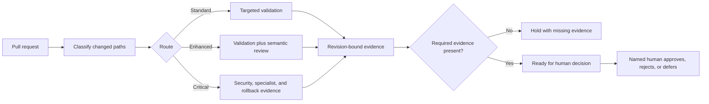

# AI SAFE2 Developer Workflow

Version: 0.1.0 contract preview

Minimum AI SAFE2 CLI: 1.0.1

AI SAFE2 Developer Workflow gives a software repository a visible,
provider-neutral decision process for pull requests and releases. It determines
what evidence a change needs, records what was actually produced for the exact
revision, and preserves the decision for the human who chooses whether to
merge or release.

It does not replace Claude, Codex, Superpowers, tests, scanners, or human
review. It gives those tools a common evidence contract and prevents silence,
provider failure, or a green wrapper from becoming approval.

## What changes after installation

| Before | With the contract preview installed |
|---|---|
| Every change can receive the same review | Changes route to `standard`, `enhanced`, or `critical` requirements |
| Test and reviewer output is scattered | Evidence has a common status, producer, capability, and revision |
| A successful job can hide an absent review | `failed`, `unavailable`, and `not_requested` cannot satisfy required evidence |
| AI tools can appear to be decision-makers | Tools observe or recommend; a named human retains approval authority |
| Switching providers changes the process | Claude, Codex, scanners, and later adapters can change behind stable contracts |
| Review history explains what ran, not why | The route, evidence requirements, limitations, and human decision can be replayed |

This preview establishes that structure. Automatic collection of every CI and
review result is follow-on work; until an evidence bridge is configured,
decision records correctly remain at `hold`.

## The workflow at a glance



The workflow may prepare a decision. It cannot authorize one.

## What you receive

- stable adapter, evidence-envelope, decision-record, and workflow contracts;
- deterministic standard, enhanced, and critical change routes;
- a ready-to-customize game-development profile;
- a read-only starter GitHub workflow that emits a replayable route artifact;
- shared Claude and Codex repository instructions without replacing either
  provider's configuration;
- revision-bound evidence evaluation that can only reach
  `ready_for_human_decision`;
- an installation-explanation generator for the adopting repository;
- manifests and boundaries for deterministic tools, AI reviewers, security
  reviewers, runtime systems, MCP Pro, Agency Check, Sovereign Runtime, and
  Drift/Love Equation integrations;
- an upstream dependency policy that favors pinned, isolated upgrades.

Provider execution remains opt-in. Installing this pack does not call an
external model, add credentials, or change Claude or Codex settings.

## Choose the rigor your repository needs

The base package is intentionally small. Add modules according to the outcome
and risk boundary, not because every tool exists.

| Goal | Suggested module | What it contributes | Preview status |
|---|---|---|---|
| Consistent implementation planning and debugging | Superpowers methods | Brainstorming, plans, test-first work, debugging, verification | Optional external method |
| Contextual code-quality review | Codex or Claude code review | Semantic findings and a second engineering perspective | Adapter contract; execution is not bundled |
| Security-sensitive change review | Codex Security or Claude security review | Diff-focused vulnerability analysis and threat-boundary review | Adapter contract; execution is not bundled |
| Deterministic vulnerability and quality checks | CodeQL, Semgrep, Gitleaks, tests | Repeatable findings suitable for merge gates | External tools; normalize their output |
| Strategic integration or release review | Greptile or another reviewer | Selective repository-context review at major integration points | Optional advisory integration |
| Runtime authority and tool-call enforcement | NEXUS or another implementation | Enforcement evidence beyond source review | Separate runtime surface |
| Human-readable action review | Agency Check | Translates evidence into a bounded human decision card | Separate product surface |

The table is a decision menu, not a claim that every integration executes in
this preview. See [Adoption and capability guide](docs/ADOPTION-GUIDE.md).

## Repository structure

```text
developer-workflow/
├── README.md                         Start here
├── profiles/                         Reusable domain routing profiles
├── schemas/                          Stable adapter, evidence, and decision contracts
├── scripts/                          Classify, validate, build, evaluate, explain
├── adapters/                         Integration registry and declared boundaries
├── repository-template/
│   ├── .ai-safe2/                    Repository policy and selected profile
│   ├── .github/                      PR template and read-only route workflow
│   ├── AGENTS.md                     Provider-neutral/Codex instructions
│   ├── CLAUDE.md                     Claude entry point to the same policy
│   └── scripts/                      Self-contained repository tools
├── tests/                            Contract and adversarial regression tests
└── docs/                             Architecture, adoption, integrations, gaps, releases
```

An adopting repository should vendor only the files it needs, record the
upstream commit and local adaptations, and update through reviewed pull
requests. It does not need to copy the AI SAFE2 framework content.

## Five-minute game-developer setup

1. Install and verify AI SAFE2 in an isolated environment:

   ```console
   python -m pip install "ai-safe2[all]==1.0.1"
   safe2 --version
   safe2 self-check --strict
   ```

2. Copy `repository-template/` into the game repository.
3. Copy or adapt `profiles/game.json` as `.ai-safe2/profiles/game.json`.
4. Replace repository owners and example commands with real values.
5. Validate and generate the repository-specific explanation:

   ```console
   python scripts/validate_workflow.py --root .
   python scripts/explain_workflow.py \
     --workflow .ai-safe2/workflow.json \
     --profile .ai-safe2/profiles/game.json \
     --output AI-SAFE2-DEVELOPER-WORKFLOW.md
   ```

6. Read the generated explanation, confirm the paths and required evidence,
   then open a setup pull request. Claude and Codex continue to work as they
   did before.

See [Game Developer Quickstart](docs/GAME-DEVELOPER-QUICKSTART.md) and
[Contract semantics](docs/CONTRACTS.md).

## Decision and provider states

The workflow never converts silence into success:

- `produced`: expected evidence exists for the exact subject revision;
- `unavailable`: the provider could not be reached or used;
- `failed`: the provider ran but did not complete correctly;
- `not_requested`: policy did not require the provider;
- `hold`: evidence or human judgment is still required;
- `ready_for_human_decision`: required evidence is present, but no merge or
  release has been authorized.

## Product boundary

```text
AI SAFE2 Core
  policy + evidence + decision state + provenance + replay contracts

Surfaces
  CLI | NEXUS | Skills | MCP | SDK/API

Product workflows
  Developer Workflow | MCP Pro | Agency Check | future domain workflows

Replaceable modules
  profiles | methods | reviewers | scanners | runtime adapters
```

The CLI is the supported operator and CI interface to AI SAFE2 Core. It is not
the architectural core. See [Architecture](docs/ARCHITECTURE.md).

## Benefits and tradeoffs

**Benefits:** proportionate review, truthful provider states, reduced provider
lock-in, revision-bound evidence, inspectable authority, and a clearer path to
stronger planning or security when the repository needs it.

**Tradeoffs:** teams must define real critical paths, maintain pins, map their
checks to capabilities, and keep a human decision owner. More rigorous routes
can add time and cost. The preview does not automatically make a repository
secure, compliant, or release-ready.

## Release status

Version 0.1.0 is a stable contract preview for controlled adoption. It does not
claim automatic provider execution, automatic certification, or independent
validation. See [Current State and Release Gap](docs/CURRENT-STATE-AND-GAPS.md).
