# Adoption and capability guide

## The outcome

AI SAFE2 Developer Workflow changes a repository from a collection of checks
into an evidence-led human decision process. It answers five questions for each
governed change:

1. What changed, and which trust boundaries might it affect?
2. How much review does policy require?
3. Which evidence was actually produced for this exact revision?
4. What is missing, failed, unavailable, or stale?
5. Who made the final decision, with what rationale?

It does not answer “is this safe?” with an unsupported yes. It preserves the
facts, limitations, and decision boundary.

## Before and after

```mermaid
flowchart TB
    subgraph Before[Typical repository]
        B1[PR opened] --> B2[Same checks run]
        B2 --> B3[Outputs in separate tools]
        B3 --> B4[Green can mean ran, skipped, or unavailable]
        B4 --> B5[Human reconstructs context manually]
    end

    subgraph After[AI SAFE2 Developer Workflow]
        A1[PR opened] --> A2[Deterministic risk route]
        A2 --> A3[Capability requirements]
        A3 --> A4[Revision-bound evidence]
        A4 --> A5[Hold or ready for human decision]
        A5 --> A6[Attributable human record]
    end
```

## Adoption levels

### Level 1: Decision structure

Install the profile, policy, schemas, classifier, validator, and agent
instructions. Every PR receives a deterministic route and a decision-record
skeleton. This is what the contract preview delivers directly.

### Level 2: Deterministic evidence

Map existing unit tests, integration tests, linters, CodeQL, Semgrep, Gitleaks,
builds, and smoke tests into evidence envelopes. These are the strongest
candidates for required merge gates because their completion criteria are
defined and repeatable.

The general-purpose CI evidence bridge is not bundled in v0.1.0. Until it is
implemented, evidence must be attached by repository-specific automation or a
human and the decision remains `hold`.

### Level 3: Development methods

Add Superpowers or another structured method when the team needs better
problem framing, planning, test-first implementation, debugging, or completion
verification. Methods shape how work is done. They do not satisfy security or
release evidence by themselves.

### Level 4: Semantic and security reviewers

Enable Codex, Claude, Codex Security, Claude security review, PR-Agent,
Greptile, or other providers through bounded adapters. Record the provider,
version, data boundary, reviewed scope, result, limitations, and availability.

AI reviewers remain advisory unless an existing human-owned policy explicitly
uses a deterministic result as an enforcement input. Provider failure is never
approval.

### Level 5: Runtime evidence

For agentic systems, connect NEXUS, MCP controls, Sovereign Runtime, or another
runtime implementation. Source review cannot prove that identity, delegation,
tool calls, receipts, rollback, or stopping authority behaved correctly in the
deployed environment.

## Choosing optional modules

| Repository goal | Start with | Add when |
|---|---|---|
| Small application with low-impact releases | Standard routing and deterministic tests | Enhanced review when public APIs, data, or deployment behavior changes |
| Mobile application | Mobile profile, privacy, signing, permissions, API compatibility | Security review for auth, payments, storage, telemetry, or release automation |
| Game | Game profile, save/economy/authority/performance tests | Critical review for multiplayer authority, purchases, signing, or migrations |
| API or service | API profile, schema compatibility, authz, migration, rollback evidence | Security review for identity, secrets, tenant isolation, or infrastructure |
| Agent or MCP system | Agent/MCP profile, tool-surface and prompt-injection tests | Runtime receipts and enforcement when tools or delegated authority are enabled |
| Major integration or release | Compare prior and current evidence | Strategic reviewer and named specialist for cross-cutting risk |

Only the game profile ships in v0.1.0. Other profiles in this table describe
the intended modular structure, not delivered files.

## What installation does not do

- It does not change provider credentials, models, hooks, or MCP servers.
- It does not enable Codex, Claude, Greptile, or another external reviewer.
- It does not infer that a missing check passed.
- It does not make a compliance or certification determination.
- It does not merge, release, deploy, accept risk, or alter policy.
- It does not automatically discover upstream updates.

## Extending safely

1. Add a domain profile rather than editing core contracts.
2. Add a method module for planning or implementation behavior.
3. Add an adapter for a reviewer, scanner, or runtime producer.
4. Normalize its output into an evidence envelope.
5. Add hostile fixtures for timeout, stale revision, empty success, malformed
   output, and provider unavailability.
6. Pin the dependency and update it in an isolated pull request.
7. Keep authorization with a named human.

## What good adoption evidence looks like

An adoption is demonstrated when a real pull request:

- routes as expected for the changed paths;
- records the exact commit and policy version;
- preserves failed and unavailable providers truthfully;
- lists missing required capabilities;
- reaches `ready_for_human_decision` only when every requirement has produced
  evidence for that revision;
- records the final human decision separately.

A green installation check proves configuration and contract behavior. It does
not prove that every reviewer ran or that the application is secure.
