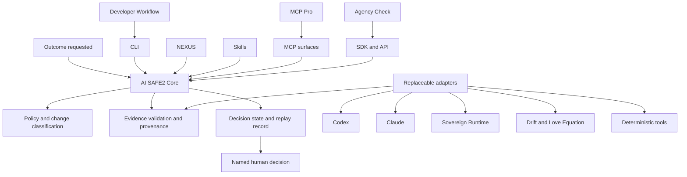

# Architecture

## Architectural decision

AI SAFE2 Core is the policy, evidence, provenance, and decision engine. The CLI
is one interface to that core. NEXUS, Skills, MCP, SDKs, and product workflows
are other interfaces or deployment surfaces.

## Stable core contracts

The first release stabilizes four contracts:

1. **Subject:** repository, revision, scope, and change class.
2. **Evidence:** producer, execution state, observations, findings,
   limitations, provenance, and artifacts.
3. **Adapter:** capability, data boundary, permissions, output schema, and
   upgrade policy.
4. **Decision record:** required evidence, observed evidence, unresolved risk,
   human authority, and replay inputs.

Providers may change without changing these contracts. Additive schema fields
are permitted within v1. Removing or changing the meaning of a required field
requires a new major schema version.

## Product surfaces

### Developer Workflow

For software teams. It classifies changes, invokes proportionate engineering
and security controls, and prepares evidence for merge or release decisions.

### MCP Pro

For builders and security teams operating inside Claude Code, Cursor, Codex,
and other MCP-capable tools. It exposes governance and implementation-review
capabilities at the execution boundary. The public product page describes free
and paid capabilities; this repository does not duplicate entitlement logic.

### Agency Check

For people making everyday decisions with an agent. It translates the same
evidence discipline into one Decision Card with `ready_to_review`,
`clarify_one_thing`, or `pause_and_verify`. It is advisory and never labels an
action safe or authorizes the action.

Agency Check is planned to live at `agency-check.app`. The domain is a
deployment endpoint, not a dependency of AI SAFE2 Core.

## Adapter boundary

Adapters observe or translate. They do not inherit authority from the core.
Every adapter declares:

- capabilities and supported subject types;
- whether source or evidence leaves the local boundary;
- permissions and secrets required;
- normalized output contract;
- version pin and upgrade policy;
- failure behavior;
- whether it observes, recommends, enforces existing policy, or authorizes.

Version 0.1 permits `observe` and `recommend`. No bundled adapter may
`authorize` merge, release, deployment, purchase, message, booking, or risk
acceptance.

## Superpowers boundary

Superpowers is an optional development-method module. It improves how an agent
brainstorms, plans, isolates work, tests, debugs, requests review, and verifies
completion. AI SAFE2 determines which evidence is required and whether the
result supports a human decision. The project links to Superpowers rather than
copying its skill text.

## Compatibility rule

Claude and Codex instructions remain separate, thin entry points over the same
repository policy:

- `AGENTS.md` supplies provider-neutral and Codex-compatible instructions.
- `CLAUDE.md` points Claude to the same policy and evidence contracts.
- neither file changes the developer's model, login, hooks, MCP configuration,
  or provider secrets;
- provider adapters can be enabled, disabled, or upgraded independently.

