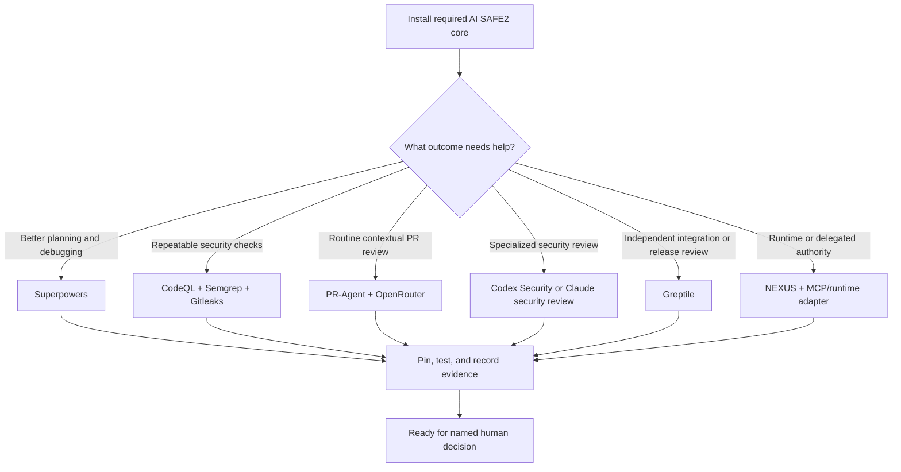

# Tool setup and capability selection

This is the new-user path for adding tools to AI SAFE2 Developer Workflow.
Install the required core first, then add only the capabilities that match the
repository's goals and trust boundaries.

A tool named in `adapters/manifests.json` is discoverable, not automatically
installed: a manifest is not execution. Setup is complete only when the tool
produces verified evidence for the exact pull-request revision.

## The setup decision



## Step 1 — Install the required core

Every adoption starts here. Optional tools supplement this layer; they do not
replace it.

1. Install and verify the pinned CLI in an isolated environment:

   ```console
   python -m pip install "ai-safe2[all]==1.0.1"
   safe2 --version
   safe2 self-check --strict
   ```

2. Copy `repository-template/` into the adopting repository.
3. Replace every `REPLACE-*` value in `.ai-safe2/` and the PR template.
4. Adapt the profile's critical and enhanced paths to the real repository.
5. Validate the installation:

   ```console
   python scripts/validate_workflow.py --root .
   ```

6. Open a setup PR and confirm that documentation-only, normal code, and one
   critical-path fixture choose the expected routes.
7. Confirm the CLI decision result and human decision record name the exact
   candidate revision. They must remain at `hold` while required evidence is
   absent.

## Step 2 — Generate a goal-based setup plan

The repository template includes a setup assistant. It asks about outcomes,
not vendors, and writes a reviewable plan without changing external systems.

```console
python scripts/setup_assistant.py \
  --interactive \
  --output AI-SAFE2-SETUP-PLAN.md
```

For repeatable automation, select goals explicitly:

```console
python scripts/setup_assistant.py \
  --goals planning,deterministic-security,semantic-review \
  --output AI-SAFE2-SETUP-PLAN.md
```

Supported goals are `planning`, `deterministic-security`, `semantic-review`,
`security-review`, `strategic-review`, and `runtime`.

The assistant does not create accounts, install third-party software, add
credentials, enable repository apps, or change branch protection. A human
reviews the generated plan and authorizes each external action separately.

## Step 3 — Add selected modules

### Better planning — Superpowers

Use when the team wants stronger problem framing, plans, test-first work,
debugging, or completion verification.

1. Review [Superpowers](https://github.com/obra/superpowers), its installation
   method, and the skills that will enter the agent environment.
2. Record the reviewed commit in `upstreams.lock.json`.
3. Install only the needed skills using the upstream instructions for the
   chosen agent environment.
4. Run one bounded task through planning, implementation, tests, and
   verification.
5. Keep method output separate from evidence: a plan is not a test result and
   cannot authorize merge or release.
6. Update through an isolated PR; never execute from a floating upstream
   branch.

### Repeatable security — CodeQL, Semgrep CE, and Gitleaks

Start here before relying on probabilistic security review.

#### CodeQL

1. In GitHub, open **Settings → Security and analysis → Code scanning**.
2. Choose default setup, or add a SHA-pinned advanced workflow when the
   repository needs custom languages, queries, schedules, or build steps.
3. Open a representative PR and confirm CodeQL analyzes the expected languages.
4. Triage the existing baseline before making findings blocking.
5. Require the named CodeQL check only after a clean and failing fixture prove
   the rule works.

See [GitHub CodeQL setup](https://docs.github.com/en/code-security/code-scanning/enabling-code-scanning/configuring-default-setup-for-code-scanning).

#### Semgrep Community Edition

1. Choose repository-owned rules or a reviewed ruleset; do not use an
   unreviewed moving rules source as a merge gate.
2. Pin the Semgrep version or container digest.
3. Run locally first, for example:

   ```console
   semgrep scan --config .semgrep/security.yml --error --metrics=off
   ```

4. Add the same command to PR CI with read-only repository permissions.
5. Verify a deliberately vulnerable fixture fails and a clean fixture passes.
6. Normalize completion, findings, revision, version, and limitations into an
   evidence envelope.

See [Semgrep CI examples](https://semgrep.dev/docs/semgrep-ci/sample-ci-configs).

#### Gitleaks

1. Choose a pinned binary or SHA-pinned action. Check licensing before using
   the hosted action for an organization repository.
2. Scan the PR-visible history and enable redaction.
3. Keep approved test tokens in a narrow baseline; never baseline a real secret.
4. Verify a fake-secret fixture fails without printing the secret.
5. Rotate any real exposed credential; deleting it from the latest commit is
   not sufficient remediation.

See the [Gitleaks project](https://github.com/gitleaks/gitleaks) and
[Gitleaks Action](https://github.com/gitleaks/gitleaks-action).

### Routine PR review — PR-Agent with OpenRouter

Use for non-trivial code changes when a low-cost contextual reviewer is useful.
It remains advisory.

#### Owner tasks

1. Create an OpenRouter account and an API key with an expiry and spending
   limit suitable for the repository. The plaintext key is sensitive and may
   be shown only once.
2. In GitHub, open **Repository Settings → Secrets and variables → Actions**.
   Do not use **Agents** secrets for GitHub Actions.
3. Add `OPENROUTER_API_KEY` as a repository or approved organization secret.
4. Decide whether a metered OpenAI fallback is acceptable. If yes, add
   `OPENAI_KEY`; if no, leave it absent and preserve fallback unavailability.
5. Review repository and data-retention boundaries before sending source to
   any hosted model.

See [OpenRouter key information](https://openrouter.ai/docs/api/api-reference/api-keys/get-current-key)
and its [live model catalog API](https://openrouter.ai/docs/api/api-reference/models/get-models).

#### Maintainer tasks

1. Adapt these tested reference files from the AI SAFE2 repository:
   - `.github/workflows/pr-agent.yml`
   - `.ai-safe2/pr-agent-preflight-policy.json`
   - `scripts/pr_agent_preflight.py`
   - `scripts/classify_pr_change.py`
2. Install PR-Agent's supported Python CLI from a reviewed commit SHA. The
   reference workflow intentionally avoids the Docker-based action so Docker
   Hub throttling cannot prevent the reviewer from starting.
3. Map the route classifier to the adopting repository. Documentation and
   simple asset changes should not consume a semantic review by default.
4. Keep live model discovery and the bounded canary. Free-model names and
   availability change; do not document a model as permanently available.
5. Preserve preflight qualification separately from execution. A degraded
   model may be used for advisory evidence but must remain labeled degraded.
6. Verify substantive publication instead of trusting the action exit code.
7. Retain the preflight and execution receipts for the exact head revision.

#### Acceptance test

1. Open a non-draft PR containing a small, known code defect and a test gap.
2. Confirm the workflow records eligible, tested, selected, and final models.
3. Confirm PR-Agent publishes a substantive review for the current head.
4. Push a correction and confirm the review updates to the new head.
5. Temporarily test missing-provider behavior in a safe branch: the receipt
   must report `unavailable` or `failed`, never approval.
6. Confirm `OPENAI_KEY` is not invoked when OpenRouter produced the review.

Current package boundary: v0.1.0 provides the adapter contract and this tested
reference path; it does not silently copy credentials or enable the workflow
in an adopting repository.

### Specialized AI security — Codex Security or Claude security review

Use only for routes whose trust boundary warrants specialized review.

1. Define or review `SECURITY.md`, in-scope assets, trust boundaries, and
   prohibited claims before enabling the reviewer.
2. Choose the provider after reviewing source-access, retention, permissions,
   and execution boundaries.
3. Bind it to critical or explicitly selected enhanced routes.
4. Use a representative security-sensitive diff to confirm the reviewer sees
   the correct base, head, and policy.
5. Validate candidate findings against code and policy before fixing them.
6. Record no-finding, finding, failed, unavailable, and not-requested outcomes
   distinctly.
7. Keep human security and release authority explicit.

Upstream options are inventoried in `upstreams.lock.json`. Their current
Developer Workflow status is `manifest_only`; installation and evidence
bridges remain repository-specific.

### Strategic third-party review — Greptile

Use Greptile at major integration or release boundaries when another
repository-context perspective is worth the time or review credit.

#### Owner tasks

1. Review and install the [Greptile GitHub App](https://github.com/apps/greptile-apps)
   only for approved repositories.
2. In Greptile, confirm the repository is indexed and review the requested
   source, metadata, and PR permissions.
3. Choose a cost-aware policy:
   - automatic review on PR open only for repositories where that spend is acceptable;
   - label-filtered review for selected integration or release PRs; or
   - manual review after the candidate head is frozen.
4. Keep draft reviews off unless early review is deliberate.
5. Do not use **On new pushes** or **On all events** when each rerun consumes a
   constrained review allowance.

See [Greptile's product overview](https://www.greptile.com/docs/introduction).

#### Reviewer tasks

1. Finish first-party checks and freeze the candidate head.
2. Request one Greptile review using the configured dashboard, PR integration,
   or CLI path.
3. Confirm the last-reviewed commit equals the current PR head.
4. Triage every finding as actionable, informational, already addressed, or
   accepted residual risk.
5. Fix valid findings and rerun affected deterministic checks.
6. Retrigger only when the changed head requires new evidence.
7. Record Greptile as `produced`, `failed`, `unavailable`, or `not_requested`.
   A green advisory-status wrapper is not proof that a substantive review ran.

Do not trigger Greptile for routine text, link, image, or low-impact
documentation changes unless the route or owner explicitly selects it.

### Runtime and consequential actions — NEXUS and MCP adapters

1. Identify the model, harness, tools, identities, delegated authority,
   enforcement plane, and consequential actions.
2. Select only adapters that match the deployed system.
3. Verify policy enforcement and evidence production in the actual environment.
4. Exercise authorization, delegation, prompt-injection, stale-evidence,
   interruption, rollback, and dependency-failure cases.
5. Bind receipts to software, configuration, policy, environment, and owner.
6. Keep source-review evidence separate from deployment/runtime evidence.

See [MCP Pro](integrations/MCP-PRO.md) and
[Agency Check](integrations/AGENCY-CHECK.md). NEXUS and other runtime adapters
remain separate surfaces with their own readiness evidence.

## Step 4 — Control upstream updates

1. Add every selected repository, action, package, and hosted service to
   `upstreams.lock.json`.
2. Replace `resolve-during-adoption` with the exact reviewed version or commit.
3. Use one update authority—Dependabot or Renovate—to open isolated update PRs.
4. Never depend on an upstream `main` branch at runtime.
5. Test the previous and proposed versions using the same fixtures.
6. Preserve the last known-good pin and rollback path.
7. Never let an adapter approve its own upgrade.

See [Upstream Update Policy](UPSTREAM-UPDATES.md).

## Step 5 — Know when setup is complete

| Check | Required result |
|---|---|
| Core configuration | Validator passes and no `REPLACE-*` placeholders remain |
| Route fixtures | Documentation, code, and critical paths route as intended |
| CLI | Pinned version and strict self-check pass |
| Decision records | Exact revision, policy, missing evidence, and human owner are visible |
| Selected deterministic tools | Clean and deliberately failing fixtures behave correctly |
| Selected AI reviewers | Substantive output is tied to the current head |
| Provider failure | Appears as failed or unavailable, never produced |
| Secrets | Stored only in the approved secret store and absent from logs/artifacts |
| Upstreams | Exact pins and isolated update policy are recorded |
| Authority | A named human still owns merge, release, deployment, and risk decisions |

Setup is not complete merely because an app is installed or a workflow is
green. It is complete when the selected capability produces truthful,
revision-bound evidence and fails visibly when it cannot.
