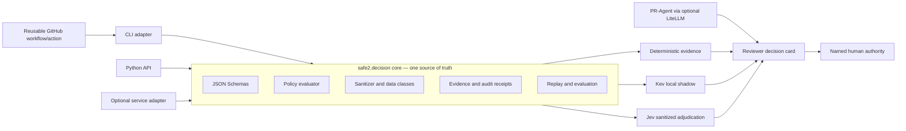
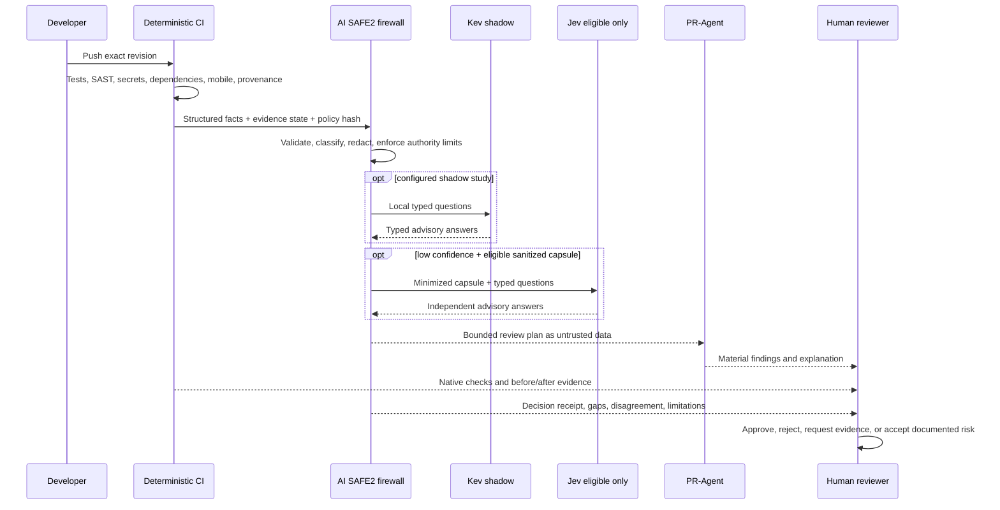

# ADR: Decision Firewall Architecture

- Status: accepted for staged implementation
- Date: 2026-09-28
- Scope: AI SAFE2 CLI, AI SAFE2 CI/CD, and Be You integration

## Decision

Build the decision firewall as a **CLI-first modular core with an optional
standalone service adapter**.

The core belongs in the AI SAFE2 Python package because it owns the contracts,
policy validation, sanitization, evidence calculation, authority limits, audit
receipts, and replay logic. `safe2 decision ...` remains the default local and
CI interface. A later stateless service imports the same core for teams that
need concurrent remote clients, provider pooling, centralized rate limits, or
operational telemetry. It must not fork or reinterpret policy.

This is a ports-and-adapters boundary, not three implementations. Inputs and
outputs are versioned JSON contracts. Adapters contain transport concerns only.

## Options considered

| Shape | Advantages | Disadvantages | Decision |
| --- | --- | --- | --- |
| CLI-only | Small attack surface; offline; easy CI use; reproducible; no service operations | Process startup per call; weak multi-client concurrency, pooling, health, and central telemetry | Keep as the default interface, but not the only future adapter |
| Library/module-only | Strong reuse and unit testing; lowest internal duplication | Python-specific; poor operator discoverability; every consumer invents its own evidence UX | Use as the core implementation, exposed through stable adapters |
| Standalone-only | Central policy distribution, caching, rate limits, provider pooling, service metrics | Network dependency; tenant/auth/availability burden; policy drift risk; poor offline/sovereign use; bootstrap problem when CI depends on the service it validates | Reject as the sole architecture |
| CLI-first core plus optional service | Local-first safety plus a path to scale; identical contracts and replay across deployments | Requires strict adapter conformance tests and release discipline | Selected |

## What the firewall is—and is not

The firewall is a policy decision and evidence boundary between untrusted change
state, optional semantic judgment, deterministic enforcement, and human
authority. It is not a replacement for CI, authorization, branch protection,
PR-Agent, Greptile, CodeQL, Semgrep, Scorecard, or human review.

It may:

- classify review context within an enumerated decision class;
- select review/test modules without removing deterministic requirements;
- identify missing evidence and recommend escalation;
- call an eligible provider with a minimized capsule;
- emit an immutable, revision-bound advisory receipt.

It may never authorize merge, release, deployment, exceptions, policy changes,
or secret access. Those denials are schema-enforced and must also remain enforced
by GitHub rulesets and environment protection.

## Industry comparison

No single referenced project supplies this complete development-cycle design.
The approach composes established patterns while keeping their authority
separate.

| Adjacent approach | What it already does well | Difference from this firewall |
| --- | --- | --- |
| [OPA](https://www.openpolicyagent.org/docs) / Rego | General policy-as-code over structured input; embeddable or service deployment | Excellent deterministic policy engine; it does not supply semantic reviewers, evidence history, model calibration, or PR-specific decision cards. OPA could become a policy adapter if rule complexity warrants it |
| [Cedar](https://docs.cedarpolicy.com/) | Fast, analyzable authorization decisions for principal/action/resource/context | Better fit for runtime authorization than review routing. It should protect actions, not interpret code quality |
| PR-Agent, Greptile, CodeRabbit-like reviewers | Explain changes and identify semantic defects | Their output is probabilistic review evidence. They do not own the deterministic risk floor or merge authority here |
| Kev/Jev-style typed decisions | Bounded questions and probability-bearing answers | They sit behind data, scope, confidence, and authority controls and start in shadow mode |
| LiteLLM | Provider abstraction, routing, budgets, keys, rate limits, and telemetry | It routes generative model calls; it does not establish whether evidence is sufficient or an action is authorized |
| OpenSSF Scorecard | Repository and supply-chain hygiene checks | Produces posture evidence; it neither evaluates the PR's business logic nor authorizes release |
| NIST SSDF / OWASP MASVS | Control objectives and verification vocabulary | Define what good requires; AI SAFE2 binds applicable controls to changed paths and evidence |
| SLSA / in-toto provenance | Verifiable build origin, inputs, and builder identity | Covers artifact provenance, not semantic review. The firewall should consume and report provenance verification |

### Where this approach is stronger

- Deterministic facts, semantic advice, and human authority are explicitly
  separate rather than collapsed into one AI score.
- External data release is an allowlisted decision with a minimized capsule and
  digest, not an incidental side effect of model routing.
- Every decision binds to a subject revision, policy hash, evidence state, and
  provider receipt, enabling before/after and replay analysis.
- Provider disagreement and outage remain visible uncertainty instead of being
  averaged into apparent confidence.
- The same contract works offline in the CLI and later behind a service.

### Where it is weaker today

- The seeded corpus is too small and does not yet measure provider accuracy,
  calibration, abstention, consistency, injection resistance, or drift.
- PR-Agent/Greptile findings are not normalized into a durable finding identity,
  so inherited, introduced, fixed, reopened, and accepted-risk states are not
  yet computed automatically.
- The JSONL ledger is append-only and hash-linked but lacks a verifier, signer,
  external timestamp, and durable evidence store.
- Provider retries declared in policy are not yet implemented; neither are
  circuit breakers, concurrency budgets, service identity, or tenant isolation.
- CI artifacts are retained, but release artifacts do not yet carry signed SLSA
  provenance that a consumer verifies.
- MASVS, SSDF, and Scorecard mappings are documented intentions, not yet a
  versioned control-to-evidence policy pack.
- The decision plan is produced beside PR-Agent; a hardened, injection-resistant
  handoff of that plan into the reviewer is still to be implemented and tested.

These gaps prohibit enforcement by a semantic provider. They do not prevent the
current deterministic and advisory workflow from producing useful evidence.

## Build blueprint

### Milestone A — core contract hardening

1. Version schemas for request, result, routing policy, provider receipt, replay
   report, and finding lifecycle.
2. Validate policy before evaluation and reject unknown fields.
3. Make all authority fields constant false in both code and schema.
4. Validate exact provider question/answer correspondence and probabilities.
5. Add contract fixtures for fail-closed, injection, oversized input, prohibited
   data, provider timeout, malformed response, and downgrade attempts.
6. Publish compatibility rules: additive optional fields within a major version;
   breaking semantics require a new schema version.

Exit: all adapters pass the same conformance suite and the deterministic replay
corpus has no regression.

### Milestone B — evidence and history

1. Define a stable finding fingerprint from repository, rule/reviewer, path,
   normalized location, and normalized issue class.
2. Store baseline and head finding sets; label findings inherited, introduced,
   fixed, reopened, accepted-risk, or unknown.
3. Record native evidence links, tool version/digest, timestamps, and exact
   base/head SHAs without copying secrets or full source.
4. Add `safe2 decision ledger verify` and optional signing/export to an approved
   immutable evidence store.
5. Generate the PR decision card and release decision card from the same facts.

Exit: before/after claims are mechanically reproducible and “unknown” cannot be
rendered as zero.

### Milestone C — shadow-provider study

1. Pin and isolate Kev; record model artifact digest and service build digest.
2. Expand a labeled corpus across AI SAFE2 and Be You risk boundaries, including
   adversarial instructions and ambiguous changes.
3. Measure accuracy by decision class, calibration error, abstention quality,
   consistency, false de-escalation rate, leakage, latency, and availability.
4. Evaluate NanoJev independently as a challenger, not an automatic fallback.
5. Permit Jev only for explicit public/internal-sanitized capsules; compare
   disagreement utility without allowing either provider to change gates.

Exit: owners approve written thresholds and a rollback rule. Until then, all
provider output remains shadow evidence.

### Milestone D — developer-cycle adapters

1. Keep `safe2 decision evaluate` and `replay` as the reference interface.
2. Publish a thin Python API and a reusable, SHA-pinned GitHub workflow/action.
3. Feed the signed/hashed review plan to PR-Agent as delimited data, never as
   executable instructions; test prompt-injection resistance.
4. Add repository policy packs: `ai-safe2-core`, `be-you-mobile`, and
   `python-release`, each with owners, control mappings, and evidence rules.
5. Add OpenSSF Scorecard as a separate least-privilege scheduled/default-branch
   workflow after action SHA and permissions review.
6. Add SLSA provenance generation and verification to release evidence.

Exit: local and hosted runs produce contract-equivalent results for identical
inputs and are understandable by a reviewer without opening raw logs.

### Milestone E — optional shared service

Implement only when multiple repositories need it enough to justify operations:

- mutually authenticated clients and workload identity;
- tenant-separated policy and audit storage;
- provider allowlists, timeouts, bounded retries, circuit breakers, and budgets;
- health/readiness endpoints that do not leak configuration;
- encrypted transport and storage with secret-manager integration;
- signed receipts and correlation IDs, with content-minimized telemetry;
- horizontal concurrency limits and explicit fail-closed/degraded behavior;
- adapter conformance tests proving identical core semantics.

The service returns advisory evidence. GitHub remains the enforcement point and
named humans remain the decision authority.

## Operational flow

## Non-goals

- A universal AI judge or a numeric “safe” score.
- Automatic suppression of deterministic findings.
- Sending complete repositories or restricted findings to an external provider.
- Duplicating GitHub authorization or branch protection inside a model service.
- Claiming compliance from tool installation, a green aggregate score, or model
  confidence.
