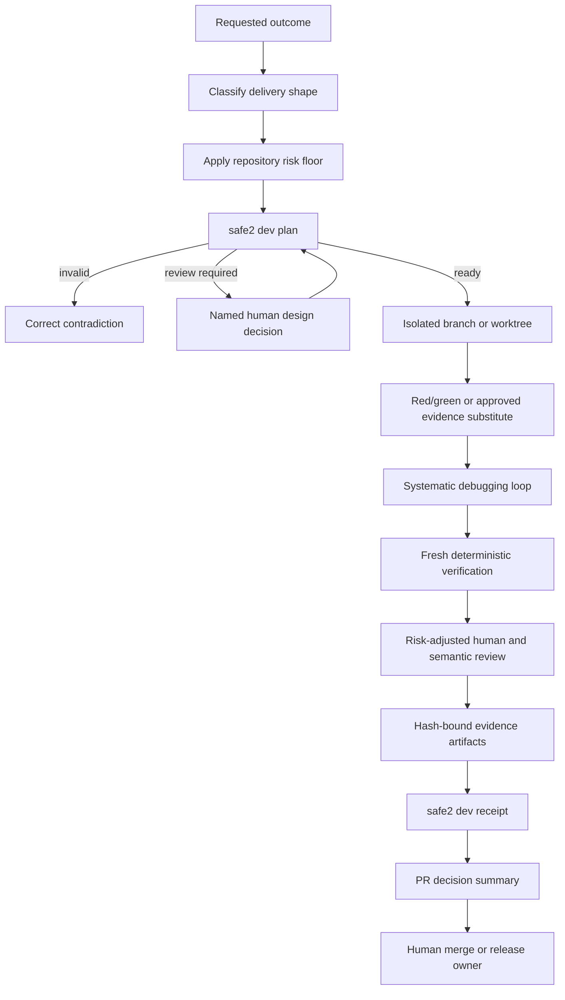
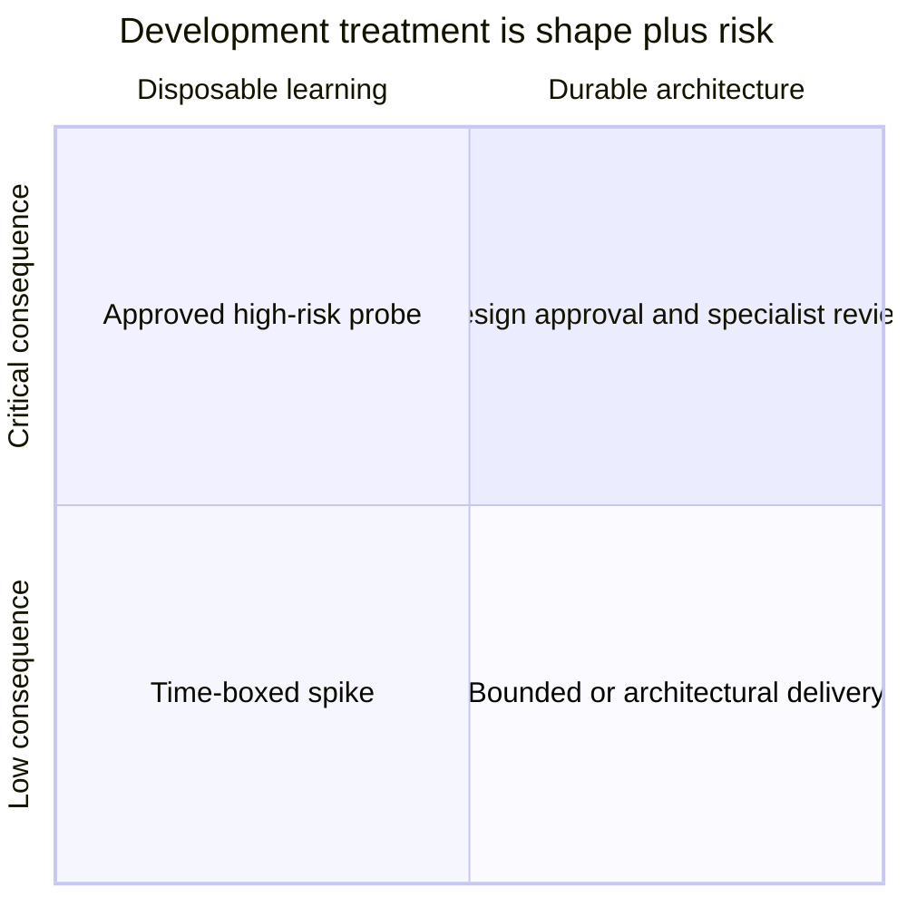
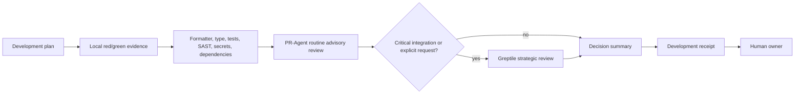
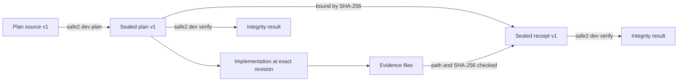

# AI SAFE² Development Method

## Decision and status

The development method is a **snap-in AI SAFE² CLI module plus a reusable agent
skill**, not a separate product and not a wholesale installation of another
agent framework.

This position keeps one evidence vocabulary from request through release while
allowing teams to adopt the method without adopting NEXUS, a specific model, or
a specific coding harness. The method adds discipline before and during coding;
the existing decision firewall, deterministic CI, PR-Agent, strategic Greptile
review, and human ownership remain the review and authorization layers.

The implementation consists of:

- `.ai-safe2/development-policy.json`: repository-owned delivery and risk policy;
- `safe2 dev plan`: deterministic planning requirements and named gaps;
- `safe2 dev receipt`: revision-bound, hash-checked development evidence;
- `safe2 dev verify`: structural and integrity verification;
- `safe2 dev replay`: deterministic policy regression cases;
- versioned JSON Schemas in `safe2/data/`;
- `skills/codex/ai-safe2-development-method/`: portable agent workflow;
- `.ai-safe2/development-evals/`: pressure cases for policy regression.

None of these artifacts authorizes completion, merge, release, deployment,
policy change, exception, or residual-risk acceptance.

## Why this architecture

| Option | Benefits | Costs and risks | Decision |
| --- | --- | --- | --- |
| Standalone methodology repository | Independent release cadence; usable without the CLI | Duplicated contracts, weaker subject binding, separate evidence lifecycle, integration drift | Do not split now |
| Built directly into every CI workflow | Immediate automation | Vendor- and repository-specific; hard to reuse; process logic becomes YAML | Use only thin workflow adapters |
| Wholesale Superpowers installation | Mature opinionated agent workflow; many ready-made skills | Universal rules do not fit every risk tier; plugin/hooks enlarge trust and maintenance boundaries; evidence is not native AI SAFE² | Do not import wholesale |
| AI SAFE² snap-in module and skill | Shared schemas, evidence, policy, receipts, and human authority; harness-neutral | Adds contracts and fixtures that maintainers must version | **Selected** |

The module can be used alone with `safe2 dev`, through the Codex skill, or from
CI. NEXUS may consume its artifacts but is not required. That preserves the
framework rule that NEXUS is a reference implementation, not a conformance
dependency.

## End-to-end flow



Delivery shape and risk are separate axes:



## Classification model

### Delivery shape

| Shape | Use when | Required design | Reusable implementation |
| --- | --- | --- | --- |
| `spike` | The purpose is to answer a bounded unknown | Hypothesis, time box, evidence target, discard plan | No |
| `bounded` | Scope and acceptance can be stated without changing a durable boundary | Outcome, acceptance conditions, inclusions, exclusions | Yes |
| `architectural` | The change crosses durable interfaces, ownership, authority, storage, deployment, or trust boundaries | Written design and implementation plan | Yes, after explicit approval |

A spike may produce knowledge, tests, or a design recommendation. Its probe code
does not quietly become production code. Reusable work must be replanned as
bounded or architectural delivery.

### Risk tier

Repository path policy supplies the minimum tier. `safe2 dev plan` matches the
declared scope against `.ai-safe2/review-policy.json`, records the matching
rules and policy digest, and raises—never lowers—the effective tier. Use
`--review-policy FILE` outside a repository with the conventional path.
Matched rules also add their required evidence and specialist review lenses to
the plan; they are not reduced to a numeric tier.
Observed trust-boundary, privacy, authorization, supply-chain, financial, or
release impact can only raise the tier further.

| Tier | Design approval | Review cadence | Typical minimum evidence |
| --- | --- | --- | --- |
| `low` | Not separately required | Completion | Targeted validation |
| `medium` | Not separately required | Subsystem boundary | Targeted and regression validation |
| `high` | Required | Each planned task | Negative tests and human review |
| `critical` | Required | Each task plus specialist | Threat model, security/negative tests, evidence-backed human and security review; Greptile recommended |

Low- and medium-risk bounded work proceeds under the user's original authority.
The method does not add approval theater. It pauses only for a decision that the
selected shape or tier actually requires.

## Evidence modes

| Mode | Evidence expectation | Appropriate use |
| --- | --- | --- |
| `tdd` | Requested behavior is observed failing, then passing | New code behavior |
| `characterization-first` | Existing behavior is captured before intentional change | Legacy or ambiguous behavior |
| `contract-first` | Rejection and acceptance boundaries are established first | APIs, schemas, policy, security checks |
| `schema-validation` | Invalid and valid structured states are checked | Configuration and machine contracts |
| `render-validation` | Rendered or interactive output is inspected | Documentation and UI |
| `approved-spike` | Hypothesis, result, and discard decision are retained | Disposable experiments |
| `not-applicable` | No implementation behavior is claimed | Research-only work |

The policy rejects incompatible combinations. For example, production code
cannot select `not-applicable`, and a non-spike cannot use `approved-spike`.

## Implementation and debugging loop

```mermaid
sequenceDiagram
    participant Dev as Developer or agent
    participant Test as Deterministic check
    participant Code as Implementation
    participant Review as Reviewer
    Dev->>Test: Establish failing/invalid/baseline state
    Test-->>Dev: Exact observed evidence
    Dev->>Code: Smallest change for one hypothesis
    Dev->>Test: Re-run smallest affected check
    alt check still fails
        Test-->>Dev: Preserve failure; localize boundary
        Dev->>Dev: Replace disproven hypothesis
    else check passes
        Test-->>Dev: Green evidence
        Dev->>Test: Relevant regression and security gates
        Dev->>Review: Diff plus evidence and residual risk
    end
```

Systematic debugging means reproduce, narrow the failing boundary, compare with
a known-good path, form one falsifiable hypothesis, change one cause, and
verify. Multiple speculative fixes obscure causality and weaken before/after
evidence.

## Relationship to the PR review stack



- Deterministic checks are authoritative for the state they observe.
- PR-Agent is the routine semantic reviewer. A wrapper is green only when a
  substantive current-attempt publication is observed.
- Greptile is recommended for critical integration points and remains advisory.
  Quota exhaustion, stale findings, or no publication is `unavailable`, not pass.
- Reviewer findings must be verified against code and native evidence.
- A provider can recommend escalation but cannot lower risk, waive evidence, or
  authorize an action.

## Artifact lifecycle



The plan source records outcome, acceptance conditions, shape, risk, scope,
trust boundaries, assumptions, unknowns, design state, isolation, and evidence
mode. `safe2 dev plan` derives requirements and one disposition:

- `ready`: planning prerequisites are represented;
- `review_required`: a named human decision or artifact is missing;
- `invalid`: declarations contradict policy.

The receipt source records the exact revision, evidence paths and expected
hashes, test-cycle observations, before/after state, reviews, findings,
residual risk, rollback, and completion claim. `safe2 dev receipt` produces:

- `supported`: every required consistency check has supporting bytes;
- `review_required`: evidence is missing, unavailable, or lower-severity findings remain;
- `contradicted`: evidence failed, a high/critical finding remains, or the plan is invalid.

These states describe evidence consistency. They are not action authorization.

## Threat model

Protected assets are the repository-owned policy, the selected plan, the exact
revision, evidence bytes, provider attribution, and human authority. Inputs from
source files, code under review, test output, and semantic providers are
untrusted evidence.

| Threat | Control | Remaining limitation |
| --- | --- | --- |
| A source or model grants itself authority | Output schemas fix every authorization field to `false` | A surrounding system could ignore the contract |
| Evidence path escapes the artifact root | Absolute paths, parent traversal, links, reparse points, and unsafe components are rejected | A trusted root can still be modified concurrently |
| Plan or receipt is changed after generation | Canonical SHA-256 integrity seal | The seal is unsigned and does not identify an author |
| A stale plan is cited for different work | Receipt binds the plan digest and task identifier | Revision is operator-declared unless stronger capture evidence is supplied |
| A hash is presented as successful execution | Receipt language limits the claim to byte consistency | Use signed reports and trusted runners when execution authenticity matters |
| Reviewer failure becomes “no findings” | Completed, unavailable, and not requested are distinct review states | Review state is operator-declared unless a provider receipt is retained |
| Risk is lowered to bypass review | Repository policy supplies a floor; changes are code-reviewed | Semantic trust-boundary changes can still require human escalation |
| Sensitive material reaches a free model | Provider review remains outside the CLI and subject to data classification | The caller must enforce provider retention and data-boundary policy |

Fail closed on malformed contracts, invalid integrity, unsafe paths, plan
contradictions, failed evidence, and open high/critical findings. Preserve
missing evidence as `review_required`; do not silently convert it to pass or
failure when the truth is unknown.

## Operating procedure

### 1. Create the plan source

```json
{
  "schema_version": "safe2.development-plan-source.v1",
  "task_id": "issue.412",
  "title": "Add a bounded receipt field",
  "outcome": "Reviewers can distinguish a missing provider from a passing review.",
  "delivery_shape": "bounded",
  "risk_tier": "medium",
  "change_kind": "code",
  "work_product": "reusable",
  "acceptance_conditions": [
    "A failed or absent publication is represented as unavailable.",
    "A substantive current-attempt publication remains supported."
  ],
  "scope": {
    "include": ["safe2/review/**", "tests/test_review.py"],
    "exclude": ["provider credentials", "branch protection"]
  },
  "trust_boundaries": ["CI runner to external review provider"],
  "assumptions": [],
  "unknowns": [],
  "design": {
    "summary": "Extend the existing receipt state without changing merge authority.",
    "approved": false
  },
  "isolation": {
    "strategy": "worktree",
    "reference": "feat/review-receipt"
  },
  "testing": {"mode": "tdd"}
}
```

Validate and generate:

```text
safe2 schema validate development-plan-source-v1 plan-source.json
safe2 dev plan plan-source.json --output development-plan.json
safe2 dev verify development-plan.json
```

Exit `0` from `dev plan` means the plan is `ready`; exit `1` means review or
correction is required. The output is written in either case. Unreadable or
invalid input is an execution error.

The generated plan preserves declared tier, policy floor, effective tier,
matched rule identifiers, reasons, paths, and policy hash. Review the match when
scope contains broad globs; a semantic boundary not covered by path policy still
requires human escalation.

### 2. Implement and retain evidence

Use isolated work, follow the plan's evidence mode, and store only safe minimal
artifacts. Test reports should bind the revision and environment through the
existing `safe2 feedback` capture/import tools when stronger evidence is needed.
Do not put secrets, private prompts, personal data, or unnecessary raw output in
the evidence directory.

### 3. Produce the receipt

The receipt source uses one record per evidence identifier. A `passed` record
must include a relative path below the artifact root and the expected SHA-256.
Failed and unavailable evidence deliberately omit a path and hash.
Required human or specialist reviews count only when the review record points
to a supported evidence artifact; a bare `completed` declaration is insufficient.

```text
safe2 schema validate development-receipt-source-v1 receipt-source.json
safe2 dev receipt development-plan.json receipt-source.json \
  --artifact-root .safe2/evidence --output development-receipt.json
safe2 dev verify development-receipt.json
```

`dev receipt` exits `0` only for a `supported` claim and `1` for
`review_required` or `contradicted`. It never runs the referenced commands and
never treats a hash as authenticated execution.

### 4. Replay policy decisions

```text
safe2 dev replay .ai-safe2/development-evals \
  --policy .ai-safe2/development-policy.json \
  --output development-replay.json
```

This replay is deterministic policy regression, not live-model evaluation or
calibration. Live harness evaluation should additionally record the harness,
model/provider, prompt version, expected decision, observed decision, repository
revision, and independent evaluator.

## Reviewer-facing PR output

Each material PR should make these answers visible without requiring chat logs:

1. What outcome and acceptance conditions were agreed?
2. Which delivery shape and risk tier were selected, and why?
3. What exact revision and scope were assessed?
4. Which trust boundaries changed?
5. What was observed before and after? If no baseline exists, why not?
6. Which deterministic checks ran, and where is their native evidence?
7. Which semantic reviewers completed, failed, or were unavailable?
8. What findings remain open, with severity and owner?
9. What assumptions, unknowns, conflicts, and residual risks remain?
10. What is the rollback or recovery path?
11. Who owns the merge, release, deployment, and risk decisions?

The PR summary should separate observed facts, operator declarations,
inferences, unknowns, and authorizations. “No review published” is never
rewritten as “no findings.”

## Before and after

| Dimension | Earlier approach | Integrated method |
| --- | --- | --- |
| Planning | Good prose guidance in `AGENTS.md` | Versioned source and generated plan with explicit gaps |
| Work type | Risk was dominant | Delivery shape and risk are independent |
| Approval | Could become an all-or-nothing pause | Low/medium bounded work proceeds; architecture/high/critical pauses precisely |
| Test discipline | Required evidence, but method selected informally | TDD, characterization, contract, render, schema, or approved-spike mode is explicit |
| Debugging | General expectation to fix correctly | One-hypothesis, reproduce-localize-verify loop is documented |
| Semantic review | PR-Agent and Greptile receipts | Same stack, now preceded by plan requirements and followed by a development receipt |
| Completion | PR narrative and task receipts | Final revision binds plan, evidence hashes, test cycle, findings, rollback, and residual risk |
| Regression | Decision routing corpus | Additional development-policy corpus with pressure cases |
| Portability | Repository instructions | CLI contracts plus a reusable Codex skill |

## Superpowers comparison and disposition

The external [Superpowers](https://github.com/obra/superpowers) project is an
MIT-licensed, agent-oriented development workflow. Its useful contribution is a
disciplined sequence around brainstorming, plans, test-driven development,
debugging, review, and verification. AI SAFE² adds policy, evidence typing,
security boundaries, provider attribution, decision ownership, and durable
machine-readable receipts.

| Practice | Superpowers emphasis | AI SAFE² integration | Disposition |
| --- | --- | --- | --- |
| Brainstorm before coding | Strong default | Depth varies by shape and risk | Adapt |
| Written implementation plans | Very detailed task plans | Required for architectural work; lighter contract for bounded work | Adapt |
| Test-driven development | Strong universal coding discipline | Default for new code; named substitutes for legacy, contracts, docs, UI, research | Adapt |
| Systematic debugging | Reproduce and find root cause | Same, with evidence states and receipt binding | Adopt |
| Verification before completion | Fresh proof before claims | Same, plus exact revision, hashes, limitations, and false authorization fields | Adopt and strengthen |
| Review during implementation | Frequent task review | Cadence is policy-derived from shape and risk | Adapt |
| Agent/subagent orchestration | Parallel task execution pattern | Optional; separate isolation and CP.9 governance still apply | Selective only |
| Plugin and hook installation | Product integration mechanism | Not required; use native CLI and portable skill | Reject wholesale |
| One mandatory process for every task | Consistency | Would create friction and unnecessary approval loops | Reject |
| Semantic reviewer as process proof | Useful feedback | Always advisory and independently verified | Strengthen boundary |

### What is better in Superpowers

- It offers a highly usable, practiced interaction sequence for coding agents.
- Its skill decomposition makes test-first and debugging behaviors easy to invoke.
- It strongly resists premature “done” claims.

### What is better in this integration

- Policy decisions are versioned, deterministic, and replayable.
- The exact plan, revision, evidence bytes, gaps, and provider state survive chat loss.
- Security and release authority are structurally excluded from model outputs.
- Different work types have valid evidence substitutes instead of forced ceremony.
- PR-Agent, Greptile, SAST, secrets, dependencies, CODEOWNERS, and release evidence
  occupy explicit, non-overlapping roles.

### Remaining weaknesses

- Hash-bound evidence is not authenticated execution unless separately signed and trusted.
- Initial replay cases test policy behavior, not live-agent adherence.
- The method needs outcome data to learn whether review cadence is cost-effective.
- A path-based risk floor cannot understand every semantic trust-boundary change.
- Teams must maintain policy and fixture versions as architecture changes.

## Why certain practices were not adopted

- **No wholesale plugin:** it would add executable hooks and a transitive trust
  boundary without improving the core AI SAFE² evidence contract.
- **No universal design approval:** repeated approval for low-risk bounded work
  slows delivery and obscures genuinely consequential decisions.
- **No universal TDD claim:** schemas, rendered documents, research, and controlled
  probes require different falsifiable evidence.
- **No automatic code promotion from spikes:** probe code optimizes learning, not
  maintainability, security, compatibility, or release readiness.
- **No AI merge gate:** model output is probabilistic and provider availability is
  variable. Deterministic checks and named humans retain authority.
- **No automatic Greptile use on every PR:** strategic critical-point review
  preserves quota and makes independent review more valuable.

## Adoption and measurement

| Phase | Behavior | Exit evidence |
| --- | --- | --- |
| 0 — contract | Plan, schemas, receipts, and replay cases | Focused and full repository tests green |
| 1 — advisory use | Generate plan and receipt on material PRs | Reviewers can answer the eleven decision questions |
| 2 — outcome study | Track rework, escaped defects, review latency, false findings, and missing evidence | Representative before/after sample |
| 3 — policy tuning | Adjust cadence and evidence thresholds | Replay corpus plus approved policy change |
| 4 — broader adapters | Add other harness and CI adapters | Same artifacts and authority boundaries preserved |

Do not claim a 10× or 100× improvement from process adoption alone. Measure
defect escape rate, change-failure rate, mean evidence-recovery time, review
latency, accepted/dismissed AI findings, provider availability, and reviewer
comprehension before making an improvement claim.

## Attribution and trust boundary

Superpowers informed the workflow design but is not copied, installed, or run by
this module. Its repository, skills, release history, and evaluation project are
external references, not transitive trust or authorization. Before any future
code dependency is adopted, pin it, review its license and provenance, scan it,
and evaluate it against repository-owned cases.

Primary references:

- [Superpowers repository and basic workflow](https://github.com/obra/superpowers)
- [Brainstorming skill](https://github.com/obra/superpowers/blob/main/skills/brainstorming/SKILL.md)
- [Test-driven development skill](https://github.com/obra/superpowers/blob/main/skills/test-driven-development/SKILL.md)
- [Systematic debugging skill](https://github.com/obra/superpowers/blob/main/skills/systematic-debugging/SKILL.md)
- [Verification before completion skill](https://github.com/obra/superpowers/blob/main/skills/verification-before-completion/SKILL.md)
- [Superpowers evaluation project](https://github.com/prime-radiant-inc/superpowers-evals)
