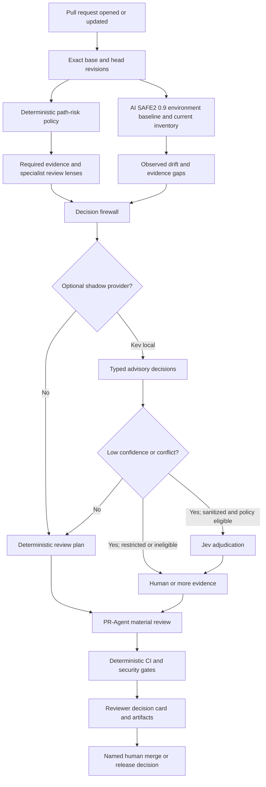
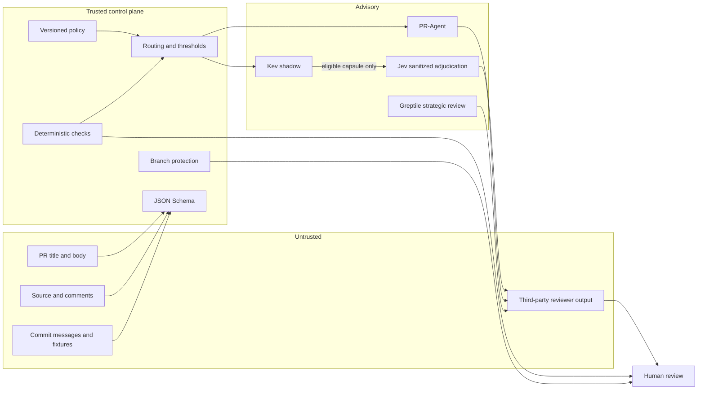

# PR Decision-Evidence Workflow

This document defines the pull-request and release workflow used by AI SAFE2
and adapted for Be You. It explains what the system observes, what it can
decide, where optional semantic decision models fit, what evidence is retained,
and which decisions always remain human-owned.

## Executive decision

The workflow uses this authority order:

```text
deterministic checks > repository policy > advisory semantic routing > human decision
```

PR-Agent explains and reviews. Greptile is a strategic second reviewer. The
AI SAFE2 decision gateway can optionally use a local System One provider such
as Kev in shadow mode and a sanitized external provider such as Jev for eligible
adjudication. None of these models can approve, merge, release, deploy, grant an
exception, access a secret, or change policy.

Kev currently exposes TypeSafe-compatible typed questions and a local
`/v1/systemone` endpoint. Its own server documentation also makes clear that
authentication must be explicitly configured; local availability is not the
same as production hardening. Jev similarly returns bounded, probability-bearing
answers, but reported speed, cost, consistency, and calibration remain vendor or
integration claims until validated on our corpus. See the
[Kev repository](https://github.com/jaredpalmer/kev) and
[LangChain's Jev harness overview](https://www.langchain.com/blog/building-a-harness-with-jev).

## End-to-end architecture



The provider branch is disabled unless explicitly configured. The normal path
today is deterministic review planning plus PR-Agent, CI, and human review.

The packaging and deployment decision is recorded in
[ADR: Decision Firewall Architecture](ADR-DECISION-FIREWALL-ARCHITECTURE.md).
In short: the contracts and policy engine live in the AI SAFE2 package, the CLI
is the default interface, and a separately deployable adapter is optional. This
keeps local and CI use offline and reproducible without preventing a shared
service later.

## Trust and authority boundaries



Untrusted content is evidence. It cannot redefine policy, thresholds, required
checks, review scope, or authority. Provider output is also evidence, even when
it is structured and confident.

## Workflow stages

### 1. Bind the subject

The workflow checks out the exact pull-request head with full history and records:

- repository, PR number, base SHA, and head SHA;
- changed paths, additions, deletions, and binary-file count;
- policy identifier and SHA-256;
- CLI version and evidence artifact hashes.

This prevents a green result for one revision being cited for another.

### 2. Classify deterministic risk

Repository-owned policy maps changed paths to low, medium, high, or critical
risk. Rules supply required evidence and specialist review lenses. Models may
recommend escalation, but they cannot lower this risk floor.

AI SAFE2 critical examples include release code, package identity, authorization,
policy enforcement, settlement, and protocol boundaries. Be You critical examples
include encrypted storage, privacy controls, Android manifests, backup/network
configuration, CI, dependency verification, and release inputs.

### 3. Capture comparable evidence

AI SAFE2 CLI 0.9.0 runs `safe2 doctor` against the base checkout and again
against the head checkout with the base as its comparison. Both inventories,
the drift result, the CLI version, the decision JSON, the Markdown card, and
hashes are retained.

The first retained record is a baseline. A missing historical structured finding
set is reported as unknown—not as zero inherited or zero fixed defects.

### 4. Build a bounded review plan

The decision request separates:

- structured state;
- typed questions;
- deterministic risk and required evidence;
- evidence status;
- data classification;
- permission for external adjudication.

Allowed decision classes are deliberately narrow: context relevance, review
module selection, test-plan selection, risk signals, and finding triage. Merge,
release, deploy, exception, policy-change, and secret-access authorization are
not valid decision classes.

### 5. Apply the decision firewall

`safe2 decision evaluate` validates the request, redacts secret-like fields,
computes missing evidence, and determines mandatory human review before any
provider is called.

If a local Kev endpoint is explicitly configured, it can supply typed shadow
decisions. If its confidence is below policy threshold, Jev is considered only
when all of these conditions hold:

1. external adjudication was explicitly allowed;
2. the decision class is allowed externally;
3. the data class is `public` or `internal_sanitized`;
4. an explicit `decision_capsule` exists;
5. the capsule contains no prohibited or secret-like fields.

Provider errors, timeouts, malformed responses, and unavailable services become
recorded evidence gaps. They never become approval.

### 6. Run semantic and deterministic review

PR-Agent receives the repository risk policy and focuses on material correctness,
security, privacy, evidence, migration, and regression issues. Its operational
failure is visible but advisory. Completion is established by a postcondition,
not by the action wrapper's exit status: a current-attempt, substantive review
publication must exist. A plain provider response, `Failed to review PR`, API
verification failure, or silence produces a retained `review_unavailable`
receipt and a failed advisory-availability check. That check is not included in
the required-status ruleset, so it cannot silently pass and cannot stop an
otherwise authorized merge.

The routine provider chain uses pinned, role-specific OpenRouter free endpoints,
then the official OpenAI API:

1. Poolside Laguna S 2.1 for the primary software-engineering review.
2. Qwen 3.8 27B for an independent coding and structured-output fallback.
3. NVIDIA Nemotron 3 Ultra for deeper architecture and security reasoning.
4. Cohere North Mini Code for a fast, code-specialized final free attempt.
5. `gpt-5.6-luna` as the metered final fallback.

Exact model IDs are part of the execution configuration and receipt context.
`openrouter/free` is excluded because random model selection makes replay and
before/after comparison unreliable. Inkling is excluded because multimodal input
does not materially improve routine text-diff review and would add a provider data
boundary. Run details and provider-reported cost are emitted for operating
evidence, and same-model retries are disabled to preserve the 50-request daily
free allowance. The retained execution receipt records the ordered provider policy
and the model observed in the substantive publication. Prove one representative PR
before a batch review. The open-source
reviewer, OpenRouter gateway, selected model hosts, and metered OpenAI fallback are
separate cost, privacy, and trust boundaries. GitHub Models is intentionally
excluded because the service was retired on July 30, 2026.

Free-provider review is limited to already-public pull-request content. The route
must not receive secrets, unpublished vulnerability details, personal data, or
private source code because the selected free endpoints may retain or use inputs
and outputs to improve their services. Private or sensitive code requires a
separately reviewed route with acceptable retention, training, residency, and
zero-data-retention controls. Provider selection does not weaken the existing
rule: a review counts only when a substantive publication is observed for the
current attempt.

Greptile is reserved for critical integration points or explicit human request.
Quota exhaustion, stale output, or provider errors are reported as “not reviewed.”
They do not block routine progress and are never rewritten as a passing review.

Tests, secret scanning, repository Semgrep rules, dependency review, CodeQL,
Android privacy checks, Gradle verification, release builds, and CODEOWNERS remain
the authoritative enforcement layers.

### 7. Produce decision-quality output

The GitHub job summary and retained artifacts answer:

- What exact revision was reviewed?
- What changed and which trust boundaries were touched?
- What risk rules matched and why?
- What evidence is required, present, missing, pending, or unavailable?
- Which checks ran and where is their native evidence?
- Was a semantic provider used, and in what mode?
- Was external adjudication eligible and what state digest was sent?
- Which facts are observed, which are inferred, and which remain unknown?
- Is Greptile strategically recommended?
- Who owns the final decision and rollback?

### 8. Retain and replay

PR evidence is retained for 90 days; release evidence is retained for 365 days.
The optional JSONL ledger hash-chains decision events. The seeded corpus can be
replayed with:

```text
safe2 decision replay .ai-safe2/decision-evals --output decision-replay.json
```

Every policy, threshold, rubric, or provider update should replay the corpus.
Provider enforcement remains prohibited until representative cases support
accuracy, calibration, abstention, injection-resistance, leakage, consistency,
drift, and resilience thresholds approved by the owners.

## Before and after

| Dimension | Before | Current workflow |
| --- | --- | --- |
| Risk selection | Broad reviewer prompt | Deterministic, versioned path policy with reasons and evidence requirements |
| Subject binding | CI run implied the revision | Exact base/head SHAs and policy hash in every record |
| Historical claims | Easy to read absence as zero | Unknown stays unknown; comparable evidence is required for introduced/fixed claims |
| AI review | One general semantic pass | PR-Agent plus bounded specialist lenses; optional shadow decision provider |
| Greptile usage | Automatic reviews could exhaust quota | Strategic recommendation for critical integration points; always advisory |
| External data | Provider-specific behavior | Explicit data classes and sanitized capsule requirement |
| Model authority | Could be mistaken for a gate | Five authorization fields are structurally fixed to `false` |
| Failure handling | Reviewer outage could look ambiguous | Unavailable, timeout, or invalid output becomes an evidence gap |
| Auditability | Job logs and comments | JSON, Markdown, base/current inventories, version, hashes, and optional hash-chain |
| Change evaluation | Point-in-time confidence | Seeded replay corpus and future calibration/defect outcome measurement |
| Release evidence | Tests and distribution artifact | Decision card, artifact hashes, exact comparison base, and 365-day retention |

## Benefits and costs

### Benefits

- Deterministic facts cannot be overridden by model confidence.
- Review effort is routed to the boundaries that actually changed.
- Restricted material stays local; external review receives only an explicit capsule.
- Results are comparable, attributable, replayable, and understandable without chat history.
- Provider outages degrade to human review or missing evidence rather than fail-open approval.
- Greptile credits are spent only where an independent semantic review has high value.
- The same contract supports AI SAFE2, Be You, and future policy packs.

### Costs and limitations

- Policies and evaluation cases require maintenance as architectures change.
- AI SAFE2 environment inventory is evidence of discovered state, not proof of runtime safety.
- A typed decision can still be semantically wrong.
- Confidence is unusable as a gate until calibrated on representative internal cases.
- Shadow providers add infrastructure, privacy, monitoring, and model-version obligations.
- Artifact retention is not a permanent analytics warehouse.
- PR-Agent and Greptile findings are not yet normalized into a single long-term finding lifecycle.

## Why we made these choices

### Why deterministic policy comes first

Changed protected paths, failing tests, leaked secrets, unsigned artifacts, and
missing approvals are exact states. Asking a model to reinterpret them makes the
system less reliable and less auditable.

### Why Kev is optional and shadow-only

Local control, a typed API, and trainability are useful. They do not establish
accuracy on AI SAFE2 or Be You decisions. Shadow mode lets us collect evidence
without silently changing merge behavior.

### Why Jev is not a general fallback

An external service changes the data boundary. It is useful as an independent
adjudicator only for sanitized, policy-eligible state. Restricted source,
vulnerability detail, customer data, production logs, credentials, and proprietary
architecture must not be sent merely because the local model is uncertain.

### Why disagreement escalates

Averaging disagreement hides uncertainty. It is more useful as a signal that the
case is difficult, the rubric is ambiguous, or evidence is incomplete.

### Why PR-Agent remains generative

Review comments need explanations, file-level reasoning, and remediation guidance.
Typed decision models are better suited to bounded routing and classification,
not to replacing the explanatory reviewer.

### Why Greptile remains strategic

It can provide valuable independent cross-repository context, but quota, cost,
and availability make it unsuitable as the routine merge authority. A current-head
review is corroboration, not proof.

### Why we did not deploy Kev, Jev, Docker, or Kubernetes in this change

No representative calibration corpus, approved runtime environment, capacity
model, data-processing decision, threat model review, or operating owner exists
yet. Shipping infrastructure first would create cost and attack surface before
establishing decision quality. The provider abstraction and corpus are the
reversible prerequisites; deployment follows evidence.

### Why artifacts are retained instead of committed by CI

CI commits create recursive workflow runs, branch contention, and an unnecessarily
mutable automation identity. Retained immutable run artifacts bind evidence to the
native check. A separate approved evidence store can be added when longitudinal
reporting outgrows artifact retention.

## Adoption gates

| Phase | Provider behavior | Exit condition |
| --- | --- | --- |
| 0 — current | Deterministic routing only | Contracts, policies, artifacts, and replay stay green |
| 1 — shadow | Kev observes eligible cases; no action | Representative labeled corpus and stable replay |
| 2 — adjudication study | Jev receives eligible capsules; no action | Zero prohibited-data leakage and useful disagreement signal |
| 3 — assisted routing | Models may recommend modules/evidence | Approved accuracy, calibration, abstention, and drift thresholds |
| 4 — bounded automation | Only low-risk routing may change automatically | Sustained outcomes and rollback evidence; high/critical remain human-owned |

There is no phase in which a model gains merge, release, deploy, exception,
secret-access, or policy-change authority.

## Reviewer checklist

- Confirm base SHA, head SHA, policy hash, and artifact revision agree.
- Read matched risk rules and verify no relevant path escaped classification.
- Confirm all required evidence has a native run or an explicit gap.
- Treat provider probabilities as advisory and check data eligibility before external use.
- Confirm high/critical changes have the named human approvals.
- Verify PR-Agent findings against code and deterministic evidence.
- Request Greptile only after the candidate stabilizes and only when strategically justified.
- Record accepted residual risk, owner, expiry/review point, and rollback.
- Never call the change “fixed” unless comparable before evidence identifies the finding and current evidence shows it resolved.

## Repository and standards disposition

References are inputs, not transitive trust. Every executable dependency must
be version/hash pinned, license reviewed, scanned, and evaluated on the CSI
corpus before adoption. A linked repository is not automatically installed or
authorized to receive source, secrets, logs, or findings.

| Project | Workflow position | Decision |
| --- | --- | --- |
| [PR-Agent](https://github.com/The-PR-Agent/pr-agent) | Generative explanation and review after deterministic planning | Use as the routine advisory reviewer; wrap with repository policy and preserve native findings |
| [Kev](https://github.com/jaredpalmer/kev) | Local typed decision provider behind the firewall | Evaluate in shadow mode; pin model and service revision before any assisted routing |
| [NanoJev](https://github.com/TianyuCodings/NanoJev) | Alternative implementation and training/evaluation reference | Research only until security-domain accuracy, calibration, provenance, and maintenance are established |
| [NanoJev model artifacts](https://huggingface.co/C-Tianyu/NanoJev) | Candidate weights | Mirror, scan, hash, license-check, and record model-card evidence before isolated evaluation |
| [TypeSafe skills](https://github.com/typesafe-ai/skills) | Integration-pattern reference | Review and pin individual useful patterns; do not install the collection wholesale |
| [LiteLLM](https://github.com/BerriAI/litellm) | Optional gateway for generative LLM calls | Use for PR-Agent/provider budgets, routing, and telemetry; do not put it in the typed-decision authority path unless it preserves the System One contract exactly |
| [OWASP MASVS](https://github.com/OWASP/masvs) | Be You mobile control vocabulary | Map MASVS/MASWE controls to changed paths, required evidence, and test results; it is a standard, not a scanner |
| [OpenSSF Scorecard Action](https://github.com/ossf/scorecard-action) | Repository/supply-chain posture collection | Add as an isolated scheduled/default-branch workflow with least privilege and immutable action pins; do not run it as an expensive semantic review on every PR |
| [OpenSSF Scorecard](https://github.com/ossf/scorecard) | Underlying checks and local/reference engine | Use its findings as observed evidence; do not treat an aggregate score as release authorization |
| [typesafe-computer-use](https://github.com/awlevin/typesafe-computer-use) | Constrained UI-action pattern | Borrow decision/action separation only in disposable QA environments |
| [jev-browser-use](https://github.com/wy-coliney/jev-browser-use) | Browser decision pattern | Reference for bounded action menus; never use against privileged production sessions |
| [jev-browser](https://github.com/jkudish/jev-browser) | MCP/CLI browser execution pattern | Evaluate only for sandboxed emulator/browser testing with one-action receipts |
| [skillbox](https://github.com/kitze/skillbox) | Versioned skill registry pattern | Borrow registry, versioning, provenance, and selection concepts for policy packs |
| [captaincore](https://github.com/captaincore/captaincore) | Scanner-evidence/AI-triage pattern | Borrow the separation; a model may prioritize but never silently suppress high-severity scanner evidence |
| [tax-doc-classifier](https://github.com/kyotofin/tax-doc-classifier) | Typed-classification/evaluation example | Borrow corpus methodology only; domain accuracy does not transfer to software security |
| [jev-bot](https://github.com/bl888m/jev-bot) | Decision-to-action example | Cautionary reference only; its coupling of judgment to consequential action is explicitly excluded |
| [NIST SSDF](https://csrc.nist.gov/pubs/sp/800/218/final) | Secure-development governance baseline | Map workflow controls and owners to SSDF practices |
| [SLSA](https://slsa.dev/spec/v1.0/levels) | Release provenance and build integrity | Add signed provenance and downstream verification; evidence hashes alone are not SLSA provenance |
| [OWASP MASVS](https://mas.owasp.org/MASVS/) | Mobile verification baseline | Apply to Be You policy packs and release evidence |
| [OpenSSF Scorecard](https://scorecard.dev/) | Repository hygiene baseline | Track individual checks and remediation trends, not the score alone |

### Changes resulting from this review

- Added schema validation for the routing policy itself. A malformed or
  authority-expanding policy now fails before evaluation.
- Required HTTPS for an explicitly configured external Jev endpoint and rejected
  endpoint URLs containing embedded credentials, queries, or fragments.
- Required provider answers to match the exact requested question set and
  constrained probability-bearing fields to the range 0–1.
- Kept LiteLLM out of the typed-decision path by default. Its strengths are
  generative-model routing, budgets, rate limits, and telemetry; it is not the
  source of deterministic policy truth.
- Deferred Scorecard installation until its workflow is independently pinned
  and permission-reviewed. The official publishing mode has strict workflow and
  OIDC requirements, so copying an unreviewed template into existing CI would
  enlarge the trust boundary.
- Made SLSA provenance, longitudinal finding normalization, ledger verification,
  provider calibration, and shared-service operations explicit backlog items.
