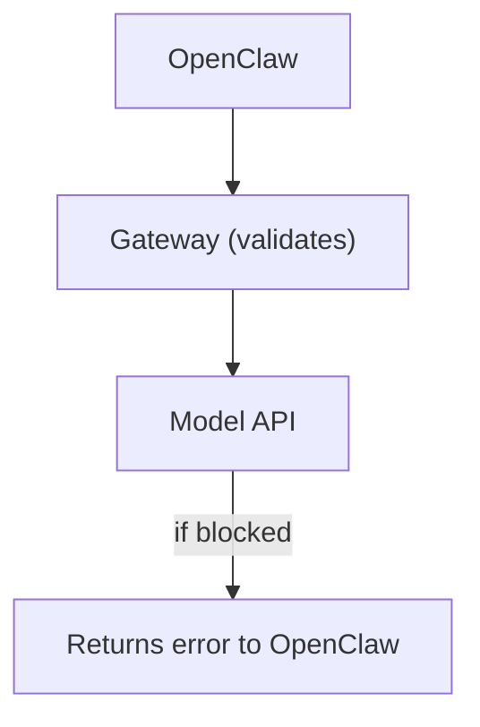

# AI SAFE² Control Gateway

## Gateway — v3.0 Enforcement Layer

AI enforcement proxy implementing the full AI SAFE² v3.0 control stack for OpenClaw — risk scoring, 4-tier HITL, immutable audit, and heartbeat-gated safe mode between client and Anthropic API.

The `gateway/` subfolder contains the AI SAFE² v3.0 enforcement proxy for OpenClaw.

This is the production-ready gateway component — not a demo, not a stub. It intercepts every request before it reaches the Anthropic API and enforces the full AI SAFE² v3.0 control stack.

### What the gateway enforces

| Control | Implementation |
|---------|---------------|
| **Heartbeat validation** | `HEARTBEAT.md` must exist, be well-formed, and be fresh (≤ 120s) before any request is proxied. Missing or stale → safe mode. |
| **Immutable audit log** | Every request written to HMAC-SHA256 chained JSONL. Tamper detection on startup. Chain break → safe mode. |
| **3-vector risk scoring** | Action type × target sensitivity × historical context. Weights 0.40 / 0.35 / 0.25. Injection +5, A2A +3. Capped 10.0. |
| **4-tier HITL** | AUTO (0–3) / MEDIUM token (4–6) / HIGH token + reason (7–8) / CRITICAL HMAC 2FA (> 8). |
| **Response scanning** | Every upstream response inspected for exfiltration patterns and tool\_use injection payloads before returning to client. |
| **Rate limiting** | Per-identity sliding window (requests/minute + requests/hour). |
| **Safe mode** | Hard stop activated by heartbeat failure or chain break. Operator-key deactivation only — agents cannot self-recover. |

### Files

```
examples/openclaw/gateway/
├── gateway.py              # Flask enforcement proxy — the enforcement engine
├── provider_adapters.py    # Multi-provider adapter layer (Anthropic, OpenAI, Gemini, Ollama, OpenRouter)
├── config.yaml             # Thresholds, weights, provider config, NEXUS settings
├── start.sh                # 9-step pre-flight validator + gateway launcher
└── README.md               # Full deployment and operations reference
```
Note: provider_adapters.py must be in the same directory as gateway.py. The gateway imports from it at startup and falls back to Anthropic-only mode with a warning if it's absent.

### Quick start

```bash
# 1. Set environment variables
#    AUDIT_CHAIN_KEY and OPERATOR_DEACTIVATION_KEY are always required.
#    Set the API key for your active provider (config.yaml → provider.active).

export AUDIT_CHAIN_KEY="$(openssl rand -hex 32)"
export OPERATOR_DEACTIVATION_KEY="$(openssl rand -hex 16)"

# Anthropic (default)
export ANTHROPIC_API_KEY="sk-ant-api..."

# OpenAI
# export OPENAI_API_KEY="sk-..."

# Gemini
# export GEMINI_API_KEY="AIza..."

# OpenRouter
# export OPENROUTER_API_KEY="sk-or-..."

# Ollama (local) — no API key required

# 2. Initialize heartbeat (first run only)
python3 gateway.py --init-heartbeat

# 3. Start
bash start.sh
```

See [`gateway/README.md`](./gateway/README.md) for full configuration reference, HITL flow, audit log format, and governance notes.

## How It Works

```mermaid
flowchart TD
    A["OpenClaw"] --> B["Gateway (validates)"]
    B --> C["Model API"]
    C -->|if blocked| D["Returns error to OpenClaw"]

```

## Multi-Provider Support

The gateway supports five LLM providers via a pass-through adapter architecture. The client sends requests in each provider's native format. The gateway enforces on a normalized internal representation, then forwards the original payload untouched.

**Supported providers:** `anthropic` | `openai` | `gemini` | `ollama` | `openrouter`

Switch the active provider in `config.yaml`:

```yaml
provider:
  active: "openai"   # anthropic | openai | gemini | ollama | openrouter
```

Set the corresponding API key environment variable before starting:

| Provider | Environment variable |
|----------|---------------------|
| Anthropic | `ANTHROPIC_API_KEY` |
| OpenAI / Codex | `OPENAI_API_KEY` |
| Gemini | `GEMINI_API_KEY` |
| Ollama (local) | none required by default |
| OpenRouter | `OPENROUTER_API_KEY` |

All enforcement controls — heartbeat validation, risk scoring, HITL tiers, immutable audit, response scanning — operate identically regardless of provider. The adapter layer handles auth headers and response format normalization transparently.

**Provider adapter file:** `provider_adapters.py` must be placed in the same directory as `gateway.py`. If it is absent the gateway falls back to Anthropic-only mode and logs a warning at startup.

### Ollama (local models)

```bash
# Pull a model first
ollama pull llama3

# Set in config.yaml
# providers.ollama.model: "llama3"
# providers.ollama.host: "http://localhost:11434"
```

No API key required for local Ollama. For remote Ollama with auth, set `OLLAMA_API_KEY` and add `api_key: "${OLLAMA_API_KEY}"` under `providers.ollama`.

### OpenRouter

OpenRouter provides access to 100+ models including Claude, GPT-4, Llama, Mistral, and others via a single endpoint and billing account. Set the model string to any [OpenRouter model ID](https://openrouter.ai/models):

```yaml
providers:
  openrouter:
    model: "anthropic/claude-sonnet-4-20250514"   # or any OpenRouter model string
```

---

## NEXUS-A2A Compatibility

The gateway includes NEXUS-A2A v0.2 compatibility hooks. No NEXUS runtime is required — these hooks are forward-compatible with the NEXUS-A2A release.

**What is active now:**
- NEXUS header detection (`x-nexus-agent-id`, `x-nexus-session-id`, `x-nexus-delegation-chain`, etc.)
- NEXUS identity fields logged in every audit entry when present
- A2A detection upgraded to NEXUS-aware indicator set (includes NEXUS v0.2 canonical message types: `nexus-a2a`, `spiffe://`, `nexus_swarm`, `nor_receipt`, and others)

**What activates when NEXUS ships:**
- Update `nexus.enforcement` in `config.yaml` from `passthrough` to `verify` or `enforce`
- No gateway code changes required

```yaml
nexus:
  enabled: true
  enforcement: "passthrough"    # → "verify" | "enforce" when NEXUS runtime available
  log_agent_identity: true
  log_delegation_chain: false   # enable for deep audit; can be verbose
```

NEXUS-A2A specification: [Cyber Strategy Institute](https://github.com/CyberStrategyInstitute)

## Migrating from v2.1

The `risk_threshold` single-value config key used in v2.1 is not recognized in v3.0 and will be silently ignored. It has been replaced by `hitl_thresholds` with four tier boundaries:
```yaml
hitl_thresholds:
  auto_max: 3.0    # replaces: risk_threshold (lower end)
  medium_max: 6.0
  high_max: 8.0
             # scores > high_max → CRITICAL tier
```

If you are carrying a v2.1 `config.yaml` forward, add the `hitl_thresholds` block and remove `risk_threshold`. Requests will not be gated correctly until this is done.

### Feature status from v2.1

| Feature | Status in v3.0 |
|---------|---------------|
| JSON schema validation | **Present** — `jsonschema` runs against `SCHEMAS["tool_plan"]` if a `schemas/` directory exists. Optional, not required. |
| Prompt injection blocking | **Present, expanded** — `INJECTION_PATTERNS` list now also applies a +5.0 risk modifier to the composite score. |
| Risk scoring (0–10) | **Present, upgraded** — was 2-vector, now 3-vector composite (action type × target sensitivity × historical context). |
| High-risk tool denial | **Removed** — see `allow_high_risk_tools` section below. |
| Immutable audit logging | **Present, upgraded** — was plain file, now HMAC-SHA256 chained JSONL with tamper detection. |
| Circuit breakers | **Present, upgraded** — was single binary block, now 4-tier HITL (AUTO / MEDIUM / HIGH / CRITICAL). |
| `bind_host` / `bind_port` | **Present** — defaults to `127.0.0.1:8888`. Configurable in `config.yaml`. |
| `risk_threshold` single value | **Removed** — replaced by `hitl_thresholds`. See migration note above. |
| `POST /emergency/safe-mode` | **Present** |
| `GET /health` / `GET /stats` | **Present** |

## Troubleshooting

See [../../troubleshooting.md](../../troubleshooting.md)

## allow_high_risk_tools

The `allow_high_risk_tools` boolean flag from v2.1 has been removed. Tool risk is now handled structurally: tools with exec/delete-tier names (e.g. `bash_execute`, `run`, `deploy`) score 10.0 on the action-type vector, which drives the composite risk score into HIGH or CRITICAL HITL tier automatically.

If you need a hard block on exec-tier tools regardless of HITL outcome, add this check at the top of your request handler before the risk scoring call:
```python
BLOCKED_TOOL_NAMES = {"bash_execute", "run", "exec", "deploy", "delete", "kill", "terminate"}

def check_hard_tool_block(data: dict) -> bool:
    """Returns True if request should be hard-blocked before scoring."""
    tools = data.get("tools", [])
    for tool in tools:
        name = (tool.get("name", "") if isinstance(tool, dict) else str(tool)).lower()
        if any(blocked in name for blocked in BLOCKED_TOOL_NAMES):
            return True
    return False
```

Call it before `calculate_composite_risk()` and return a 403 if `True`.

If you want this as a native config option in a future version, [submit an issue](https://github.com/CyberStrategyInstitute/ai-safe2-framework/issues) with your use case.

## More Info

- [Main OpenClaw README](../README.md)
- [10-Minute Hardening Guide](../../../guides/openclaw-hardening.md)
