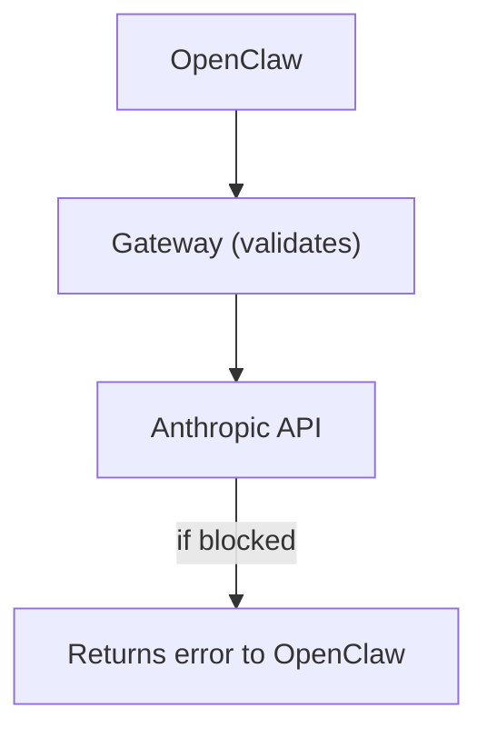

# AI SAFE² Control Gateway

**Reverse proxy that enforces security controls for OpenClaw formerly Moltbot / Clawdbot**

## Quick Start
```bash
# 1. Set API key
export ANTHROPIC_API_KEY="sk-ant-..."

# 2. Start gateway
./start.sh

# 3. Gateway runs on http://127.0.0.1:8888
```

## Features

- ✅ JSON schema validation
- ✅ Prompt injection blocking
- ✅ Risk scoring (0-10)
- ✅ High-risk tool denial
- ✅ Immutable audit logging
- ✅ Circuit breakers

## Configuration

Edit `config.yaml` to customize:

- `bind_host`: Network binding (default: 127.0.0.1)
- `bind_port`: Port number (default: 8888)
- `risk_threshold`: Block requests above this score (default: 7.0)
- `allow_high_risk_tools`: Enable dangerous tools (default: false)

## Endpoints

- `POST /v1/messages` - Main proxy (routes to Anthropic)
- `GET /health` - Health check
- `GET /stats` - Usage statistics
- `POST /emergency/safe-mode` - Emergency stop

## How It Works

## Troubleshooting

See [../../troubleshooting.md](../../troubleshooting.md)

## More Info

- [Main OpenClaw README](../README.md)
- [10-Minute Hardening Guide](../../../guides/openclaw-hardening.md)
